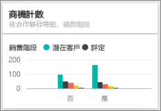

# Power BI 的商機分析範例：導覽

## 商機分析範例概觀
[商機分析範例] 包含一個儀表板及相關聯的報表，以分析一家具有 2 個銷售通路 (「直接」和「合作夥伴」) 的軟體公司。 此儀表板由銷售經理所建立，以區域、交易量及通路來追蹤商機與營收。

銷售經理依賴兩項營收量值：

* **營收** – 此為業務人員對於營收的預估。
* **要素營收** – 其以營收 x 機率 % 進行計算，且一般認為其可更精確地預測實際銷售營收。 機率由交易目前的***銷售階段*** 決定.
  * 潛在客戶 – 10%  
  * 評定 – 20%  
  * 解決方案 – 40%  
  * 提案 – 60%  
  * 定案 – 80%

  

此範例是系列中的一部分，該系列說明您可如何使用 Power BI 的商業導向資料、報表及儀表板。 此為來自 obviEnce 的匿名真實資料 ([www.obvience.com)](http://www.obvience.com/)。

## 先決條件

 您必須先將範例下載為[內容套件](https://docs.microsoft.com/en-us/power-bi/sample-opportunity-analysis#get-the-content-pack-for-this-sample)、[.pbix 檔案](http://download.microsoft.com/download/9/1/5/915ABCFA-7125-4D85-A7BD-05645BD95BD8/Opportunity Analysis Sample PBIX.pbix)或 [Excel 活頁簿](http://go.microsoft.com/fwlink/?LinkId=529782)，才能使用範例。

### 取得此範例的內容套件

1. 開啟 Power BI 服務 (app.powerbi.com) 並登入。
2. 在左下角選取 [取得資料]。
   
    
3. 在顯示的 [取得資料] 頁面上，選取 [範例]。
   
   
4. 選取 [商機分析範例]，然後選擇 [連線]。  
  
   
   
5. Power BI 會匯入內容套件，並將新的儀表板、報表及資料集新增到您目前的工作區。 新的內容會以黃色星號標示。 
   
   
  
### 取得此範例的 .pbix 檔案

或者，您可以下載此範例為 .pbix 檔案，其設計目的是要用於 Power BI Desktop。 

 * [商機分析範例](http://download.microsoft.com/download/9/1/5/915ABCFA-7125-4D85-A7BD-05645BD95BD8/Opportunity%20Analysis%20Sample%20PBIX.pbix)

### 取得此範例的 Excel 活頁簿
您也可以[只下載此範例的資料集 (Excel 活頁簿)](http://go.microsoft.com/fwlink/?LinkId=529782)。 活頁簿包含的 Power View 工作表可供您檢視及修改。 若要查看未經處理的資料，請選取 [Power Pivot] > [管理]。

## 儀表板告訴我們什麼？
我們的銷售經理建立儀表板來追蹤她認為最重要的度量。 當她看到值得關注的項目時，她可以選取圖格深入探究資料。

1. 公司營收 $20 億而要素營收為 $4.61 億。
2. 商機計數和營收會依照類似的漏斗圖模式：每個後續階段總計遞減。
3. 我們的商機大多位於東部地區。
4. 大商機會比中小型商機產生更多收益。
5. 合作夥伴的大交易比直接銷售產生更多的收益；平均分別為 $8 百萬與 $6 百萬。

不論交易歸屬於大型、中型或小型，為了成交都必須付出一樣的心力，因此公司應該深入探討資料以更了解大商機。

選取 [由合作夥伴和銷售階段帶動的商機計數]  圖格以開啟報表的第 1 頁。  

## 瀏覽報表的頁面
### 我們報表第 1 頁的標題為「商機計數概觀」。

* 東部是我們商機計數最大的地區。  
* 在圓形圖上，逐一選取每個地區以篩選頁面。 在每個地區中，合作夥伴都會更積極追求大商機。   
* [由合作夥伴和商機大小帶來的商機計數] 直條圖清楚顯示，大部分的大型商機都是合作夥伴帶動，而更多中小型商機並不是由合作夥伴帶動。
* 在左下方的橫條圖中選取每個 [銷售階段]，查看地區計數的差異，並注意即使東部是我們計數最大的地區，[解決方案]、[提案] 和 [定案] 階段中所有 3 個地區都有為數相當的計數。 這表示我們在中部和西部有更高的成交率。

### 我們報表第 2 頁的標題為「營收概觀」。
本頁會採取類似的資料檢視方式，但改由營收的角度而不是計數的角度來看。  

* 東部不只是商機最大的地區，也是營收最高的地區。  
* 在篩選由合作夥伴帶動的營收時 (選取右上角圖例中的 [是]  )，會顯示 $15 億和 $2.94 億的營收。 將這些數據與由非合作夥伴帶動的營收 ($6440 億和 $1.66 億) 進行比較。  
* 相較於非合作夥伴帶動的銷售平均營收 6 百萬，若商機是由合作夥伴帶動，則大型帳戶平均營收較高 (8 百萬)。  
* 若是由合作夥伴帶動的銷售，大商機的平均營收幾乎是中型商機的兩倍 (4 百萬)。  
* 而不論是合作夥伴帶動的銷售及非合作夥伴帶動的銷售，其中小型銷售的平均營收為數相當。   

顯然我們的合作夥伴在向客戶銷售時表現得更好。  因此，將更多交易分配給我們的合作夥伴應該是合理的。

### 我們報表第 3 頁的標題為「地區階段計數」。
本頁會採取類似的資料檢視方式，但依地區和階段細分。  

* 在篩選東部時 (選取圓形圖中的 [東部]  )，顯示東部由合作夥伴帶動及非合作夥伴帶動的商機分配相當平均。
* 大商機最常出現在中部地區，小型商機最常出現在東部地區，而中型商機則最常出現在西部地區。

### 我們報表第 4 頁的標題為「即將出現的商機」。
同樣地，我們會檢視類似的要素，但這次會從日期/時間的角度來看。  

我們 CFO 使用此頁面來管理工作量。 藉由查看依銷售階段和月份區分的營收商機，她可以進行適當的規劃。

* [定案] 階段的平均營收最高。 因此成交是第一要務。
* 在依月篩選 (選取左邊交叉分析篩選器的月份名稱) 時，會顯示一月的 [定案] 階段有較多大型交易，要素營收為 $7500 萬。 反之，二月的 [解決方案] 和 [提案] 階段中大多數是中型交易。
* 一般而言，要素營收數字會因銷售階段、商機數與交易大小而變動。 針對這些要素加入篩選 (使用右邊的 [篩選] 窗格) 以探索更深入的資訊。

這是安全的作業環境。 您一律可以選擇不儲存變更。 但如果儲存了變更，您也可以隨時移至 [取得資料]  ，重新複製此範例。

## 下一步：連接到您的資料
我們希望本教學已示範 Power BI 儀表板、問與答和報表如何讓您深入了解商機追蹤的資料。 現在輪到您了 — 連接到您自己的資料。 您可以透過 Power BI 連接到各式各樣的資料來源。 深入了解[開始使用 Power BI](service-get-started.md).

[下載範例](sample-datasets.md)  
