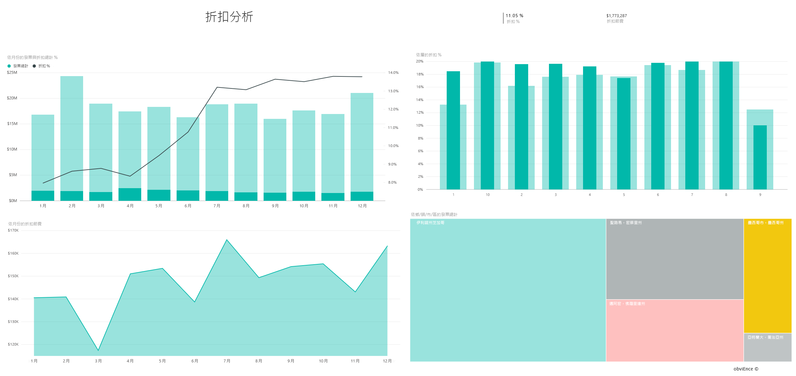

# 適用於 Power BI 的採購分析範例：觀看導覽

採購分析範例內容套件包含儀表板、報表和資料集，用於依類別及地點分析製造公司在廠商上的支出。 本範例會探討以下幾方面：

* 哪些是最熱門的廠商
* 哪些類別花費最多
* 哪些廠商給我們最高的折扣以及何時提供折扣

此範例是系列中的一部分，說明您可如何使用 Power BI 的商業導向資料、報表與儀表板。 它是由 [obviEnce](http://www.obvience.com/) 使用真實資料 (已匿名化) 所建立。 資料會以數種格式提供：內容套件、.pbix Power BI Desktop 檔案，或 Excel 活頁簿。 請參閱 [Power BI 範例](sample-datasets.md)。 

此教學課程探索 Power BI 服務中的採購分析範例內容套件。 因為 Power BI Desktop 和服務中報表的使用體驗皆非常類似，因此您也可以在 Power BI Desktop 中使用範例 .pbix 檔案來進行教學課程。 

您不需要 Power BI 授權，即可在 Power BI Desktop 中瀏覽範例。 如果您沒有 Power BI Pro 授權，則可以將範例儲存到 Power BI 服務中的 [我的工作區]。 

## 取得範例

您必須先將範例下載為[內容套件](#get-the-content-pack-for-this-sample)、[.pbix 檔案](#get-the-pbix-file-for-this-sample)或 [Excel 活頁簿](#get-the-excel-workbook-for-this-sample)，才能使用範例。

### 取得此範例的內容套件

1. 開啟 Power BI 服務 (app.powerbi.com) 並登入，然後開啟您要儲存範例的工作區。 

    如果您沒有 Power BI Pro 授權，則可以將範例儲存到 [我的工作區]。

2. 在左下角選取 [取得資料]  。

    ![選取 [取得資料]](media/sample-datasets/power-bi-get-data.png)
3. 在顯示的 [取得資料]  頁面上，選取 [範例]  。

4. 選取 [採購分析範例]  ，然後選擇 [連線]  。  
  
   
   
5. Power BI 會匯入內容套件，然後將新儀表板、報表和資料集新增至您目前的工作區。
   
   
  
### 取得此範例的 .pbix 檔案

或者，您可以將採購分析範例範例下載為 [.pbix 檔案](https://download.microsoft.com/download/D/5/3/D5390069-F723-413B-8D27-5888500516EB/Procurement%20Analysis%20Sample%20PBIX.pbix)，其設計目的是要用於 Power BI Desktop。 

### 取得此範例的 Excel 活頁簿

如果您想要檢視此範例的資料來源，其也有可用的 [Excel 活頁簿](https://go.microsoft.com/fwlink/?LinkId=529784) 格式。 活頁簿包含的 Power View 工作表可供您檢視及修改。 若要查看未經處理資料，請啟用「資料分析」增益集，然後選取 [Power Pivot] > [管理]  。 若要啟用 Power View 和 Power Pivot 增益集，請參閱[在 Excel 中探索 Excel 範例](sample-datasets.md#explore-excel-samples-inside-excel)以了解詳情。

## 支出趨勢
首先，我們先來看依類別和地點劃分的支出趨勢。  

1. 在儲存範例的工作區中，開啟 [儀表板]  索引標籤，然後尋找 [採購分析範例]  儀表板並加以選取。 
2. 選取儀表板圖格 [依國家/地區劃分的發票總計]  ，這將開啟 [採購分析範例]  報表的 [支出概觀]  頁面。

    ![[支出概觀] 頁面](media/sample-procurement/procurement2.png)

注意下列詳細資料：

* 在 [依月份和類別劃分的發票總計]  折線圖中，[直接]  類別的支出一致，[物流]  的支出高峰為十二月，而 [其他]  支出在二月有所激增。
* 在 [依國家/地區劃分的發票總計]  地圖中，我們大部分的支出都是在美國。
* 在 [依子類別劃分的發票總計]  直條圖中，[硬體]  和 [間接商品與服務]  是最大的支出類別。
* 在 [依層級劃分的發票總計]  橫條圖中，我們大多數的業務都是與第 1 層 (前 10 大) 廠商合作完成。 這麼做使我們能夠管理更好的廠商關係。

## 墨西哥的支出
讓我們來瀏覽墨西哥的支出部分。

1. 在 [依國家/地區劃分的發票總計]  地圖中，選取 [墨西哥]  泡泡。 請注意，在 [依子類別劃分的發票總計]  直條圖中，大部分費用都是在 [間接商品與服務]  子類別中。

   ![在 [支出概觀] 頁面中選取 [墨西哥]](media/sample-procurement/pbi_procsample_spendmexico.png)
2. 向下鑽研**間接貨物與服務**資料行：

   * 在 [依子類別劃分的發票總計] 圖表中，選取圖表右上角的向下鑽研箭號 (**向下鑽研箭號**)。
   * 選取**間接貨物與服務**資料行。

      如您所見，到目前為止最高的支出是 [銷售與行銷]  子類別。
   * 在地圖上再次選取 **墨西哥** 。

      對墨西哥而言，最大的支出是 [維護和修復]  子類別。

      ![墨西哥的 [間接商品與服務] 向下切入](media/sample-procurement/pbi_procsample_drill_mexico.png)
3. 選取圖表左上角的向上箭號，以重新向上鑽研。
4. 再選取向下切入箭號，即可關閉向下鑽研。  
5. 在頂端導覽窗格，選取 [採購分析範例]  ，以返回儀表板。

## 評估不同的城市
我們可以使用反白顯示來評估不同的城市。

1. 選取儀表板圖格 [依月份劃分的發票總計與折扣百分比]  ，這將開啟 [採購分析範例]  報表的 [折扣分析]  頁面。
2. 在 [依城市劃分的發票總計]  樹狀結構圖中，依次選取城市，以查看城市的比較結果。 請注意，幾乎所有邁阿密的發票都是來自第 1 層廠商。

   

## 廠商折扣
接著，我們來探索廠商提供的折扣和我們取得最多折扣的時間週期：
* 折扣是每月不同還是維持不變？
* 部分城市的折扣比其他城市多嗎？

![[折扣分析] 頁面](media/sample-procurement/procurement4.png)

### 依月份的折扣
如果您查看 [依月份劃分的發票總計與折扣百分比]  組合圖時，我們發現「二月」是最繁忙的月份而「九月」是最不忙碌的月份。 

查看這幾個月的折扣百分比：當交易量增加時，折扣縮小，當交易量減少時，折扣增加。 在我們越需要折扣時，交易反而越不划算。

![[依月份劃分的發票與折扣總計百分比] 圖表](media/sample-procurement/procurement5.png)

### 依城市的折扣
另一個要瀏覽的部分是依城市劃分的折扣。 依次選取樹狀圖中的每個城市，並查看其他圖表有哪些變更：

* 聖路易的二月發票總計大增，並在四月因為折扣節省而大降。
* 墨西哥市享有最高折扣率 (11.05%)，而亞特蘭大折扣率最低 (0.08%)。

### 編輯報表
選取左上角的 [編輯報表]  ，並在 [編輯檢視] 中瀏覽：

* 了解如何製作頁面。
* 根據相同的資料加入頁面和圖表。
* 變更圖表的視覺效果類型，例如將樹狀圖變更為環圈圖。
* 將圖表釘選到您的儀表板。

## 後續步驟：連線到您的資料
您可以在此環境盡情嘗試，因為您可以選擇不儲存您的變更。 但如果儲存了變更，您也可以隨時選取 [取得資料]  以取得此範例的新複本。

希望此教學已讓您了解 Power BI 儀表板、問與答和報表能夠如何提供範例資料的見解。 現在輪到您了，請連接到您自己的資料。 您可以透過 Power BI 連接到各式各樣的資料來源。 若要深入了解，請參閱[開始使用 Power BI 服務](service-get-started.md)。

