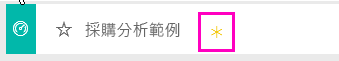
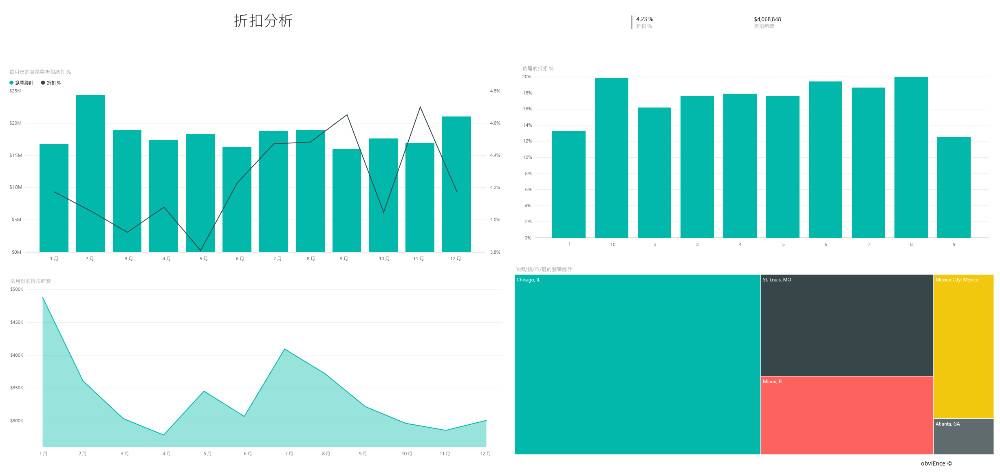
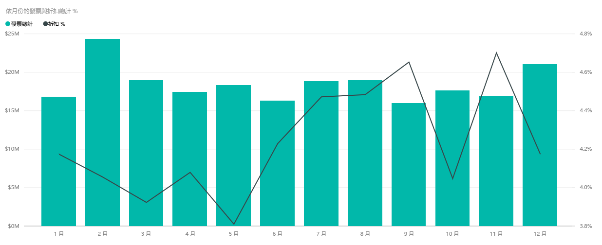

# Power BI 的採購分析範例：導覽

## 採購分析範例概觀
此產業儀表板範例以及基礎報表，會依類別及地點來分析一家製造公司對廠商的花費。 本範例會探討以下幾方面：

* 哪些是最熱門的廠商
* 哪些類別花費最多
* 哪些廠商給我們最高的折扣以及何時提供折扣

此範例是系列中的一部分，該系列說明您可如何使用 Power BI 的商業導向資料、報表及儀表板。 此為來自 obviEnce 的匿名真實資料 ([www.obvience.com)](http://www.obvience.com/)。

## 先決條件

 您必須先將範例下載為[內容套件](https://docs.microsoft.com/en-us/power-bi/sample-procurement#get-the-content-pack-for-this-sample)、[.pbix 檔案](http://download.microsoft.com/download/D/5/3/D5390069-F723-413B-8D27-5888500516EB/Procurement Analysis Sample PBIX.pbix)或 [Excel 活頁簿](http://go.microsoft.com/fwlink/?LinkId=529784)，才能使用範例。

### 取得此範例的內容套件

1. 開啟 Power BI 服務 (app.powerbi.com) 並登入。
2. 在左下角選取 [取得資料]。
   
    
3. 在顯示的 [取得資料] 頁面上，選取 [範例]。
   
   
4. 選取 [採購分析範例]，然後選擇 [連線]。  
  
   
   
5. Power BI 會匯入內容套件，並將新的儀表板、報表及資料集新增到您目前的工作區。 新的內容會以黃色星號標示。 
   
   
  
### 取得此範例的 .pbix 檔案

或者，您可以下載此範例為 .pbix 檔案，其設計目的是要用於 Power BI Desktop。 

 * [採購分析範例](http://download.microsoft.com/download/D/5/3/D5390069-F723-413B-8D27-5888500516EB/Procurement%20Analysis%20Sample%20PBIX.pbix)

### 取得此範例的 Excel 活頁簿
您也可以[只下載此範例的資料集 (Excel 活頁簿)](http://go.microsoft.com/fwlink/?LinkId=529784)。 活頁簿包含的 Power View 工作表可供您檢視及修改。 若要查看未經處理的資料，請選取 [Power Pivot] > [管理]。

## 支出趨勢
我們先來看依類別和地點區分的支出趨勢。  

1. 從工作區中，開啟 [儀表板] 索引標籤，然後選取 [採購分析] 儀表板。
2. 選取儀表板圖格 [依國家/地區的發票總計] 。 它會開啟 [採購分析範例] 報表的 [支出概觀] 頁面。

    

請注意下列事項：

* 在 [ **依月份和類別目錄的發票總計** ] 折線圖：[ **直接** ] 類別的支出相當一致，[ **物流** ] 的支出高峰為十二月，而 [ **其他** ] 支出在二月有所激增。
* 在 [ **依國家/地區的發票總計** ] 地圖中：我們大部分的支出都是在美國。
* 在 [依子類別目錄的發票總計] 直條圖中：[硬體] 和 [間接貨物與服務] 是最大的支出類別。
* 在 [依層級的發票總計] 橫條圖中：我們大多數的業務都是與第 1 層 (前 10 大) 廠商合作完成。 這有助於更妥善管理廠商合作關係。

## 墨西哥的支出
讓我們來瀏覽墨西哥的支出部分。

1. 在圓形圖中，選取地圖中的**墨西哥**泡泡。 請注意，在「依子類別目錄的發票總計」直條圖中，大部分項目都是在**間接貨物與服務**子類別中。

   
2. 向下鑽研**間接貨物與服務**資料行：

   * 在圖表右上角的選取向下鑽研箭號 。
   * 選取**間接貨物與服務**資料行。

      截至目前為止，此類別最大的支出是銷售與行銷。
   * 在地圖上再次選取 **墨西哥** 。

      在墨西哥，此類別最大的支出是維護和修復。

      
3. 選取圖表左上角的向上箭號，以重新向上鑽研。
4. 再選取一次箭號，即可關閉向下鑽研。  
5. 選取上方導覽列的 [Power BI]，返回儀表板。

## 評估不同的城市
我們可以使用反白顯示來評估不同的城市。

1. 選取儀表板圖格 [依月份的發票總計與折扣百分比] 。 報表會開啟 [折扣分析] 頁面。
2. 在 [ **依城市的發票總計** ] 矩形式樹狀結構圖中，選取不同城市，查看城市的比較結果。 幾乎所有邁阿密的發票都是來自第 1 層供應商。

   

## 廠商折扣
接著，我們來探索廠商提供的折扣和我們取得最多折扣的時間週期。

具體來說，就是討論這些問題：

* 各個月份的折扣不同嗎？還是每個月的折扣都相同？
* 部分城市的折扣比其他城市多嗎？

### 依月份的折扣
查看 [ **依月份的發票總計與折扣百分比** ] 組合圖時，我們發現 [ **二月** ] 是最繁忙的月份而 [ **九月** ] 是最不忙碌的月份。 現在看一下這些月份期間的折扣百分比。
我們發現到當銷售量增加時，折扣會減少；當銷售量較少時，折扣就增加。 在我們越需要折扣時，交易反而越不划算。

### 依城市的折扣
另一個要瀏覽的部分是依城市的折扣。 選取樹狀圖中的每個城市，並查看其他圖表有哪些變更。

* 密蘇里州聖路易的二月發票總計大增，並在四月因為折扣節省而大降。
* 墨西哥的墨西哥市享有最高折扣率 (11.05%)，而喬治亞州的亞特蘭大折扣率最低 (0.08%)。

### 編輯報表
選取左上角的 [ **編輯報表** ]，並在 [編輯檢視] 中瀏覽。

* 了解如何製作頁面
* 根據相同的資料新增頁面和圖表
* 變更圖表的視覺效果類型，例如將樹狀圖變更為環圈圖
* 將頁面釘選到您的儀表板

這是安全的作業環境。 您一律可以選擇不儲存變更。 如果儲存了變更，您也可以隨時移至 [ **取得資料** ]，重新複製此範例。

## 下一步：連接到您的資料
我們希望本教學已示範 Power BI 儀表板和報表如何讓您深入了解採購的資料。 現在輪到您了 &#151; 連接到您自己的資料。 您可以透過 Power BI 連接到各式各樣的資料來源。 深入了解[開始使用 Power BI](service-get-started.md).
