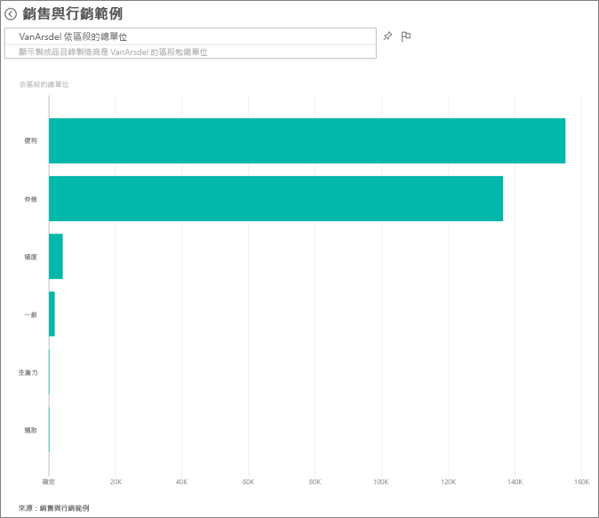
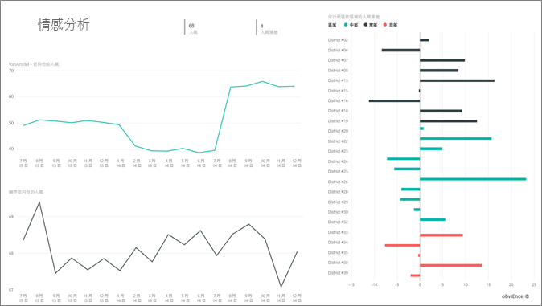
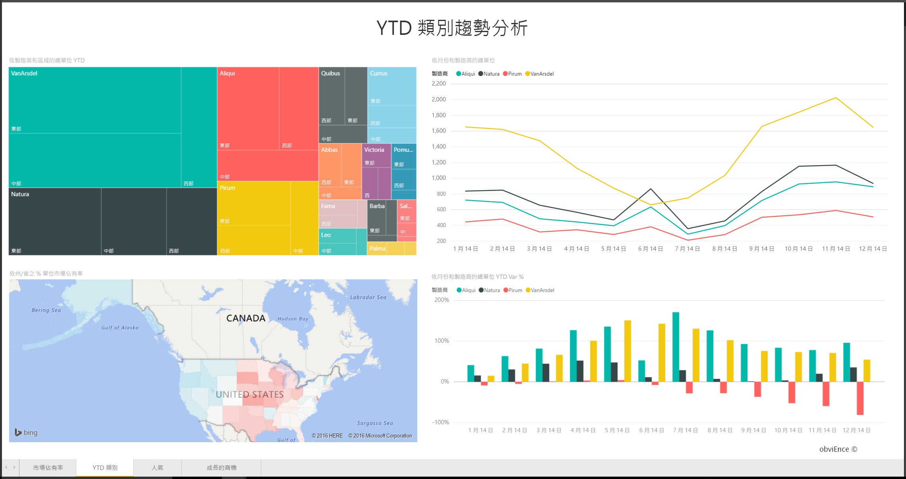

# 適用於 Power BI 的銷售與行銷範例：觀看導覽

銷售與行銷範例包含一家虛構製造公司 VanArsdel Ltd 的儀表板和報表。VanArsdel 行銷長 (CMO) 建立了此儀表板來查看業界及公司的市場佔有率、產品量、銷售額及人氣。

VanArsdel 有許多競爭對手，但仍是該產業的市場領導者。 CMO 想要提高市場佔有率和探索成長的商機。 不過，基於不明原因，VanArsdel 的市場佔有率在 6 月份已開始大幅滑落。

![[銷售與行銷範例] 儀表板](media/sample-sales-and-marketing/sales1.png)

此範例是系列中的一部分，說明您可如何使用 Power BI 的商業導向資料、報表與儀表板。 它是由 [obviEnce](http://www.obvience.com/) 使用真實資料 (已匿名化) 所建立。 資料會以數種格式提供：內容套件、.pbix Power BI Desktop 檔案，或 Excel 活頁簿。 請參閱 [Power BI 範例](sample-datasets.md)。 

此教學課程探索 Power BI 服務中的銷售與行銷範例內容套件。 因為 Power BI Desktop 和服務中報表的使用體驗皆非常類似，因此您也可以在 Power BI Desktop 中使用範例 .pbix 檔案來進行教學課程。 

您不需要 Power BI 授權，即可在 Power BI Desktop 中瀏覽範例。 如果您沒有 Power BI Pro 授權，則可以將範例儲存到 Power BI 服務中的 [我的工作區]。 

## 取得範例

您必須先將範例下載為[內容套件](#get-the-content-pack-for-this-sample)、[.pbix 檔案](#get-the-pbix-file-for-this-sample)或 [Excel 活頁簿](#get-the-excel-workbook-for-this-sample)，才能使用範例。

### 取得此範例的內容套件

1. 開啟 Power BI 服務 (app.powerbi.com) 並登入，然後開啟您要儲存範例的工作區。

   如果您沒有 Power BI Pro 授權，則可以將範例儲存到 [我的工作區]。

2. 在左下角選取 [取得資料]  。
   
   ![選取 [取得資料]](media/sample-datasets/power-bi-get-data.png)
3. 在顯示的 [取得資料]  頁面上，選取 [範例]  。
   
4. 選取 [銷售與行銷範例]  ，然後選擇 [連線]  。   
  
   
   
5. Power BI 會匯入內容套件，然後將新儀表板、報表和資料集新增至您目前的工作區。
   
   
  
### 取得此範例的 .pbix 檔案

或者，您可以將銷售與行銷範例下載為 [.pbix 檔案](https://download.microsoft.com/download/9/7/6/9767913A-29DB-40CF-8944-9AC2BC940C53/Sales%20and%20Marketing%20Sample%20PBIX.pbix)，其設計目的是要用於 Power BI Desktop。

### 取得此範例的 Excel 活頁簿

如果您想要檢視此範例的資料來源，其也有可用的 [Excel 活頁簿](https://go.microsoft.com/fwlink/?LinkId=529785) 格式。 活頁簿包含的 Power View 工作表可供您檢視及修改。 若要查看未經處理資料，請啟用「資料分析」增益集，然後選取 [Power Pivot] > [管理]  。 若要啟用 Power View 和 Power Pivot 增益集，請參閱[從 Excel 本身檢視 Excel 範例](sample-datasets.md#optional-take-a-look-at-the-excel-samples-from-inside-excel-itself)以了解詳情。

## 儀表板告訴我們什麼？
讓我們開始瀏覽儀表板並查看 CMO 已釘選的圖格。 我們可以看到我們的市場佔有率、銷售和人氣的相關資訊。 這些資料是依區域、時間和競爭對手細分。

* 左欄的數字磚顯示去年產業銷售量 (50,000)、市場佔有率 (32.86%)、銷售量 (16,000)、人氣指數 (68)、人氣落差 (4) 及售出單位總量 (100 萬)。
* 最上方折線圖 ( **% 單位市場佔有率與連續 12 個月的 % 單位市場佔有率**) 顯示市場佔有率隨時間波動的情況。 注意 6 月份的大幅下滑。 我們之前已上升一段時間的連續 12 個月 (R12M) 市佔率現在開始停滯。
* 我們最大的競爭對手是 Aliqui，如中間直條圖磚 (**年初迄今單位總量差異 %** ) 中所示。
* 我們大多數的業務都在東部和中部地區。
* 底部折線圖 (**2014 年單位總量**) 顯示我們在 6 月份的下滑不是季節性情況；沒有任何競爭對手顯示相同的趨勢。
* 右側的 [整體單位總量]  和 [年初迄今單位總量]  磚會依市場區隔和區域/製造商顯示銷售單位數。 我們產業最大的市場區隔是 [生產力]  和 [便利性]  。

## 使用問與答更深入鑽研

您可以使用問與答，進一步詳細探索資料。

### 哪些市場區隔可帶動銷售？ 它們符合產業趨勢嗎？
1. 選取 [依市場區隔的整體單位總量]  磚以開啟問與答，然後填入查詢「依市場區隔的單位總量」  。
2. 在現有查詢的結尾，新增：*for VanArsdel*。 問與答可解譯問題，並顯示答案與已更新的圖表。 請注意，我們產品量大部分是來自 [便利性]  和 [合適性]  市場區隔。

   
3. 我們在 [合適性]  和 [便利性]  兩個類別的市佔率很高；這些都是我們具競爭力的市場區隔。
4. 選取頂端導覽窗格的 [銷售與行銷範例]  ，以返回儀表板。

### 依據類別目錄 (與地區) 的單位銷售總量市場佔有率為何？
1. 注意 [依製造商、區域的年初迄今單位總量]  磚。 依類別的總單位市場佔有率為何？

   ![[依製造商、區域的年初迄今單位總量] 磚](media/sample-sales-and-marketing/sales3.png)
2. 選取儀表板頂端的問題方塊，鍵入問題：「依 2014 年製造商和類別的單位總量矩形式樹狀結構圖」  。 請注意當您輸入問題時，視覺效果更新的方式。

   
3. 若要比較其中的發現，可將圖表釘選到儀表板。 注意以下有趣發現：在 2014 年，VanArsdel 僅售出 [都市]  類別的產品。
4. 返回儀表板。

## 銷售與行銷範例報表

儀表板是報表的進入點。 如果磚是從基礎報表建立，選取該磚會隨即開啟報表。

在我們的儀表板上，[% 單位市場佔有率與連續 12 個月的 % 單位市場佔有率]  圖表中的 [R12M 的 % 單位市場佔有率]  一行顯示我們的市場佔有率已不再隨時間增加。 甚至有點衰退。 那麼，為什麼市場佔有率在 6 月份會大幅下滑？ 

銷售與行銷範例報表有四頁。
 
### VanArsdel - 市場佔有率頁面
報表的第一頁著重於 VanArsdel 的市場佔有率。

1. 在儀表板中，選取 [% 單位市場佔有率與連續 12 個月的 % 單位市場佔有率]  圖表以開啟銷售與行銷範例報表的 [VanArsdel - 市場佔有率]  頁面。

   

2. 查看報表底部的 [VanArsdel 月份單位總量]  直條圖。 黑色直條表示 VanArsdel (我們的產品)，而綠色直條則是我們的競爭對手。 2014 年 6 月 VanArsdel 的下滑情況並未發生在競爭對手身上。

3. 右側的 [依市場區隔的總類別銷售量]  橫條圖已篩選為顯示 VanArsdel 的前兩大市場區隔。 看一下這個篩選的建立方式：  

   a. 選取 [依市場區隔的總類別銷售量]  圖表。

   b. 選取右側的 [篩選]  窗格將它展開。  

   c. 在 [視覺效果層級篩選]  下，注意 [市場區隔]  已篩選為只包含 [便利性]  和 [合適性]  市場區隔。  

   d. 選取 [市場區隔]  將它展開，然後核取 [生產力]  新增該市場區隔，以修改篩選。  

4. 在 [VanArsdel 月份單位總量]  圖表中，選取圖例中的 [是]  以依 VanArsdel 交叉篩選頁面。 在 [依市場區隔的總類別銷售量]  圖表中，注意我們並未參與 [生產力]  市場區隔的競爭。

5. 再次選取圖例中的 [是]  以移除篩選。

6. 查看 [每月 % 單位市場佔有率和 R12M 的 % 單位市場佔有率]  折線圖。 它會顯示每月市場佔有率和連續 12 個月的市場佔有率。 連續月份資料有助於緩和每個月的波動並顯示長期趨勢。 在 [依市場區隔的總類別銷售量]  橫條圖中，依序選取 [便利性]  和 [合適性]  ，以查看每個市場區隔的市場佔有率波動情況。 請注意，[合適性]  市場區隔顯示的市場佔有率波動更大。

我們仍必須找出市場佔有率在 6 月份下滑的原因。 接下來，讓我們看看報表的 [人氣分析]  頁面。

### 人氣分析頁面
報表的第三頁著重於消費者人氣。

推文、Facebook、部落格和文章全部都會影響消費者人氣，如頁面左側的兩個折線圖所示。 左上角的 [VanArsdel - 依月份的人氣]  圖表顯示我們的產品人氣在 2 月以前大致算高。 從 2 月開始到 6 月，就開始大幅下滑至低點。 是什麼原因導致這種人氣下滑情況？ 

讓我們看看外部來源。 2 月時，有幾篇文章和部落格文章將 VanArsdel 的客戶服務評為產業最差。 這種負面媒體報導對客戶人氣與銷售產生直接關聯。 VanArsdel 努力改善客戶服務，且客戶與產業皆有目共睹。 7 月時，正面的人氣開始攀升，然後達到 1960 年代有史以來的高峰。 這種人氣攀升反映在報表第一頁和第二頁的 [月份單位總量]  圖表中。 或許這可以說明我們的市場佔有率在 6 月下滑的部分原因？

人氣落差可能是另一個要探索的重點。 哪些區域有最高的人氣落差、管理階層該如何利用它，以及如何在其他區域中複製它？

### 年初迄今類別趨勢分析頁面
報表的第二頁著重於年初迄今類別趨勢。

注意下列詳細資料：
* VanArsdel 是此類別的最大公司，且其主要競爭對手為 Natura、Aliqui 和 Pirium。 我們非常關注競爭對手的動態。
* Aliqui 業績開始增加，但相較於我們的產品量仍然很低。
* 樹狀圖的綠色表示 VanArsdel。 東部區域客戶比較偏好我們的競爭對手，但我們在中部區域表現的不錯。 我們在東部區域的市佔率最低。
* 地理位置對銷售單位數量也有影響。 東部區域是大多數製造商的地盤，但 VanArsdel 在中部區域的勢力也不小。
* 在右下方 [依月份和製造商的年初迄今單位總量差異 %]  圖表中，注意差異為正值，這是個好預兆。 我們比去年業績更好，但競爭對手 Aliqui 也是一樣。

### 成長的商機頁面
報表的第四頁著重於競爭產品分析。

注意下列詳細資料：
* 左下方 [依市場區隔的單位總量]  圖表顯示 VanArsdel 兩個最強市場區隔以外的所有類別市場區隔。 依序選取每個市場區隔，以識別 VanArsdel 仍可拓展業績的潛力區域。 
* 請注意，[極限]  和 [生產力]  市場區隔的成長速度比其他市場區隔更快。 不過，我們並未參與這些市場區隔的競爭；如果我們想要切入這些市場區隔，可以使用我們的資料來查看哪些區域中有哪些市場區隔比較熱門。 我們可以進一步調查問題，例如哪些區域成長速度較快，以及在該市場區隔中誰會是我們的最大競爭對手。
* 還記得我們在 6 月份的市場佔有率下滑嗎？ 6 月是 [生產力]  市場區隔的旺季，這是我們完全未參與競爭的市場區隔。 此詳細資料也可以協助說明我們在 6 月份的市場佔有率下滑原因。

藉由依 VanArsdel、市場區隔、月份以及地區篩選視覺效果，我們可以發現 VanArsdel 的成長商機。

## 後續步驟：連線到您的資料
您可以在此環境盡情嘗試，因為您可以選擇不儲存您的變更。 但如果儲存了變更，您也可以隨時選取 [取得資料]  以取得此範例的新複本。

我們希望本教學已示範 Power BI 儀表板、問與答和報表如何讓您深入了解人力資源的資料。 現在輪到您了，請連接到您自己的資料。 您可以透過 Power BI 連接到各式各樣的資料來源。 若要深入了解，請參閱[開始使用 Power BI 服務](service-get-started.md)。
