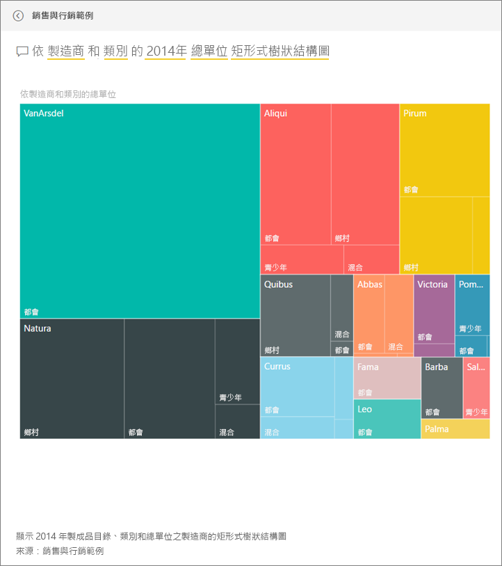

# Power BI 的銷售與行銷範例：導覽

## 銷售與行銷範例概觀
**銷售與行銷範例** 包含一家名為 VanArsdel Ltd 的虛構製造公司的儀表板和報表。此儀表板由 VanArsdel 行銷長 (CMO) 所建立，可查看業界及其公司的市場佔有率、產品量、銷售額及人氣。

VanArsdel 有許多競爭對手但仍是該產業的市場領導者。 CMO 想要提高市場佔有率和探索成長的商機。 但是基於某些原因，VanArsdel 的市場佔有率在 6 月份已開始大幅滑落 。

此範例是系列中的一部分，該系列說明您可如何使用 Power BI 的商業導向資料、報表及儀表板。 此為來自 obviEnce 的匿名真實資料 (www.obvience.com)。

## 先決條件

 您必須先將範例下載為[內容套件](https://docs.microsoft.com/en-us/power-bi/sample-sales-and-marketing#get-the-content-pack-for-this-sample)、[.pbix](http://download.microsoft.com/download/9/7/6/9767913A-29DB-40CF-8944-9AC2BC940C53/Sales and Marketing Sample PBIX.pbix) 或 [Excel 活頁簿](http://go.microsoft.com/fwlink/?LinkId=529785)，才能使用範例。

### 取得此範例的內容套件

1. 開啟 Power BI 服務 (app.powerbi.com) 並登入。
2. 在左下角選取 [取得資料]。
   
    
3. 在顯示的 [取得資料] 頁面上，選取 [範例]。
   
   
4. 選取 [銷售與行銷範例]，然後選擇 [連線]。  
  
   
   
5. Power BI 會匯入內容套件，並將新的儀表板、報表及資料集新增到您目前的工作區。 新的內容會以黃色星號標示。 
   
   
  
### 取得此範例的 .pbix 檔案

或者，您可以下載此範例為 .pbix 檔案，其設計目的是要用於 Power BI Desktop。 

 * [銷售與行銷範例](http://download.microsoft.com/download/9/7/6/9767913A-29DB-40CF-8944-9AC2BC940C53/Sales%20and%20Marketing%20Sample%20PBIX.pbix)

### 取得此範例的 Excel 活頁簿
您也可以[只下載此範例的資料集 (Excel 活頁簿)](http://go.microsoft.com/fwlink/?LinkId=529785)。 活頁簿包含的 Power View 工作表可供您檢視及修改。 若要查看未經處理的資料，請選取 [Power Pivot] > [管理]。

## 儀表板告訴我們什麼？
讓我們開始瀏覽儀表板並查看 CMO 已釘選的圖格。 我們可以看到我們的市場佔有率、銷售和人氣的相關資訊。 接著，我們可以看到這些資料是依區域、時間和競爭對手細分。

* 左側資料行下方的數字圖格顯示去年產業銷售量 (5 萬)、市場佔有率 (32.86%)、銷售量 (16000)、人氣指數 (68)、人氣落差 (4) 以及銷售單位總量 (100 萬)。
* 最上方折線圖顯示我們的市場佔有率隨時間波動的情況。 我們的市場佔有率在 6 月份大幅下滑。 此外，我們之前已上升一段時間的 R12M (循環 12 個月) 市佔率則開始停滯。
* 我們最大的競爭對手是 Aliqui (如中間直條圖圖格中所示)。
* 我們大多數的業務都在東部和中部地區。
* 底部折線圖顯示我們在 6 月份的下滑不是季節性情況 – 因為沒有任何競爭對手顯示相同的趨勢。
* 其中兩個 [單位總量] 圖格會依市場區隔和地區/製造商顯示銷售單位數量。 我們產業最大的市場區隔是 [產能]  和 [便利性] 。

### 使用問與答更深入鑽研
#### 哪些市場區隔可帶動銷售？ 它符合產業趨勢嗎？
1. 選取 [依市場區隔的整體銷售單位總量] 圖格以開啟問與答。
2. 在現有查詢的結尾輸入 **for VanArsdel** 。 問與答可解譯問題，並顯示答案與已更新的圖表。 我們產品量是來自 [便利性] 和 [合適性] 兩個市場區隔。

   
3. 我們在 [合適性]  和 [便利性]  兩個類別目錄的市佔率非常高；這些都是我們具競爭力的市場區隔。
4. 選取上方導覽列 (階層連結) 中的儀表板名稱，以巡覽回儀表板。

#### 依據類別目錄 (與地區) 的單位銷售總量市場佔有率為何？
1. 請注意 [依製造商、地區的總單位 YTD] 圖格。 我想知道依類別目錄的單位銷售總量市場佔有率為何？

   
2. 在儀表板頂端的問題方塊中，將問題輸入為**依 2014 年製造商和類別目錄的單位總數矩形式樹狀結構圖**。 請注意當您輸入問題時，視覺效果更新的方式。
   
3. 若要比較其中的發現，可將圖表釘選到儀表板。 有趣的是，在 2014 年中，VanArsdel 只有銷售屬於 **都市** 類別目錄的產品。
4. 瀏覽回儀表板。

儀表板也是報表的進入點。  如果圖格是從基礎報表建立，按一下該圖格即會開啟報表。

在我們的儀表板中，R12M (循環 12 個月) 一行顯示我們的市場佔有率已不再隨時間增加，甚至有點衰退。 那麼，為什麼市場佔有率在 6 月會大幅下滑？ 若要進一步調查，請按一下此視覺效果來開啟基礎報表。

### 我們的報表有 4 頁，
#### 報表的第 1 頁著重於 VanArsdel 的市場佔有率。

1. 請看看 [月份 VanArsdel 單位總量] 直條圖底部。 黑色的資料行代表 VanArsdel (我們的產品) 而綠色代表我們的競爭對手。 2014 年 6 月 VanArsdel 的下滑情況並未發生在競爭對手身上。
2. 我們將右側中間的 [依市場區隔的類別目錄量] 橫條圖篩選為顯示 VanArsdel 的前 2 大市場區隔。 看一下這個篩選的建立方式：  

   a.  展開右側的 [篩選] 窗格。  
   b.  按一下以選取視覺效果。  
   c.  在視覺效果層級篩選下方，已將**市場區隔**篩選為只包含**便利性**和**合適性**.  
   d.  選取 [市場區隔] 以展開該區段，然後查看 [產能] 並新增該市場區隔，以修改篩選。  
3. 在 [VanArsdel 月份單位總量] 中，選取圖例中黑色的 [是] 以依 VanArsdel 交叉篩選頁面。 請注意，我們並未在 [產能] 市場區隔中參與競爭。
4. 再次選取黑色的 [是] 以移除篩選。
5. 檢視折線圖。 它會顯示我們的每月市場佔有率和循環 12 個月的市場佔有率。 循環 12 個月的資料可緩和每個月的波動並顯示長期趨勢。 選取 [便利性] 和 [合適性] 橫條圖，以查看每個市場區隔的市場佔有率波動情況。 [合適性] 市場區段顯示的市場佔有率波動比 [便利性] 市場區隔更大。

我們仍必須找出市場佔有率在 6 月份下滑的原因。 讓我們檢查一下 [人氣]。

#### 報表第 3 頁著重於人氣。

其中兩個折線圖顯示由推文、Facebook、部落格、文章等產生的人氣狀況。 左上方的人氣圖表顯示我們的產品人氣在 2 月以前還算高。 從 2 月開始到 6 月，就開始大幅下滑至低點。 是什麼原因導致這種人氣下滑情況？ 我們需要查看外部來源。 2 月時，有幾篇文章和部落格文章將 VanArsdel 的客戶服務評為產業最差。 這種負面媒體報導對客戶人氣與銷售產生直接關聯。 VanArsdel 努力改善客戶服務，客戶與產業皆有目共睹。 7 月時，正面的人氣開始攀升，然後達到 1960 年代有史以來的高峰。 我們可以發現這種人氣攀升反映在第 1 頁和第 3 頁的 [月份單位總量]。 或許這可以說明我們的市場佔有率在 6 月下滑的部分原因？

人氣落差是另一個要瀏覽的重點：哪一個區域有最高的人氣落差、管理時該如何利用這項資訊，並探索可複製套用於其他區域的方法。

#### 報表第 2 頁著重於 YTD 類別目錄趨勢。

* 在此類別目錄的所有公司中，VanArsdel 是最大的公司，而主要競爭對手為 Natura、Aliqui 和 Pirium。 我們非常關注競爭對手的動態。
* Aliqui 業績開始增加，但相較於我們的產品量仍然很低。
* 樹狀圖的綠色表示 VanArsdel。 東部客戶比較傾向我們的競爭對手，而我們在中部的業績表現不錯，因此我們在東部的市佔率最低。
* 地理位置對銷售單位數量也有影響。 東部是大多數製造商的地盤，但 VanArsdel 在中部地區的勢力也不小。
* 在右下方的 [依月份和製造商的銷售單位總量 YTD 浮動率] 中 – 我們的浮動是正向的，這是個好預兆，表示我們比去年業績更好，但另一個競爭對手 Aliqui 也是一樣。

#### 報表的第 4 頁著重在競爭產品分析。

* 左下方圖表顯示 VanArsdel 表現最好的兩個市場區隔以外的所有類別目錄市場區隔。 按一下橫條以進行類別目錄的篩選，有助於識別 VanArsdel 仍可拓展業績的潛力區域。 [極限]  和 [產能]  市場區隔的成長速度比其他市場區隔更快。
* 但我們並未參與這些市場區隔的競爭。 如果我們想要將切入這些區域，我們可以使用我們的資料來查看哪些地區中有哪些市場區隔比較熱門。 我們可以進一步調查問題，例如哪些地區成長速度較快，以及在該市場區隔中誰會是我們的最大競爭對手。
* 還記得我們在 6 月份的市場佔有率下滑嗎？ 6 月是 [產能] 市場區隔的旺季 – 這是我們完全未參與競爭的市場區隔。 這也可以協助說明我們在 6 月份的市場佔有率下滑原因。

藉由依 VanArsdel、市場區隔、月份以及地區篩選視覺效果，我們可以發現 VanArsdel 的成長商機。

這是安全的作業環境。 您一律可以選擇不儲存變更。 但如果儲存了變更，您也可以隨時移至 [取得資料]  ，重新複製此範例。

## 下一步：連接到您的資料
我們希望本教學已示範 Power BI 儀表板、問與答和報表如何讓您深入了解銷售與行銷的資料。 現在輪到您了 — 連接到您自己的資料。 您可以透過 Power BI 連接到各式各樣的資料來源。 深入了解[開始使用 Power BI](service-get-started.md).  
