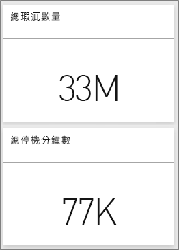
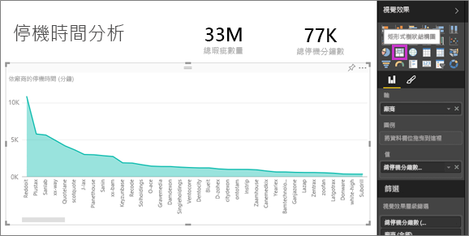
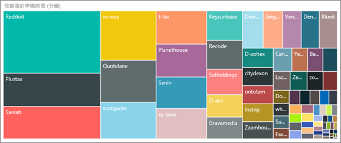
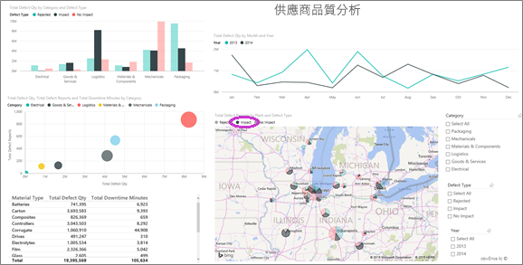
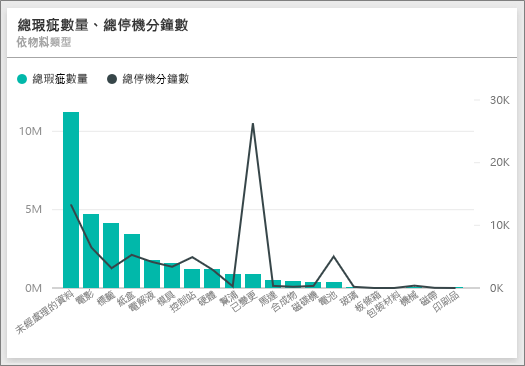
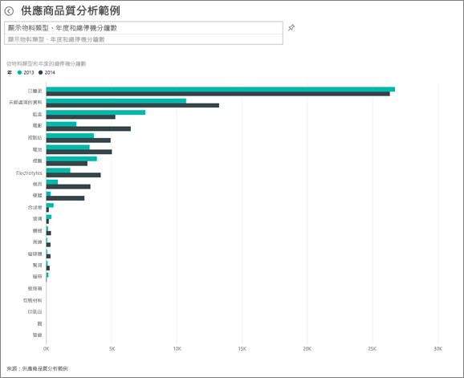
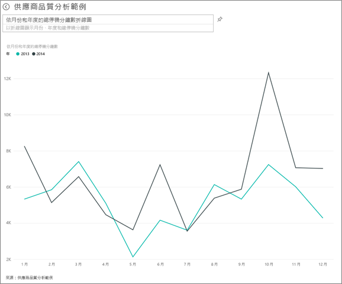

# Power BI 的供應商品質分析範例：導覽

## 供應商品質分析範例的簡要概觀
這個產業範例的儀表板和基礎報表，著重在傳統供應鏈的其中一項挑戰 — 供應商品質的分析。
有兩個主要的計量會在此分析中發揮作用：缺失總數和缺失所造成的停工期總計。 此範例有兩個主要目標：

* 了解就品質而言，哪家供應商最好，而哪家供應商最差
* 找出哪些工廠在找出及淘汰瑕疵品的工作表現較佳，以縮短停工時間

此範例是系列中的一部分，該系列說明您可如何使用 Power BI 的商業導向資料、報表及儀表板。
此為來自 obviEnce 的匿名真實資料 ([www.obvience.com](http://www.obvience.com/))。

## 先決條件

 您必須先將範例下載為[內容套件](https://docs.microsoft.com/en-us/power-bi/sample-supplier-quality#get-the-content-pack-for-this-sample)、[.pbix 檔案](http://download.microsoft.com/download/8/C/6/8C661638-C102-4C04-992E-9EA56A5D319B/Supplier-Quality-Analysis-Sample-PBIX.pbix)或 [Excel 活頁簿](http://go.microsoft.com/fwlink/?LinkId=529779)，才能使用範例。

### 取得此範例的內容套件

1. 開啟 Power BI 服務 (app.powerbi.com) 並登入。
2. 在左下角選取 [取得資料]。
   
    
3. 在顯示的 [取得資料] 頁面上，選取 [範例]。
   
   
4. 選取 [供應商品質分析範例]，然後選擇 [連線]。  
  
   
   
5. Power BI 會匯入內容套件，並將新的儀表板、報表及資料集新增到您目前的工作區。 新的內容會以黃色星號標示。 
   
   
  
### 取得此範例的 .pbix 檔案

或者，您可以下載此範例為 .pbix 檔案，其設計目的是要用於 Power BI Desktop。 

 * [供應商品質分析範例](http://download.microsoft.com/download/8/C/6/8C661638-C102-4C04-992E-9EA56A5D319B/Supplier-Quality-Analysis-Sample-PBIX.pbix)

### 取得此範例的 Excel 活頁簿
您也可以[只下載此範例的資料集 (Excel 活頁簿)](http://go.microsoft.com/fwlink/?LinkId=529779)。 活頁簿包含的 Power View 工作表可供您檢視及修改。 若要查看未經處理的資料，請選取 [Power Pivot] > [管理]。

## 用料瑕疵所造成的停工時間
讓我們來分析用料瑕疵所造成的停工時間並查看應由哪些廠商負責。  

1. 在儀表板中，選取 [瑕疵品總數]  數字圖格或 [停工時間總分鐘數]  數字圖格。  

     

   [供應商品質分析範例] 報表即會開啟 [停工時間分析] 頁面。 請注意我們有 3300 萬個瑕疵品，而這些瑕疵品所造成的停工時間為 77000 分鐘。 雖然有些用料的瑕疵品較少，但因為它們會導致嚴重延誤，亦導致停工時間更長。 讓我們在報表頁面上瀏覽這些項目。  
2. 查看 [依用料類型的瑕疵品和停工時間 (分鐘)]  組合圖中的 [停工時間總分鐘數]  一行，我們發現瓦楞紙用料會導致最多的停工時間。  
3. 選取相同組合圖中的 [瓦楞紙]  資料行，以查看哪些工廠受此瑕疵的影響最大，以及哪些廠商應負責。  

     
4. 選取地圖中的個別工廠，以查看哪家廠商或用料該為這家工廠的停工時間負責。

### 哪家是最差的供應商？
 我們想要找出最差的八家供應商，並決定他們的停工時間百分比責任歸屬。 我們可以將 [依廠商的停工時間 (分鐘)]  區域圖變更為樹狀圖，以進行這項作業。  

1. 在報表的第 3 頁 [停工時間分析] 中，選取左上角的 [編輯報表]  。  
2. 選取 [依廠商的停工時間 (分鐘)]  區域圖，並在 [視覺效果] 窗格中選取 [樹狀圖]。  

     

    樹狀圖會自動將 [廠商]  欄位做為 [群組] 。  

      

   從此樹狀圖中，我們可以看到前八個廠商是樹狀圖左側的八個區塊。 我們也可以發現它們應為約 50% 的停工時間總分鐘數承擔責任。  
3. 選取導覽列頂端的 [供應商品質分析範例]，返回儀表板。

### 比較工廠
現在讓我們來探索哪些工廠有妥善管理瑕疵用料，以確保較短的停工時間。  

1. 選取 [依工廠、瑕疵品類型的總瑕疵報表]  地圖底圖。  

    報表即會開啟 [供應商品質] 分頁。  

     
2. 在地圖圖例中，選取 [影響]  圓形。  

      

    請注意，泡泡圖中的 [物流]  是最糟糕的類別目錄 – 它在瑕疵品總量、總瑕疵報表和停工時間總分鐘數都居最高位置。 讓我們來進一步瀏覽此類別目錄。  
3. 在泡泡圖中選取 [物流] 泡泡，並觀察伊利諾州春田市和內珀維爾市的工廠。 內珀維爾市似乎在管理瑕疵供貨方面做得更好，因為它的退貨量較高，影響量也較小，而春田市的影響量就較大。  

     
4. 選取導覽列頂端的 [供應商品質分析範例]，返回您的使用中工作區。

## 哪種類型的用料管理最佳？
管理最佳的用料類型是指不論瑕疵品數量為何，皆具有最低的停工時間或不造成任何影響的類型。

* 在儀表板上，查看 [依物料類型的瑕疵品總數、瑕疵類型] 磚。

  

請注意 [原料]  的瑕疵品總數很多，但大多數的瑕疵品都會被退貨或不具影響。

讓我們確認儘管瑕疵品數量高，原料仍不會造成大量的停工時間。

* 在儀表板上，查看 [依物料類型的瑕疵品總數、停工時間總分鐘數]  圖格。

  

很顯然，原料受到妥善管理：它們的瑕疵品雖然更多，但停工時間總分鐘數較低。

### 依年度比較瑕疵品與停工時間的關係
1. 選取 [依工廠、瑕疵品類型的總瑕疵報表]  地圖底圖，將報表開啟至第一個報表分頁 [供應商品質]。
2. 請注意，2014 年的 [瑕疵品數量]  比 2013 年高。  

      
3. 瑕疵品多代表停工時間一定也更多嗎？ 我們可以在問與答方塊提問以找出答案。  
4. 選取導覽列頂端的 [供應商品質分析範例]，返回儀表板。  
5. 既然我們知道 [原料] 具有最高數量的瑕疵品，可在問題方塊中輸入：顯示物料類型、年份和瑕疵品總數。  

    2014 年的原料瑕疵品數量比 2013 年高很多。  

      
6. 現在，將問題變更為：顯示物料類型、年份和停工時間總分鐘數。  

   

雖然 2014 年的原料瑕疵品更多，但 2013 年和 2014 年的原料停工時間差不多。

因此，即使 2014 年原料瑕疵品較多，也不會導致 2014 年的原料停工時間更長。

### 依月份比較瑕疵品與停工時間的關係
讓我們看看另一個與瑕疵品總數相關的儀表板圖格。  

1. 選取問題方塊上方左上角的 [上一頁] 箭頭 ，回到儀表板。  

    進一步查看 [依月份、年度的瑕疵品總數]  圖格，可發現 2014 年上半年的瑕疵品數與 2013 年非常接近，但 2014 年下半年瑕疵品數大幅激增。  

      

    我們來看看瑕疵品數的增加是否會導致停工時間分鐘數也跟著增加。  
2. 在問題方塊中輸入：依月份和年份的停工時間總分鐘數折線圖。  

   

   在 6 月和 10 月間，我們發現停工時間分鐘數大增，但除此之外，瑕疵品數並沒有明顯導致更長的停工時間。 這意謂著我們管理瑕疵品的成效很好。  
3. 若要將這個圖表釘選至儀表板，請選取問題方塊右側的釘選圖示 。  
4. 若要瀏覽極端值月份，可提出問題：10 月工廠的停工時間總分鐘數，以依物料類型、工廠地點、類別目錄等查看 10 月的停工時間分鐘數。    
5. 選取問題方塊上方左上角的 [上一頁] 箭頭 ，回到儀表板。

這是安全的作業環境。 您一律可以選擇不儲存變更。 但如果儲存了變更，您也可以隨時移至 [取得資料]  ，重新複製此範例。

## 下一步：連接到您的資料
我們希望本教學已示範 Power BI 儀表板、問與答和報表如何讓您深入了解供應商品質的資料。 現在輪到您了 — 連接到您自己的資料。 您可以透過 Power BI 連接到各式各樣的資料來源。 深入了解[開始使用 Power BI](service-get-started.md).
