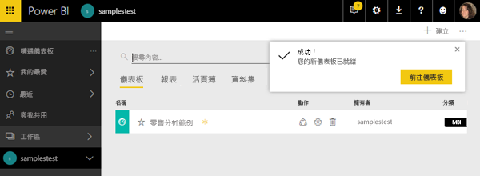
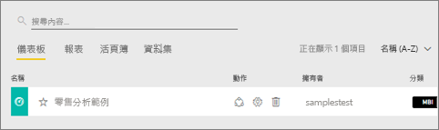

#  連線至 Power BI 服務中的範例

本教學課程將教導您如何： 
- 匯入範例內容套件，將它新增至 Power BI 服務，然後開啟內容。 「內容套件」是一種範例類型，其中資料集會隨附在儀表板及報表中。 
- 在 Power BI Desktop 中開啟範例.pbix 檔案。

如果您想要先多了解一點背景，建議您從 [Power BI 的範例資料集](sample-datasets.md)一文開始著手。 在該文章中，您會了解範例的所有資訊；範例要如何取得、儲存、使用，及各範例可提供的一些案例。 之後，當您掌握到一些基礎時，請返回本教學課程。   

## 先決條件
這些範例適用於 Power BI 服務和 Power BI Desktop。 如果要跟著做，我們將會使用「零售分析」範例。

本教學課程使用的「零售分析」內容套件範例，包含儀表板、報表和資料集。
為了熟悉此特定內容套件和其案例，您可以：[瀏覽零售分析範例](sample-retail-analysis.md)。

## 範例和 Power BI 服務

1. 開啟並登入 Power BI 服務 (app.powerbi.com)。
2. 選取左側瀏覽窗格底部的 [取得資料]  。 如果您看不到 [取得資料]，請選取  展開瀏覽窗格。
   
   
5. 選取 [範例]。  
   
   ![[範例] 按鈕](media/sample-tutorial-connect-to-the-samples/pbi_samplesdownload.png)
6. 選取 [零售分析範例]，然後選擇 [連線]。   
   
   

## 確切來說，會匯入什麼項目？
透過簡單的內容套件，當您選取 [連線] 時，Power BI 實際帶入的是該內容套件的複本，並將其儲存在雲端。 因為內容套件的建立者納入了資料集、報表及儀表板，所以當您按一下 [連線] 時，這就是您會得到的項目。 

1. Power BI 會建立新的儀表板，並將其列在您的 [儀表板] 索引標籤中。會有黃色星號讓您知道這是新的。
   
   
2. 開啟 [報表] 索引標籤。您會在這裡看到名為「零售分析範例」的報表。
   
   ![[零售分析範例] 周圍的紅色方塊和黃色星星](media/sample-tutorial-connect-to-the-samples/power-bi-new-report.png)
   
   接著查看 [資料集] 索引標籤。其中也會有新的資料集。
   
   ![[零售分析範例] 周圍的紅色方塊](media/sample-tutorial-connect-to-the-samples/power-bi-new-dataset.png)

## 探索您的新內容
現在請自行探索儀表板、資料集和報表。 有很多不同方法可以瀏覽到您的儀表板、報表和資料集，而下方僅說明這許多方法的其中一種。  

> [!TIP]
> 想要先進行一點教學嗎？  試試[瀏覽零售分析範例](sample-retail-analysis.md)，以取得本範例的逐步解說。
> 
> 

1. 瀏覽回您的 [儀表板] 索引標籤，然後選取 [零售分析範例] 儀表板加以開啟。    
   
   
2. 儀表板隨即開啟。  其中有多種視覺效果磚。
   
   
3. 選取其中一個磚以開啟基礎報表。  在本例中，我們會選取區域圖 (上一張圖片中有粉紅色外框的部分)。 報表會開啟為包含該區域圖的頁面。
   
    
   
   > [!NOTE]
   > 如果磚是使用 [Power BI 問與答](consumer/end-user-q-and-a.md)所建立，會改為開啟問與答頁面。 如果該磚是[釘選自 Excel](service-dashboard-pin-tile-from-excel.md)，則 Excel Online 將會在 Power BI 中開啟。
   > 
   > 
1. 返回您的 [資料集] 索引標籤，您有多種選項可以探索資料集。  您無法加以開啟及查看所有資料行和資料列 (如同您在 Power BI Desktop 或 Excel 中)。  當有人與同事共用內容套件時，他們通常會想共用深入資訊，而不會把資料的直接存取權提供給同事。 但這不表示您無法探索資料集。  
   
   ![[資料集] 索引標籤](media/sample-tutorial-connect-to-the-samples/power-bi-chart-icon2.png)
   
   * 其中一個探索資料集的方式，是從頭建立您自己的視覺效果及報表。  選取圖表圖示  以報表編輯模式開啟資料集。
     
       
   * 另一個探索資料集的方法是執行[深入資訊摘要](consumer/end-user-insights.md)。 選取省略符號 (...) 並選擇 [取得深入資訊]。 當深入資訊就緒時，請選取 [檢視深入資訊]。
     
       

## 範例和 Power BI Desktop 
當您第一次開啟範例 PBIX 檔案時，它會在 [報表檢視] 中顯示，以供您搭配視覺效果探索、建立及修改任何數量的報表頁面。 [報表檢視] 所提供的設計體驗，大致上與 Power BI 服務中報表的 [編輯檢視] 類似。 您可以在回處移動、複製及貼上、合併其中的視覺效果等等。

之間唯一的差別是使用 Power BI Desktop 時，您可以處理您的查詢及建立資料模型，讓資料在報表中能夠提供最透徹的深入剖析資訊。 您可以將 Power BI Desktop 檔案儲存在任何位置，無論是本機磁碟機或雲端。

1. 在 Power BI Desktop 中開啟[零售分析範例 .pbix 檔案](http://download.microsoft.com/download/9/6/D/96DDC2FF-2568-491D-AAFA-AFDD6F763AE3/Retail%20Analysis%20Sample%20PBIX.pbix)。 

    

1. 檔案會在 [報表檢視] 中開啟。 是否有注意到位於報表編輯器底部的 4 個索引標籤？ 這表示此報表中有 4 個頁面，且目前選取的是 [New Stores] \(新門市\) 頁面。 

    ![底端索引標籤和已醒目提示 [New Stores] \(新門市\) 的特寫](media/sample-tutorial-connect-to-the-samples/power-bi-sample-tabs.png).

3. 若要深入了解報表編輯器，請參閱[報表編輯器導覽](service-the-report-editor-take-a-tour.md)

## 確切來說，會匯入什麼項目？
當您在 Desktop 中開啟範例 PBIX 檔案時，Power BI 實際上是帶入該資料的複本，並為您將它儲存在雲端。 您可以從 Desktop 存取該報表***和其基礎資料集***。 當資料載入之後，Power BI Desktop 會嘗試為您尋找及建立關聯性。  

1. 選取資料表圖示  以切換至[資料檢視](desktop-data-view.md)。
 
    

    [資料檢視] 可協助您檢查、瀏覽及了解 Power BI Desktop 模型中的資料。 它與您在 [查詢編輯器] 中檢視資料表、資料行和資料的方式不同。 透過 [資料檢視]，您看到的是載入模型之後的資料。

    當您建立資料模型時，有時會想要在報表畫布上沒有建立視覺效果的情況下，查看資料表或資料行中的實際內容，通常會查看到資料列層級。 特別是當您要建立量值和導出資料行，或需要識別資料類型或資料類別時。

1. 選取圖示  以切換至[關聯性檢視](desktop-relationship-view.md)。
 
    

    [關聯性檢視] 會顯示模型中的所有資料表、資料行及關聯性。 您可以從這裡檢視、變更及建立關聯性。

## 探索您的新內容
現在請自行探索資料集、關聯性和報表。 如需開始使用的說明，請瀏覽 [Desktop 使用者入門指南](desktop-getting-started.md)。    

## 後續步驟
[Power BI 基本概念](consumer/end-user-basic-concepts.md)

[Power BI 服務範例](sample-datasets.md)

[Power BI 的資料來源](service-get-data.md)

有其他問題嗎？ [試試 Power BI 社群](http://community.powerbi.com/)

