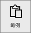
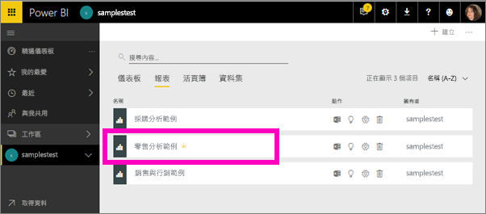
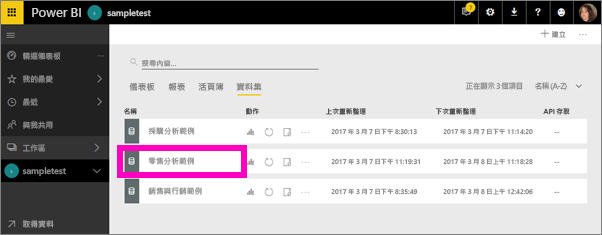
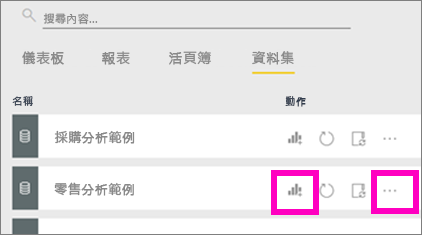

# Power BI 範例，即教學課程
<!-- Shared newnav Include -->
[!INCLUDE [newnavbydefault](./includes/newnavbydefault.md)]

建議您從 [Power BI 的範例資料集](sample-datasets.md)一文開始。 在該文章中，您會了解範例的所有資訊；範例要如何取得、儲存、使用，及各範例可提供的一些案例。 之後，當您掌握到一些基礎時，請返回本教學課程。   

## 關於本教學課程
本教學課程會教您如何匯入範例內容套件、將其新增至 Power BI 服務，以及開啟內容。 「內容套件」是一種範例類型，其中資料集會隨附在儀表板及報表中。 使用 [取得資料] 即可從 Power BI 內取得這些內容套件範例。

> [!NOTE]
> 本教學課程適用於 Power BI 服務，不適用於 Power BI Desktop。
> 
> 

本教學課程使用的「零售分析」內容套件範例，包含儀表板、報表和資料集。
為了熟悉此特定內容套件和其案例，您可以：[瀏覽零售分析範例](sample-retail-analysis.md)。

## 取得資料 (在此情況下是取得範例內容套件)
1. 開啟並登入 Power BI 服務 (app.powerbi.com)。
2. 選取工作區並建立新的儀表板。  
   
    
3. 將其命名為**零售分析範例**。
   
   
4. 選取左側瀏覽窗格底部的 [取得資料] 。 如果您沒有看到 [取得資料]，請選取  展開瀏覽窗格。
   
   
5. 選取 [範例]。  
   
   
6. 選取 [零售分析範例]，然後選擇 [連線]。   
   
   

## 確切來說，會匯入什麼項目？
透過簡單的內容套件，當您選取 [連線] 時，Power BI 實際帶入的是該內容套件的複本，並將其儲存在雲端。 因為內容套件的建立者納入了資料集、報表及儀表板，所以當您按一下 [連線] 時，這就是您會得到的項目。

1. Power BI 會建立新的儀表板，並將其列在您的 [儀表板] 索引標籤中。會有黃色星號讓您知道這是新的。
   
   
2. 開啟 [報表] 索引標籤。您會在這裡看到名為「零售分析範例」的報表。
   
   
   
   接著查看 [資料集] 索引標籤。其中也會有新的資料集。
   
   

## 探索您的新內容
現在請自行探索儀表板、資料集和報表。 有很多不同方法可以瀏覽到您的儀表板、報表和資料集，而下方僅說明這許多方法的其中一種。  

> [!TIP]
> 想要先進行一點教學嗎？  試試[瀏覽零售分析範例](sample-retail-analysis.md)，以取得本範例的逐步解說。
> 
> 

1. 瀏覽回您的 [儀表板] 索引標籤，然後選取 [零售分析範例] 儀表板加以開啟。    
   
   
2. 儀表板隨即開啟。  其中有多種視覺效果磚。
   
   
3. 選取其中一個磚以開啟基礎報表。  在本例中，我們會選取區域圖 (上一張圖片中有粉紅色外框的部分)。 報表會開啟為包含該區域圖的頁面。
   
    
   
   > [!NOTE]
   > 如果磚是使用 [Power BI 問與答](service-q-and-a.md)所建立，會改為開啟問與答頁面。
   > 
   > 
4. 返回您的 [資料集] 索引標籤，您有多種選項可以探索資料集。  您無法加以開啟及查看所有資料行和資料列 (如同您在 Power BI Desktop 或 Excel 中)。  當有人與同事共用內容套件時，他們通常會想共用深入資訊，而不會把資料的直接存取權提供給同事。 但這不表示您無法探索資料集。  
   
   
   
   * 其中一個探索資料集的方式，是從頭建立您自己的視覺效果及報表。  選取圖表圖示 ，在報表編輯模式中開啟資料集。
     
       
   * 另一個探索資料集的方法是執行[深入資訊摘要](service-insights.md)。 選取省略符號 (...) 並選擇 [取得深入資訊]。 當深入資訊就緒時，請選取 [檢視深入資訊]。
     
       

## 後續步驟
[Power BI 基本概念](service-basic-concepts.md)

[Power BI 服務範例](sample-datasets.md)

[Power BI 的資料來源](service-get-data.md)

有其他問題嗎？ [試試 Power BI 社群](http://community.powerbi.com/)

