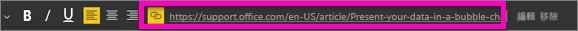
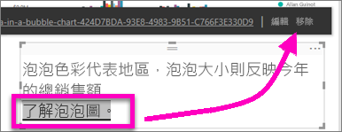

# 將超連結加入報表中的文字方塊
文字方塊可以加入報表、從報表釘選到儀表板，並直接加入儀表板。 可以將超連結加入文字方塊中，不論其所在的位置。  

> **注意**：如需 Power BI 資料表和矩陣中的超連結相關資訊，請參閱[資料表中的超連結](power-bi-hyperlinks-in-tables.md)。 如需將文字方塊新增至**儀表板**的資訊，請參閱[從儀表板直接新增磚](service-dashboard-add-widget.md)。 
> 
> 

<iframe width="560" height="315" src="https://www.youtube.com/embed/_3q6VEBhGew#t=0m55s" frameborder="0" allowfullscreen></iframe>

## 將超連結加入報表中的文字方塊
1. [建立一個文字方塊並加入一些文字](power-bi-reports-add-text-and-shapes.md)。 
2. 醒目提示現有的文字，或新增要做為超連結的文字。
   
   
3. 選取超連結圖示。
4. 在超連結欄位中，輸入或貼上的 URL 並選取 [完成] 。
   
   
5. 測試連結。  
   
   
   
   * 將游標放在反白顯示的文字中的任意處以顯示 URL。  
     
      
   * 選取 URL 以在新瀏覽器視窗中開啟頁面。

## 若要移除超連結，但保留文字
1. 在文字方塊中，選取超連結以將它反白顯示。
   
     
2. 選擇 [移除]。 

## 後續步驟
[Power BI 報表中的文字方塊](power-bi-reports-add-text-and-shapes.md)

有其他問題嗎？ [試試 Power BI 社群](http://community.powerbi.com/)

