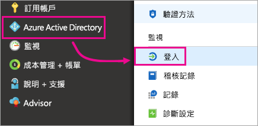
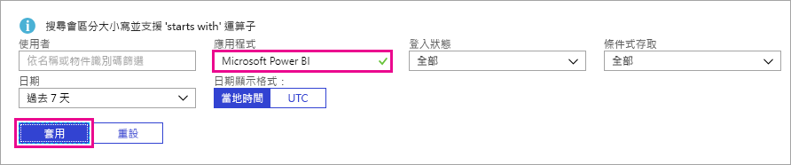

# 尋找已登入的 Power BI 使用者
如果您是租用戶系統管理員，而且想要查看誰已登入 Power BI，可以使用 Azure Active Directory 存取和使用情況報告來了解情形。

<iframe width="640" height="360" src="https://www.youtube.com/embed/1AVgh9w9VM8?showinfo=0" frameborder="0" allowfullscreen></iframe>

您可以在[新的](https://docs.microsoft.com/azure/active-directory/active-directory-reporting-activity-sign-ins)和[傳統](https://docs.microsoft.com/azure/active-directory/active-directory-view-access-usage-reports) Azure Active Directory (Azure AD) 入口網站內存取活動報告。 雖然上面的影片以傳統入口網站為例，但本文將以新的入口網站為主。

> [!NOTE]
> 此活動報告包含 Power BI (免費) 和專業使用者，但不會依他們擁有的授權來加以識別。
> 
> 

## 需求
以下是檢視登入活動報告的需求。

* 具有全域管理員、安全性系統管理員或安全性讀取者角色的使用者可以存取資料。
* 任何使用者 (非系統管理員) 都能可以存取自己的登入。
* 您的租用戶必須有相關聯的 Azure AD Premium 授權，才能查看所有登入活動報告。

## 使用 Azure 入口網站來檢視登入
您可以使用 Azure AD 入口網站來檢視登入活動。

1. 瀏覽至 **Azure 入口網站**，然後選取 [Azure Active Directory]。
2. 在 [活動] 下，選取 [登入]。
   
    
3. 依 [Microsoft Power BI] 或 [Power BI Gateway] 來篩選應用程式，然後選取 [套用]。
   
    **Microsoft Power BI** 適用於與服務相關的登入活動，而 **Power BI Gateway** 是內部部署資料閘道的特定登入。
   
    

## 匯出資料
匯出登入資料有兩種方式。 下載 csv 檔案或使用 PowerShell。

### 下載 csv
在 [活動] 畫面中，您可以在工具列選取 [下載]。 這會下載目前篩選之資料的 csv 檔案。

### PowerShell
您可以使用 PowerShell 匯出登入資料。 Azure AD 文件集內有一個[範例](https://docs.microsoft.com/azure/active-directory/active-directory-reporting-api-sign-in-activity-samples#powershell-script)。

> [!NOTE]
> 為了讓 PowerShell 範例運作，請務必遵循[存取 Azure AD 報告 API 的必要條件](https://docs.microsoft.com/azure/active-directory/active-directory-reporting-api-prerequisites)。
> 
> 

## 資料保留
登入相關的資料最多保留 30 天。 如需詳細資訊，請參閱 [Azure Active Directory 報告保留原則](https://docs.microsoft.com/azure/active-directory/active-directory-reporting-retention)。

## 後續步驟
[Azure Active Directory 入口網站 (新的入口網站) 中的登入活動報告](https://docs.microsoft.com/azure/active-directory/active-directory-reporting-activity-sign-ins)  
[檢視您的存取和使用情況報告 (傳統入口網站)](https://docs.microsoft.com/azure/active-directory/active-directory-view-access-usage-reports#view-or-download-a-report)  
[登入範例 PowerShell 指令碼](https://docs.microsoft.com/azure/active-directory/active-directory-reporting-api-sign-in-activity-samples#powershell-script)  
[Azure Active Directory 報告保留原則](https://docs.microsoft.com/azure/active-directory/active-directory-reporting-retention)  
[在組織內使用稽核](service-admin-auditing.md)  
[Pro 延長試用版啟用](service-extended-pro-trial.md)

有其他問題嗎？ [嘗試在 Power BI 社群提問](https://community.powerbi.com/)

