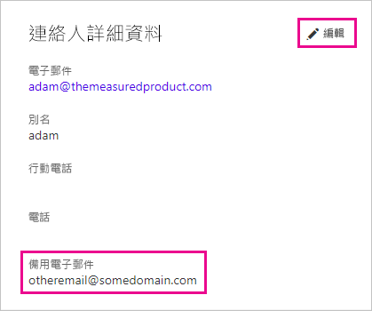

# <a name="using-an-alternate-email-address"></a>使用備用電子郵件地址
預設會使用您用來註冊 Power BI 的電子郵件地址，來傳送有關 Power BI 中活動的更新給您。  例如，當有人傳送共用邀請給您時，便會傳送至這個地址。

有時候，您可能會想要將這些電子郵件傳送至替代電子郵件地址，而不是原先用來註冊 Power BI 的電子郵件地址。

## <a name="updating-through-office-365-personal-info-page"></a>透過 Office 365 個人資訊頁面更新
1. 前往您的 [Office 365 個人資訊頁面](https://portal.office.com/account/#personalinfo)。  如果出現提示，請以您用於 Power BI 的電子郵件地址和密碼進行登入。
2. 按一下 [連絡人詳細資料] 區段中的 [編輯] 連結。  
   
   > [!NOTE]
   > 如果看不到 [編輯] 連結，表示您的電子郵件地址是由 Office 365 系統管理員所管理，因此您需要與其連絡以更新電子郵件地址。
   > 
   > 
   
   
3. 在 [替代電子郵件] 欄位中，輸入您想要收到 Power BI 更新的電子郵件地址。

> [!NOTE]
> 變更這項設定不會影響用來傳送服務更新、電子報和其他促銷通訊的電子郵件地址。  這些項目一律會傳送至您原本用來註冊 Power BI 的電子郵件地址。
> 
> 

## <a name="updating-with-powershell"></a>透過 PowerShell 更新
您也可以透過適用於 Azure Active Directory 的 PowerShell 來更新備用電子郵件地址。 做法是使用 [Set-AzureADUser](https://docs.microsoft.com/powershell/module/azuread/set-azureaduser) 命令。

```
Set-AzureADUser -ObjectId john@contoso.com -OtherMails "otheremail@somedomain.com"
```

如需詳細資訊，請參閱 [Azure Active Directory PowerShell Version 2](https://docs.microsoft.com/powershell/azure/active-directory/install-adv2) (Azure Active Directory PowerShell 版本 2)。

有其他問題嗎？ [試試 Power BI 社群](http://community.powerbi.com/)

