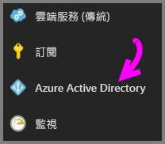
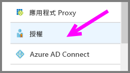
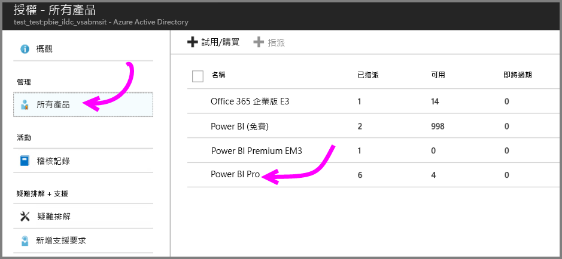
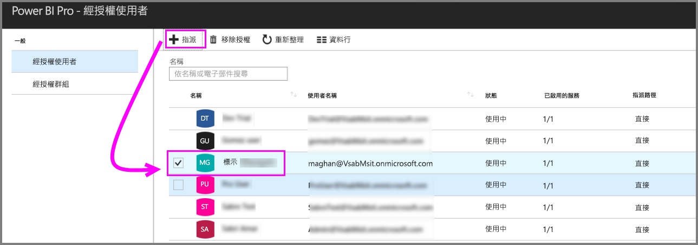

# 快速入門：在 Azure 中指派 Power BI Pro 授權

Power BI Pro 是個別的授權，允許存取 Power BI 服務中的所有內容和功能，包括能與其他 Pro 使用者分享內容和共同作業。 只有 Pro 使用者能將內容發行到應用程式工作區、從應用程式工作區中取用內容、共用儀表板，以及訂閱儀表板和報表。 本文說明如何在 Azure 中指派 Power BI Pro 授權。 您也可以[在 Office 365 中指派授權](service-admin-assigning-power-bi-pro-licenses.md)。

## 先決條件

針對 Power BI 用於 Active Directory 查詢的 Azure 訂用帳戶，您必須是訂用帳戶的擁有者。

在開始之前，您必須[購買至少一個授權](service-admin-purchasing-power-bi-pro.md)。

## 將授權指派給個別使用者帳戶

按照以下步驟操作，將 Power BI Pro 授權指派給個別使用者帳戶：

1. 開啟 [Azure 入口網站](https://ms.portal.azure.com/#@microsoft.onmicrosoft.com/dashboard/private/39bc3cf7-31a4-43f6-954c-f2d69ca2f0)。 

2. 在左側的導覽列中，選取 [Azure Active Directory]。

    

3. 在 [Azure Active Directory] 下方，選取 [授權]。

    

4. 在 [授權] 下方，選取 [所有產品]，然後選取 [Power BI Pro] 以顯示已授權使用者的清單。

    

5. 選取 [指派] 將 Power BI Pro 授權新增至其他使用者帳戶。

    

## 後續步驟

您現在已經指派授權，接著可以深入了解 Power BI Pro。

[組織的 Power BI Pro](service-admin-power-bi-pro-in-your-organization.md)

[尋找已登入的 Power BI 使用者](service-admin-access-usage.md)

有其他問題嗎？ [嘗試在 Power BI 社群提問](https://community.powerbi.com/)