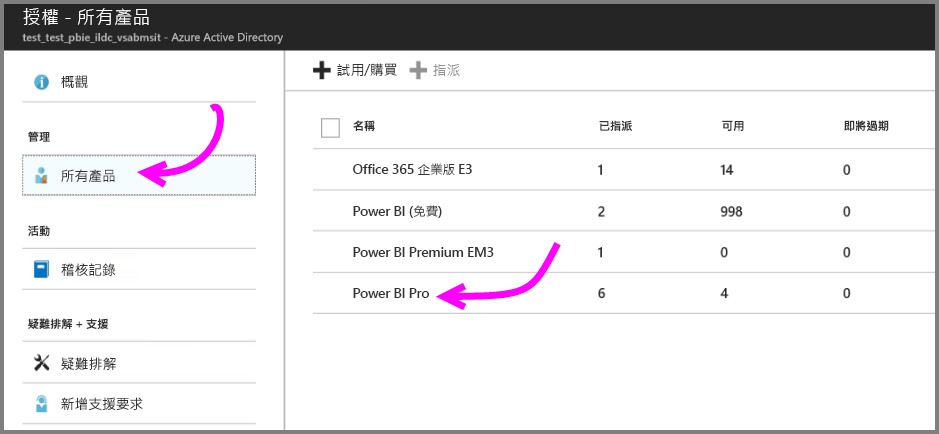
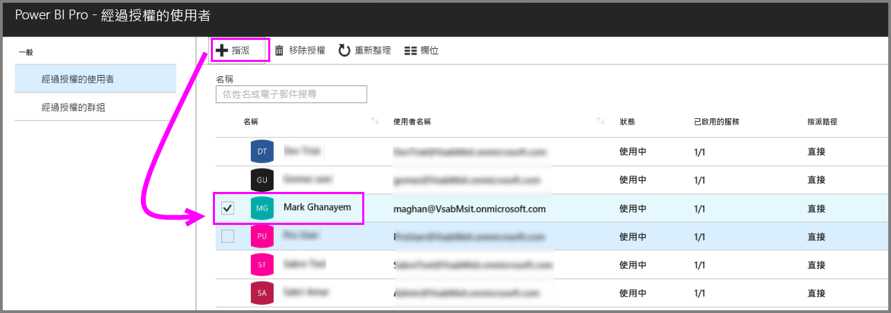
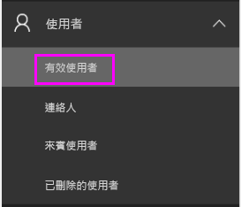
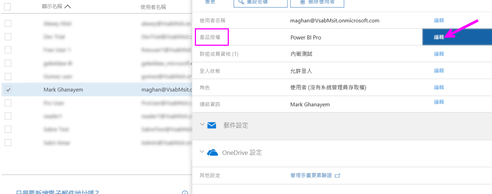
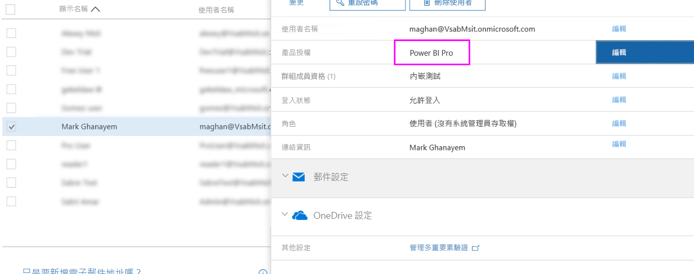

# 指派 Power BI Pro 授權

系統管理員可從各種管理入口網站和 PowerShell Cmdlet 中進行選擇，將 Power BI Pro 授權指派給使用者。 Power BI 授權管理受到 Azure Active Directory (Azure AD) 的支援。

* Azure 訂用帳戶擁有者可以使用 [Azure 入口網站](https://ms.portal.azure.com/#@microsoft.onmicrosoft.com/dashboard/private/39bc3cf7-31a4-43f6-954c-f2d69ca2f0)中的 [Azure Active Directory] 刀鋒視窗。 

* 全域管理員和使用者帳戶管理員可以使用 [Office 365 系統管理中心](https://portal.office.com/AdminPortal/Home#/homepage)。

## 在 Azure 入口網站中管理 Power BI Pro 授權

Power BI 使用 Azure AD 作為基礎服務。 Azure AD 會儲存使用者帳戶和群組，同時儲存所購買產品之相關資訊等其他設定。

### 將授權指派給個別使用者帳戶

如果您是 Azure 訂用帳戶擁有者，請執行下列步驟，將 Pro 授權指派給個別使用者帳戶：

1. 巡覽至 [Azure 入口網站](https://ms.portal.azure.com/#@microsoft.onmicrosoft.com/dashboard/private/39bc3cf7-31a4-43f6-954c-f2d69ca2f0)。 

2. 在左導覽列中，按一下 [Azure Active Directory]。

    

3. 在 [Azure Active Directory] 刀鋒視窗上，按一下 [授權]。

    

4. 在 [授權] 刀鋒視窗上，按一下 [所有產品]，然後按一下 [Power BI Pro] 以顯示授權使用者清單。

    

5. 按一下 [指派]，將 Power BI Pro 授權新增至其他使用者帳戶。

    

> [!NOTE]
> 雖然可管理大多數授權層面，但無法在 Azure 入口網站中購買 Power BI Pro 授權。 請使用 Office 365 系統管理中心來購買 Power BI Pro 訂閱。 如需詳細資訊，請參閱[購買 Power BI Pro](https://docs.microsoft.com/en-us/power-bi/service-admin-purchasing-power-bi-pro)。
>

## 在 Office 365 系統管理中心管理 Power BI Pro 授權

如果您是全域管理員，則 Office 365 系統管理中心會是您購買 Power BI Pro 訂閱並為組織管理相關聯授權的位置。

如果您是 Office 365 系統管理員，請執行下列步驟，將 Pro 授權指派給個別使用者帳戶：

1. 瀏覽至 Office 365 系統管理中心。

2. 在左側瀏覽窗格中，展開 [使用者]，然後按一下 [作用中使用者]。

    

3. 選取一或多個使用者，然後按一下 [編輯產品授權]。

    

4. 在 Power BI Pro 下，將設定切換至 [開啟]，然後按一下 [儲存]。

    

5. 在所選帳戶的 [狀態] 下，確認已成功指派 Power BI Pro 授權。

    

> [!NOTE]
> 如果您的訂閱已用完授權，請展開左側瀏覽窗格中的 [計費]，然後按一下 [訂閱]，以新增更多授權。 在 [訂閱] 頁面上，選取 Power BI Pro 訂閱，然後按一下 [新增/移除授權]。
>

## 後續步驟
[組織的 Power BI Pro](service-admin-power-bi-pro-in-your-organization.md)
 
[Pro 延長試用版啟用](service-extended-pro-trial.md)
 
[個人使用者適用的 Power BI 服務合約](https://powerbi.microsoft.com/terms-of-service/)
 
[Power BI Premium 宣告](https://aka.ms/pbipremium-announcement)
 
[尋找已登入的 Power BI 使用者](service-admin-access-usage.md)

有其他問題嗎？ [嘗試在 Power BI 社群提問](https://community.powerbi.com/)