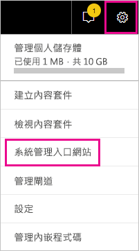
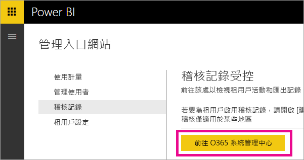
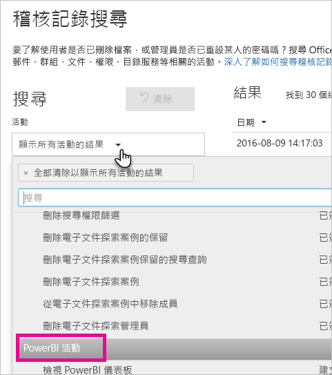
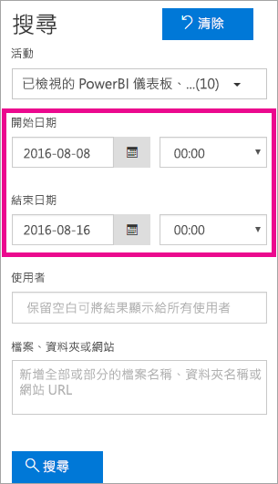
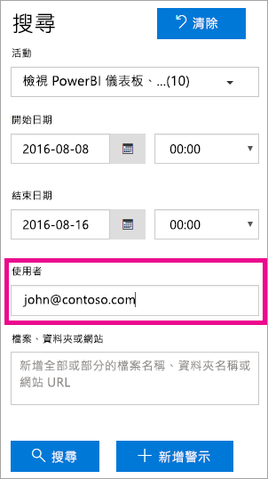
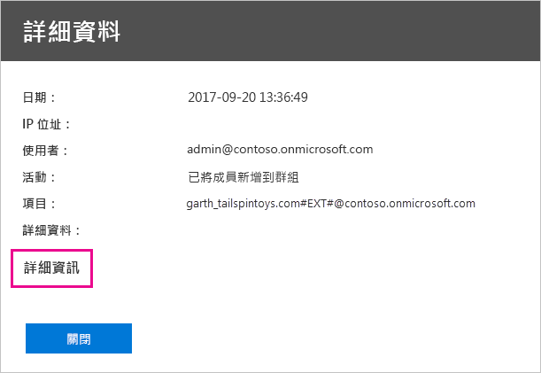
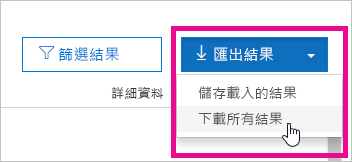

# <a name="using-auditing-within-your-organization"></a>在組織內使用稽核

了解誰正在對 Power BI 租用戶的哪個項目採取什麼動作，可能對於幫助貴組織符合其需求，例如符合法規合規性與記錄管理等而言極為重要。 使用 Power BI 稽核來稽核使用者執行的動作，例如 [檢視報表] 與 [檢視儀表板]。 您無法使用稽核來稽核權限。

您可以在 Office 365 安全性與合規性中心使用稽核，或使用 PowerShell 來執行。 我們在此文章中針對兩種方式皆有說明。 您可以依日期範圍、使用者、儀表板、報表、資料集和活動類型來篩選稽核資料。 您也可以用 csv (逗號分隔值) 檔案下載活動以便離線分析。

## <a name="requirements"></a>需求

您必須符合這些需求才能存取稽核記錄：

- 若要存取 Office 365 安全性與合規性中心的稽核區段，您必須具有 Exchange Online 授權 (隨附於 Office 365 Enterprise E3 和 E5 訂用帳戶)。

- 您必須是全域管理員或擁有 Exchange 管理員角色，才能提供稽核記錄的存取權。 Exchange 管理員角色是透過 Exchange 管理中心控制。 如需詳細資訊，請參閱 [Exchange Online 中的權限](/exchange/permissions-exo/permissions-exo/)。

- 如果您有稽核記錄的存取權，但並不是全域管理員或 Power BI 服務管理員，您將無法存取 Power BI 管理入口網站。 在此情況下，您必須取得 [Office 365 安全性與合規性中心](https://sip.protection.office.com/#/unifiedauditlog)的直接連結。

- 若要檢視租用戶中的 Power BI 稽核記錄，您的租用戶中至少必須有一個 Exchange 信箱的授權。

## <a name="accessing-your-audit-logs"></a>存取您的稽核記錄

若要存取記錄，請先確認是否已在 Power BI 中啟用記錄功能。 如需詳細資訊，請參閱系統管理入口網站文件中的[稽核記錄](service-admin-portal.md#audit-logs)。 啟用稽核到能夠檢視稽核資料之間，有最多 48 小時的延遲。 若您未立即看到資料，請稍候再查看稽核記錄。 取得檢視稽核記錄的權限，以及能夠存取記錄的延遲可能相近。

Power BI 稽核記錄可直接透過 [Office 365 安全性與合規性中心](https://sip.protection.office.com/#/unifiedauditlog)取得。 此外，也有 Power BI 系統管理入口網站的連結：

1. 在 Power BI 中，選取右上角的**齒輪圖示**，然後選取 [管理入口網站]。

   

1. 選取 [稽核記錄]。

1. 選取 [前往 O365 系統管理中心]。

   

若要提供非系統管理員帳戶存取稽核記錄的權限，您必須在 Exchange Online 系統管理中心中指派權限。 比方說，您可將使用者指派至現有的角色群組，例如組織管理，或者使用稽核記錄角色建立新的角色群組。 如需詳細資訊，請參閱 [Exchange Online 中的權限](/exchange/permissions-exo/permissions-exo/)。

## <a name="search-only-power-bi-activities"></a>僅搜尋 Power BI 活動

您可以依照下列步驟將結果限制在僅 Power BI 活動。 如需活動清單，請參閱此文章稍後的[已由 Power BI 稽核的活動清單](#list-of-activities-audited-by-power-bi)。

1. 在 [稽核記錄搜尋] 頁面上，從 [搜尋] 下選取 [活動] 下拉式清單。

2. 選取 [Power BI 活動]。

   

3. 在選取方塊外面任何地方選取，將它關閉。

您的搜尋現在已篩選為僅限 Power BI 活動。

## <a name="search-the-audit-logs-by-date"></a>依日期搜尋稽核記錄

您可以使用 [開始日期] 與 [結束日期] 欄位，依日期範圍搜尋記錄。 預設會選取過去七天。 日期和時間是以國際標準時間 (UTC) 格式顯示。 您可以指定的最大日期範圍是 90 天。 

如果選定的日期範圍超過 90 天，則會顯示錯誤。 如果您使用最大的 90 天日期範圍，請選取目前時間作為 [開始日期]。 否則，您會收到錯誤，指出開始日期早於結束日期。 如果您已在過去 90 天內開啟稽核，日期範圍開始日期不能在開啟稽核的日期之前。



## <a name="search-the-audit-logs-by-users"></a>依使用者搜尋稽核記錄

您可以搜尋特定使用者所執行活動的稽核記錄項目。 若要這樣做，請在 [使用者] 欄位中輸入一或多個使用者名稱。 使用者名稱看起來像電子郵件地址；這是使用者用來登入 Power BI 的帳戶。 將此方塊保留空白，可傳回貴組織所有使用者 (和服務帳戶) 的項目。



## <a name="view-search-results"></a>檢視搜尋結果

選取 [搜尋] 之後，搜尋結果會載入，並在一段時間後顯示在 [結果] 下。 搜尋完成後時，會顯示找到的結果數目。 會顯示最多 1000 個事件；如果超過 1000 個事件符合搜尋準則，則會顯示最新的 1000 個事件。

### <a name="view-the-main-results"></a>檢視主要結果

[結果] 區域是由搜尋所傳回之每個事件的下列資訊所組成。 選取 [結果] 下的欄標題以排序結果。

| **資料行** | **定義** |
| --- | --- |
| 日期 |發生事件時的日期和時間 (UTC 格式)。 |
| IP 位址 |記錄活動時所用裝置的 IP 位址。 IP 位址會以 IPv4 或 IPv6 位址格式顯示。 |
| 使用者 |執行觸發事件之動作的使用者 (或服務帳戶)。 |
| 活動 |使用者所執行的活動。 這個值對應至您在 [活動] 下拉式清單中選取的活動。 對於來自 Exchange 系統管理員稽核記錄的事件，此資料行中的值會是 Exchange Cmdlet。 |
| 項目 |因為對應活動而建立或修改的物件。 例如，被檢視或修改的檔案，或是被更新的使用者帳戶。 並非所有活動在此資料行中都有值。 |
| 詳細資料 |關於活動的其他詳細資料。 同樣地，並非所有活動都有值。 |

### <a name="view-the-details-for-an-event"></a>檢視事件的詳細資料

您可以透過按一下搜尋結果清單中的事件記錄，來檢視事件的詳細資料。 [詳細資料] 頁面隨即出現，其中包含事件記錄的詳細屬性。 所顯示的屬性取決於發生事件的 Office 365 服務。 

若要顯示這些詳細資料，請選取 [更多資訊]。 所有 Power BI 項目的 RecordType 屬性值都是 20。 如需有關其他屬性的詳細資訊，請參閱[稽核記錄中的詳細屬性](/office365/securitycompliance/detailed-properties-in-the-office-365-audit-log/)。

   

## <a name="export-search-results"></a>匯出搜尋結果

若要將 Power BI 稽核記錄匯出至 csv 檔案，請依照下列步驟執行。

1. 選取 [匯出結果]。

1. 選取 \[Save loaded results] \(儲存載入結果) 或 \[Download all results] \(下載所有結果)。

    

## <a name="use-powershell-to-search-audit-logs"></a>使用 PowerShell 來搜尋稽核記錄

您也可以使用 PowerShell，依據您的登入存取稽核記錄。 下列範例顯示如何使用 [Search-UnifiedAuditLog](/powershell/module/exchange/policy-and-compliance-audit/search-unifiedauditlog?view=exchange-ps/) 命令來提取 Power BI 稽核記錄項目。

若要使用 [New-PSSession](/powershell/module/microsoft.powershell.core/new-pssession/) 命令，您的帳戶需要獲指派 Exchange Online 授權，而且您需要存取租用戶的稽核記錄。 如需如何連線至 Exchange Online 的詳細資訊，請參閱[連線至 Exchange Online PowerShell](/powershell/exchange/exchange-online/connect-to-exchange-online-powershell/connect-to-exchange-online-powershell/)。

```powershell
Set-ExecutionPolicy RemoteSigned

$UserCredential = Get-Credential

$Session = New-PSSession -ConfigurationName Microsoft.Exchange -ConnectionUri https://outlook.office365.com/powershell-liveid/ -Credential $UserCredential -Authentication Basic -AllowRedirection

Import-PSSession $Session
Search-UnifiedAuditLog -StartDate 9/11/2018 -EndDate 9/15/2018 -RecordType PowerBI -ResultSize 1000 | Format-Table | More
```

如需搭配稽核記錄使用 PowerShell 的另一個範例，請參閱[使用 Power BI 稽核記錄與 PowerShell 來指派 Power BI Pro 授權](https://powerbi.microsoft.com/blog/using-power-bi-audit-log-and-powershell-to-assign-power-bi-pro-licenses/) \(英文\)。

## <a name="activities-audited-by-power-bi"></a>由 Power BI 稽核的活動

下列活動是由 Power BI 稽核。

| 易記名稱                                     | 作業名稱                              | 注意                                  |
|---------------------------------------------------|---------------------------------------------|------------------------------------------|
| 已將資料來源新增至 Power BI 閘道             | AddDatasourceToGateway                      |                                          |
| 已新增 Power BI 資料夾存取權                      | AddFolderAccess                             | 目前未使用                       |
| 已新增 Power BI 群組成員                      | AddGroupMembers                             |                                          |
| 系統管理員已將資料流程儲存體帳戶連結至租用戶 | AdminAttachedDataflowStorageAccountToTenant | 目前未使用                       |
| 已分析 Power BI 資料集                         | AnalyzedByExternalApplication               |                                          |
| 已分析 Power BI 報表                          | AnalyzeInExcel                              |                                          |
| 已將 Power BI 資料集繫結至閘道                | BindToGateway                               |                                          |
| 已變更容量狀態                            | ChangeCapacityState                         |                                          |
| 已變更容量使用者指派                  | UpdateCapacityUsersAssignment               |                                          |
| 已變更 Power BI 資料集連線              | SetAllConnections                           |                                          |
| 已變更 Power BI 閘道管理員                   | ChangeGatewayAdministrators                 |                                          |
| 已變更 Power BI 閘道資料來源使用者        | ChangeGatewayDatasourceUsers                |                                          |
| 已建立組織 Power BI 內容套件      | CreateOrgApp                                |                                          |
| 已建立 Power BI 應用程式                              | CreateApp                                   |                                          |
| 已建立 Power BI 儀表板                        | CreateDashboard                             |                                          |
| 已建立 Power BI 資料流程                         | CreateDataflow                              |                                          |
| 已建立 Power BI 資料集                          | CreateDataset                               |                                          |
| 已建立 Power BI 電子郵件訂用帳戶               | CreateEmailSubscription                     |                                          |
| 已建立 Power BI 資料夾                           | CreateFolder                                |                                          |
| 已建立 Power BI 閘道                          | CreateGateway                               |                                          |
| 已建立 Power BI 群組                            | CreateGroup                                 |                                          |
| 已建立 Power BI 報表                           | CreateReport                                |                                          |
| 已將資料流程移轉至外部儲存體帳戶     | DataflowMigratedToExternalStorageAccount    | 目前未使用                       |
| 已新增資料流程權限                        | DataflowPermissionsAdded                    | 目前未使用                       |
| 已移除資料流程權限                      | DataflowPermissionsRemoved                  | 目前未使用                       |
| 已刪除組織 Power BI 內容套件      | DeleteOrgApp                                |                                          |
| 已刪除 Power BI 註解                          | DeleteComment                               |                                          |
| 已刪除 Power BI 儀表板                        | DeleteDashboard                             | 目前未使用                       |
| 已刪除 Power BI 資料流程                         | DeleteDataflow                              | 目前未使用                       |
| 已刪除 Power BI 資料集                          | DeleteDataset                               |                                          |
| 已刪除 Power BI 電子郵件訂用帳戶               | DeleteEmailSubscription                     |                                          |
| 已刪除 Power BI 資料夾                           | DeleteFolder                                |                                          |
| 已刪除 Power BI 資料夾存取權                    | DeleteFolderAccess                          | 目前未使用                       |
| 已刪除 Power BI 閘道                          | DeleteGateway                               |                                          |
| 已刪除 Power BI 群組                            | DeleteGroup                                 |                                          |
| 已刪除 Power BI 報表                           | DeleteReport                                |                                          |
| 已探索到 Power BI 資料集資料來源          | GetDatasources                              |                                          |
| 下載 Power BI 報表                        | DownloadReport                              |                                          |
| 已編輯 Power BI 認證權限          | EditCertificationPermission                 | 目前未使用                       |
| 已編輯 Power BI 儀表板                         | EditDashboard                               | 目前未使用                       |
| 已編輯 Power BI 資料集                           | EditDataset                                 |                                          |
| 已編輯 Power BI 資料集屬性                | EditDatasetProperties                       | 目前未使用                       |
| 已編輯 Power BI 報表                            | EditReport                                  |                                          |
| 已匯出 Power BI 資料流程                        | ExportDataflow                              |                                          |
| 已匯出 Power BI 報表視覺效果資料              | ExportReport                                |                                          |
| 已匯出 Power BI 磚資料                       | ExportTile                                  |                                          |
| 無法新增資料流程權限                | FailedToAddDataflowPermissions              | 目前未使用                       |
| 無法移除資料流程權限             | FailedToRemoveDataflowPermissions           | 目前未使用                       |
| 已產生 Power BI 資料流程 SAS 權杖             | GenerateDataflowSasToken                    |                                          |
| 已產生 Power BI 內嵌權杖                    | GenerateEmbedToken                          |                                          |
| 已將檔案匯入 Power BI                         | 匯入                                      |                                          |
| 已安裝 Power BI 應用程式                            | InstallApp                                  |                                          |
| 已將工作區移轉至容量                  | MigrateWorkspaceIntoCapacity                |                                          |
| 已張貼 Power BI 註解                           | PostComment                                 |                                          |
| 已列印 Power BI 儀表板                        | PrintDashboard                              |                                          |
| 已列印 Power BI 報表頁面                      | PrintReport                                 |                                          |
| 已將 Power BI 報表發佈到 Web                  | PublishToWebReport                          |                                          |
| 已從金鑰保存庫收到 Power BI 資料流程密碼  | ReceiveDataflowSecretFromKeyVault           | 目前未使用                       |
| 已從 Power BI 閘道移除資料來源         | RemoveDatasourceFromGateway                 |                                          |
| 已移除 Power BI 群組成員                    | DeleteGroupMembers                          |                                          |
| 已從容量移除工作區                 | RemoveWorkspacesFromCapacity                |                                          |
| 已重新命名 Power BI 儀表板                        | RenameDashboard                             |                                          |
| 已要求 Power BI 資料流程重新整理               | RequestDataflowRefresh                      | 目前未使用                       |
| 已要求 Power BI 資料集重新整理                | RefreshDataset                              |                                          |
| 已擷取 Power BI 工作區                     | GetWorkspaces                               |                                          |
| 對 Power BI 資料流程設定排定的重新整理        | SetScheduledRefreshOnDataflow               |                                          |
| 對 Power BI 資料集設定排定的重新整理         | SetScheduledRefresh                         |                                          |
| 已共用 Power BI 儀表板                         | ShareDashboard                              |                                          |
| 已共用 Power BI 報表                            | ShareReport                                 |                                          |
| 已啟動 Power BI 延長試用版                   | OptInForExtendedProTrial                    | 目前未使用                       |
| 已開始 Power BI 試用版                            | OptInForProTrial                            |                                          |
| 已接管 Power BI 資料來源                   | TakeOverDatasource                          |                                          |
| 已接管 Power BI 資料集                        | TakeOverDataset                             |                                          |
| 已解除發佈 Power BI 應用程式                          | UnpublishApp                                |                                          |
| 更新容量資源管控設定      | UpdateCapacityResourceGovernanceSettings    | 目前不在 Office 365 管理入口網站中 |
| 已更新容量管理                            | UpdateCapacityAdmins                        |                                          |
| 已更新容量顯示名稱                     | UpdateCapacityDisplayName                   |                                          |
| 已更新組織的 Power BI 設定          | UpdatedAdminFeatureSwitch                   |                                          |
| 已更新 Power BI 應用程式                              | UpdateApp                                   |                                          |
| 已更新 Power BI 資料流程                         | UpdateDataflow                              |                                          |
| 已更新 Power BI 資料集資料來源             | UpdateDatasources                           |                                          |
| 已更新 Power BI 資料集參數               | UpdateDatasetParameters                     |                                          |
| 已更新 Power BI 電子郵件訂用帳戶               | UpdateEmailSubscription                     |                                          |
| 已更新 Power BI 資料夾                           | UpdateFolder                                |                                          |
| 已更新 Power BI 資料夾存取權                    | UpdateFolderAccess                          |                                          |
| 已更新 Power BI 閘道資料來源認證  | UpdateDatasourceCredentials                 |                                          |
| 已檢視 Power BI 儀表板                         | ViewDashboard                               |                                          |
| 已檢視 Power BI 資料流程                          | ViewDataflow                                |                                          |
| 已檢視 Power BI 報表                            | ViewReport                                  |                                          |
| 已檢視 Power BI 磚                              | ViewTile                                    |                                          |
| 已檢視 Power BI 使用計量                     | ViewUsageMetrics                            |                                          |
|                                                   |                                             |                                          |

## <a name="next-steps"></a>後續步驟

[什麼是 Power BI 管理？](service-admin-administering-power-bi-in-your-organization.md)  

[Power BI 管理入口網站](service-admin-portal.md)  

有其他問題嗎？ [嘗試在 Power BI 社群提問](http://community.powerbi.com/)
