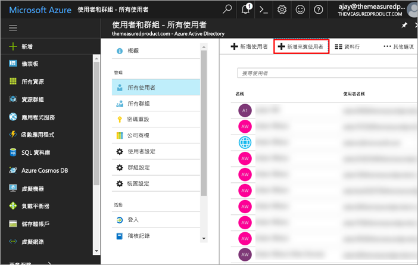
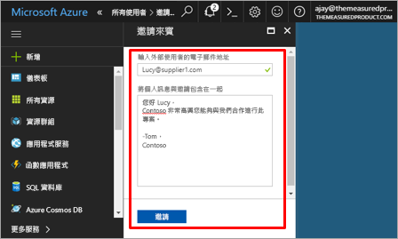
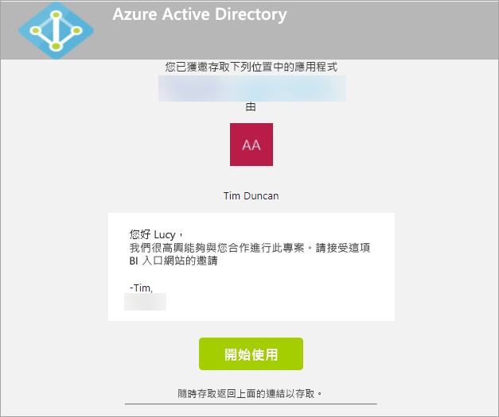
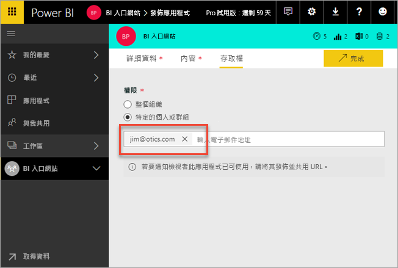
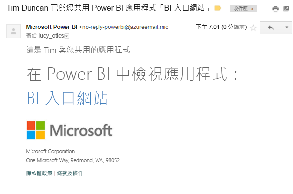
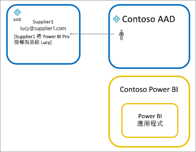

# 使用 Azure AD B2B 將 Power BI 內容散發給外部來賓使用者

Power BI 會與 Azure Active Directory 企業對企業 (Azure AD B2B) 整合，以便能夠安全地將 Power BI 內容散發給組織外部的來賓使用者，同時維持對內部資料的控制能力。

> [!VIDEO https://www.youtube.com/embed/xxQWEQ1NnlY]

> [!NOTE]
> 這項功能目前無法在 Power BI 行動裝置使用。 
> 
> 

## 邀請來賓使用者

有兩種方式可邀請來賓使用者前往您的 Power BI 租用戶：計劃性邀請或臨時邀請。 第一次邀請外部使用者前往您的組織時才需要提出邀請。

### 計劃性邀請

計劃性邀請會在 Microsoft Azure 入口網站中，於 Azure AD 中或使用 PowerShell 來進行。 如果您知道必須邀請的使用者有哪些人，便可使用此選項。 

**若要在 Azure AD 入口網站中建立來賓使用者，您必須是租用戶管理員。**

1. 瀏覽至 [Azure 入口網站](https://portal.azure.com)，然後選取 [Azure Active Directory]。

2. 瀏覽至 [使用者和群組] > [所有使用者] > [新增來賓使用者]。

    

3. 輸入 [電子郵件地址] 和 [個人訊息]。

    

4. 選取 [邀請]。

若要邀請多位來賓使用者，請使用 PowerShell。 如需詳細資訊，請參閱 [Azure Active Directory B2B 共同作業程式碼和 PowerShell 範例](https://docs.microsoft.com/azure/active-directory/active-directory-b2b-code-samples)。

來賓使用者必須在其收到的電子郵件邀請中選取 [開始使用]。 系統便會將來賓使用者新增至租用戶。

### 臨時邀請

若要在任何時候提出邀請，請在發佈應用程式時，將外部使用者新增至應用程式的存取清單。

來賓使用者會收到電子郵件，內容指出您已與其共用應用程式。

來賓使用者必須使用其組織電子郵件地址來登入。 登入之後，系統會提示他們接受邀請。 來賓使用者登入之後，系統會將其重新導向至應用程式內容。 若要返回應用程式，請將連結加入書籤，或儲存電子郵件。

## 授權

來賓使用者必須備有適當授權才能檢視共用的應用程式。 您有三個選項可供完成這項作業。

### 使用 Power BI Premium

將應用程式工作區指派給 Power BI Premium 容量會讓來賓使用者能夠使用應用程式，而不需要 Power BI Pro 授權。 Power BI Premium 還可讓應用程式充分利用其他功能，像是增加的重新整理頻率、專用的容量和大型模型大小等。

### 將 Power BI Pro 授權指派給來賓使用者

將 Power BI Pro 授權指派給您租用戶中的來賓使用者，可讓該來賓使用者檢視內容。

> [!NOTE]
> 只有在來賓使用者存取您租用戶中的內容時，來自您租用戶的 Power BI Pro 授權才會適用於來賓使用者。

### 來賓使用者帶來自己的 Power BI Pro 授權

來賓使用者已在其租用戶內獲派 Power BI Pro 授權。

## 後續步驟

如需詳細資訊 (包括資料列層級安全性的運作方式)，請參閱[白皮書](https://aka.ms/powerbi-b2b-whitepaper)。

如需有關 Azure Active Directory B2B 的資訊，請參閱[什麼是 Azure AD B2B 共同作業？](https://docs.microsoft.com/azure/active-directory/active-directory-b2b-what-is-azure-ad-b2b)