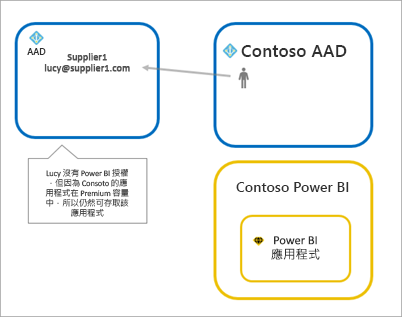
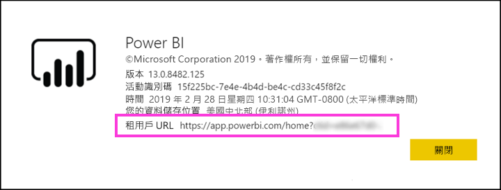

# 使用 Azure AD B2B 將 Power BI 內容散發給外部來賓使用者

Power BI 會與 Azure Active Directory 企業對企業 (Azure AD B2B) 整合，讓 Power BI 內容能以安全散發的方式提供給組織外的來賓使用者，同時維持對內部資料的控制能力。  

此外，您可以允許外部來賓使用者編輯和管理組織中的內容。

## 啟用存取

請務必啟用[與外部使用者共用內容](service-admin-portal.md#export-and-sharing-settings)在 Power BI 管理入口網站，再邀請來賓使用者的功能。

您也可以使用[允許外部來賓使用者編輯和管理組織中的內容](service-admin-portal.md#allow-external-guest-users-to-edit-and-manage-content-in-the-organization)功能。 它可讓您選取的來賓使用者可以看到，並在工作區，包括瀏覽您組織的 Power BI 中建立內容。

## 您可以邀請哪些人？

您可以邀請任何電子郵件地址，包括 gmail.com、 outlook.com 及 hotmail.com 等個人帳戶的來賓使用者。 Azure AD B2B 會呼叫這些地址*社交身分識別*。

## 邀請來賓使用者

來賓使用者只需要邀請您邀請他們加入您的組織第一次。 有兩種方式來邀請使用者： 計劃性邀請和臨機操作的邀請。

### 計劃性邀請

如果您知道要邀請哪些使用者，可以使用計劃性邀請。 您可以使用 Azure 入口網站或 PowerShell 來傳送邀請。 您必須是租用戶系統管理員才能邀請人員。

請遵循下列步驟，以在 Azure 入口網站中傳送邀請。

1. 在 [Azure 入口網站](https://portal.azure.com) 中，選取 [Azure Active Directory]  。

1. 底下**管理**，選取**使用者** > **的所有使用者** > **新增來賓使用者**。

    

1. 輸入 [電子郵件地址]  和 [個人訊息]  。

    

1. 選取 [邀請]  。

若要邀請多位來賓使用者，請使用 PowerShell。 如需詳細資訊，請參閱 [Azure AD B2B 共同作業程式碼和 PowerShell 範例](/azure/active-directory/b2b/code-samples/)。

來賓使用者必須在其收到的電子郵件邀請中選取 [開始使用]  。 系統便會將來賓使用者新增至租用戶。

### 臨機操作的邀請

若要邀請外部使用者在任何時間，新增至您的儀表板或報表透過共用 UI，或您的應用程式，透過 [存取] 頁面。 以下範例是邀請外部使用者使用應用程式時該執行的作業。

來賓使用者會收到電子郵件，指出與他們共用應用程式。

來賓使用者必須使用其組織電子郵件地址來登入。 他們會收到接受邀請之後登入的提示。 登入之後，應用程式開啟以供來賓使用者。 若要返回應用程式，他們可將連結加入書籤，或儲存電子郵件。

## 授權

來賓使用者必須具有適當的授權才能檢視您所共用的內容。 若要確定使用者有適當的權限的三種方式： 使用 Power BI Premium、 指派 Power BI Pro 授權，或使用客體的 Power BI Pro 授權。

使用[允許外部來賓使用者編輯和管理組織中的內容](service-admin-portal.md#allow-external-guest-users-to-edit-and-manage-content-in-the-organization)功能時，來賓使用者必須具備 Power BI Pro 授權才能提供工作區的內容，或與其他人共用內容。

### 使用 Power BI Premium

指派至應用程式工作區[Power BI Premium 容量](service-premium-what-is.md)讓來賓使用者使用應用程式，而不需要有 Power BI Pro 授權。 Power BI Premium 也可讓應用程式充分利用增加的重新整理頻率、 專用的容量和大型模型大小等其他功能。

### 將 Power BI Pro 授權指派給來賓使用者

將 Power BI Pro 授權指派給來賓使用者，在您的租用戶，可讓租用戶中的來賓使用者檢視內容。

### 來賓使用者帶來自己的 Power BI Pro 授權

來賓使用者已在其租用戶內獲派 Power BI Pro 授權。

## 可以編輯和管理內容的來賓使用者 

使用時[允許外部來賓使用者編輯和管理組織中的內容](service-admin-portal.md#allow-external-guest-users-to-edit-and-manage-content-in-the-organization)功能，指定的來賓使用者取得存取貴組織的 Power BI。 他們會看到他們具有權限的任何內容。 存取首頁、 瀏覽工作區、 安裝應用程式中，看到他們在存取清單中，並參與工作區的內容。 針對使用新工作區體驗的工作區，他們可以建立工作區管理員，或是成為工作區管理員。 適用某些限制。 考量與限制 區段會列出這些限制。
 
為了協助這些登入 Power BI 的使用者，提供租用戶 URL。 若要尋找租用戶 URL，請遵循下列步驟。

1. 在 Power BI 服務的頂端功能表中，選取說明 ( **?** )，然後選取 [關於 About Power BI]  。

2. 尋找 [租用戶 URL]  旁邊的值。 您可以分享給來賓使用者的租用戶 URL 的值。

    

## 考量與限制

* 根據預設，外部 Azure AD B2B 會限制來賓僅限內容耗用。 外部 Azure AD B2B 來賓可以檢視應用程式、 儀表板、 報表、 匯出資料，並建立儀表板和報表的電子郵件訂用帳戶。 他們無法存取工作區或發行其專屬內容。 不過，這些限制不適用於來賓使用者存取透過[允許外部來賓使用者編輯和管理組織中的內容](service-admin-portal.md#allow-external-guest-users-to-edit-and-manage-content-in-the-organization)功能。

* 透過啟用的來賓使用者[允許外部來賓使用者編輯和管理組織中的內容](service-admin-portal.md#allow-external-guest-users-to-edit-and-manage-content-in-the-organization)功能，某些體驗不提供給他們。 若要更新或發佈報表，他們需要使用 Power BI 服務 Web UI，包括 [取得資料] 以上傳 Power BI Desktop 檔案。  不支援下列體驗：
    * 從 Power BI Desktop 直接發佈至 Power BI 服務
    * 來賓使用者無法使用 Power BI desktop 來連接到 Power BI 服務中的服務資料集
    * 繫結至 Office 365 群組的典型工作區：
        * 來賓使用者無法建立，或者是這些工作區的系統管理員
        * 來賓使用者可以是成員
    * 傳送邀請臨機操作的工作區存取清單不支援
    * Power BI Publisher for Excel 不支援來賓使用者
    * 來賓使用者無法安裝 Power BI Gateway，並將它連接到您的組織
    * 來賓使用者無法安裝應用程式發佈到整個組織
    * 來賓使用者無法使用、 建立、 更新或安裝組織內容套件
    * 來賓使用者無法使用 Excel 中進行分析
    * 來賓使用者不可為@mentioned中註解
    * 來賓使用者不能使用的訂用帳戶
    * 如果來賓使用者要使用這項功能，則應具備工作或學校帳戶。 使用個人帳戶的來賓使用者會登入限制發生原因的更多限制。

* 這項功能目前未提供 Power BI SharePoint Online 的報表網頁組件。

* 有可能會限制外部來賓使用者可以執行您整體組織內的 Active Directory 設定。 也適用於您的 Power BI 環境。 下列文件會討論這些設定：
    * [管理外部共同作業設定](https://docs.microsoft.com/azure/active-directory/b2b/delegate-invitations#control-who-can-invite)
    * [允許或封鎖對特定組織 B2B 使用者的邀請](https://docs.microsoft.com/azure/active-directory/b2b/allow-deny-list)  

## 後續步驟

如需詳細資訊，包括如何為資料列層級安全性的運作方式，請參閱技術白皮書：[使用 Azure AD B2B 將 Power BI 內容散發給外部來賓使用者](https://aka.ms/powerbi-b2b-whitepaper)。

Azure AD B2B 的相關資訊，請參閱[什麼是 Azure AD B2B 共同作業？](/azure/active-directory/active-directory-b2b-what-is-azure-ad-b2b/)。
