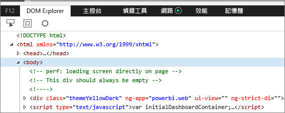
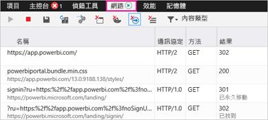
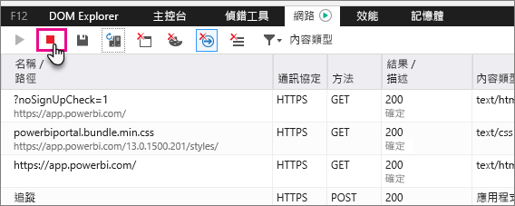
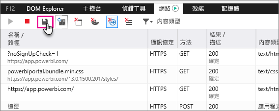

# 擷取其他診斷資訊
## 擷取 Power BI 的其他診斷資訊
這些指示提供兩個可能的選項，以從 Power BI Web 用戶端手動收集其他診斷資訊。  您只須遵循其中一個選項。

## 網路擷取 - Edge 和 Internet Explorer
1. 使用 Edge 或 Internet Explorer 瀏覽至 [Power BI](https://app.powerbi.com)。
2. 按 F12 開啟 Edge 開發人員工具。
3. 這會顯示 [開發人員工具] 視窗： 
   
   
4. 切換至 [網路] 索引標籤。其中列出已經擷取的流量。 
   
   
5. 您可以在視窗中瀏覽，並重現可能遇到的任何問題。 按 F12 可在工作階段期間隨時隱藏和顯示 [開發人員工具] 視窗。
6. 若要停止擷取，您可以在開發人員工具區域選取 [網路] 索引標籤上的紅色方塊。
   
   
7. 選取磁碟片圖示 [匯出為 HAR]
   
   
8. 提供檔案名稱並儲存 HAR 檔案。
   
    HAR 檔案會包含瀏覽器視窗與 Power BI 之間網路要求的所有資訊。  這包括每個要求的活動識別碼、每個要求的精確時間戳記，以及傳回給用戶端的任何錯誤資訊。  這項追蹤也會包含用來填入畫面上所示視覺效果的資料。
9. 您可以提供 HAR 檔案以支援檢閱。

有其他問題嗎？ [嘗試在 Power BI 社群提問](http://community.powerbi.com/)

