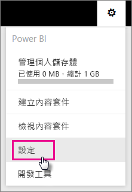
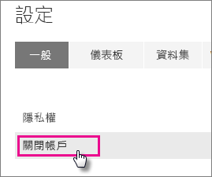
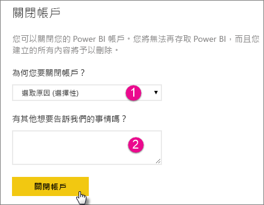
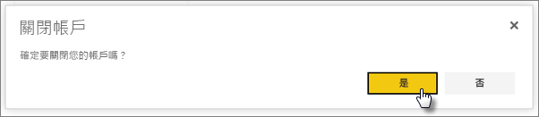

# 關閉 Power BI 帳戶

如果您不想再使用 Power BI，您可以關閉 Power BI 帳戶。  關閉帳戶之後，您將無法再登入 Power BI。 根據 Power BI 服務條款中的資料保留原則，您在 Power BI 中上傳或建立的任何客戶資料都將遭到刪除。

## 個人 Power BI 使用者

如果您是以個人身分註冊 Power BI，您可以從帳戶的 [設定] 畫面關閉帳戶。

1. 在 Power BI 中，選取在右上方的齒輪，然後選取 [設定]。

    

1. 在 [一般] 索引標籤上，選取 [關閉帳戶]。

    

1. 選取關閉帳戶的原因 (1)。 您也可以提供進一步的資訊 (2)。 然後選取 **關閉帳戶**。

    

1. 確認您要關閉帳戶。

    

    您應該會看到確認帳戶關閉的訊息。 如有必要，您可以從這裡重新開啟您的帳戶。

    

## Managed 租用戶使用者

如果是您的組織為您註冊 Power BI，請連絡您的租用戶系統管理員。要求他們從您的帳戶解除指派授權。

有其他問題嗎？ [嘗試在 Power BI 社群提問](http://community.powerbi.com/)