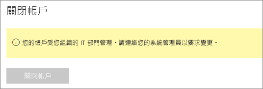

# 關閉 Power BI 帳戶

如果您不想再使用 Power BI，您可以關閉 Power BI 帳戶。  當您關閉帳戶之後，就無法登入 Power BI。 此外，按照 Power BI 服務條款中資料保留原則的指定內容，Power BI 會刪除您上傳或建立的任何客戶資料。 而不會予以保留。

## 個人 Power BI 使用者

如果您是以個人身分註冊 Power BI，您可以從帳戶的 [設定]  畫面關閉帳戶。

1. 在 Power BI 中，選取在右上方的齒輪，然後選取 [設定]  。

    ![UI 的右上角已標示齒輪圖示和 [設定] 選項的螢幕擷取畫面。](media/service-admin-closing-your-account/close-account-settings.png)

1. 在 [一般]  索引標籤上，選取 [關閉帳戶]  。

    ![[設定] 頁面左上角已標示 [關閉帳戶] 選項的螢幕擷取畫面。](media/service-admin-closing-your-account/close-account-settings-2.png)

1. 選取關閉帳戶的原因 (1)。 您也可以提供進一步的資訊 (2)。 然後選取 **關閉帳戶**。

    ![[關閉帳戶] 對話方塊已標示 [關閉帳戶] 選項的螢幕擷取畫面。](media/service-admin-closing-your-account/close-account-settings-3.png)

1. 確認您要關閉帳戶。

    ![[關閉帳戶] 確認對話方塊已標示 [是] 選項的螢幕擷取畫面。](media/service-admin-closing-your-account/close-account-settings-4.png)

    您應該會看到確認 Power BI 關閉帳戶的訊息。 如有必要，您可以從這裡重新開啟您的帳戶。

    ![[您的帳戶已關閉] 對話方塊的螢幕擷取畫面。](media/service-admin-closing-your-account/close-account-settings-5.png)

## Managed 租用戶使用者

如果是您的組織為您註冊 Power BI，請連絡您的租用戶系統管理員。要求他們從您的帳戶解除指派授權。

有其他問題嗎？ [嘗試在 Power BI 社群提問](https://community.powerbi.com/)