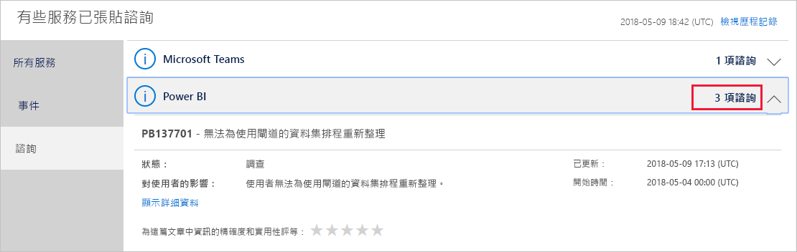

# 在 Office 365 中追蹤 Power BI 服務健康狀態

Microsoft 365 系統管理中心會提供重要的工具，適用於 Power BI 系統管理員。 這些工具包括服務健康情況的目前和歷程記錄資訊。 若要存取服務健全狀況資訊，您必須是下列角色之一：

* Power BI 服務管理員

* Office 365 全域管理員

如需角色的詳細資訊，請參閱[系統管理員角色與 Power BI 相關](service-admin-administering-power-bi-in-your-organization.md#administrator-roles-related-to-power-bi)。

1. 登入 [MIcrosoft 365 系統管理中心](https://portal.office.com/adminportal)。

1. 從左側的導覽列中，選取**全部顯示** > **健全狀況** > **服務健全狀況**。 服務健康情況頁面隨即出現：

    

1. 從**所有服務**清單中，選取**諮詢**或是**事件**檢閱結果。 在以下的螢幕擷取畫面，您會看到三個作用中的摘要報告的其中一個。

    

1. 若要查看詳細資訊，請選取項目的 [顯示詳細資料]  。 在以下的螢幕擷取畫面，您會看到其他詳細資料，包括最新狀態更新。

    

    向下捲動以查看更多資訊，然後當您完成時即可關閉窗格。

1. 若要查看歷程記錄資訊的右上角中的所有服務跨**服務健全狀況**頁面上，選取**檢視歷程記錄**。 然後選取 [最近 7 天]  或 [最近 30 天]  。 

1. 若要返回目前的服務健康狀態，請選取 [檢視目前狀態]  。