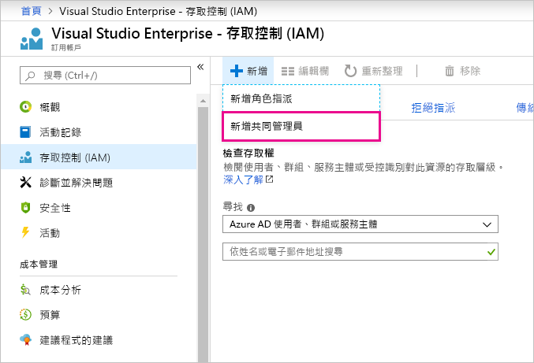

# 針對 Power BI 和 Azure 使用相同的帳戶

如果您同時是 Power BI 和 Azure 的使用者，您可能想要針對這兩個服務使用相同的登入，這樣您就不需要輸入兩次密碼。

Power BI 使用與您的公司或學校電子郵件地址相關聯的組織帳戶將您登入。  Azure 使用 Microsoft 帳戶或組織帳戶將您登入。

如果您想要針對 Azure 和 Power BI 使用相同的登入，請務必使用您的組織帳戶登入 Azure。

**如果我已經使用 Microsoft 帳戶登入 Azure，該怎麼辦？**

透過遵循下列這些步驟，您可以加入組織帳戶作為 Azure 中的共同管理員：

1. 登入 [Azure 入口網站](http://portal.azure.com/)。 如果您是多個 Azure 目錄中的使用者，請選取 [訂用帳戶]  ，然後透過篩選方式只檢視您想要編輯的目錄與訂用帳戶。

1. 在 [導覽] 窗格中，選取 [存取控制 (IAM)]  ，然後選取 [新增]  \> [新增共同管理員]  。

    

1. 輸入與您的組織帳戶相關聯的電子郵件地址，並選取 [新增]  。

1. 下次登入 Azure 入口網站時，使用您的組織電子郵件地址。

有其他問題嗎？ [試試 Power BI 社群](http://community.powerbi.com/)
