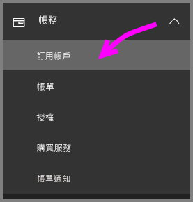
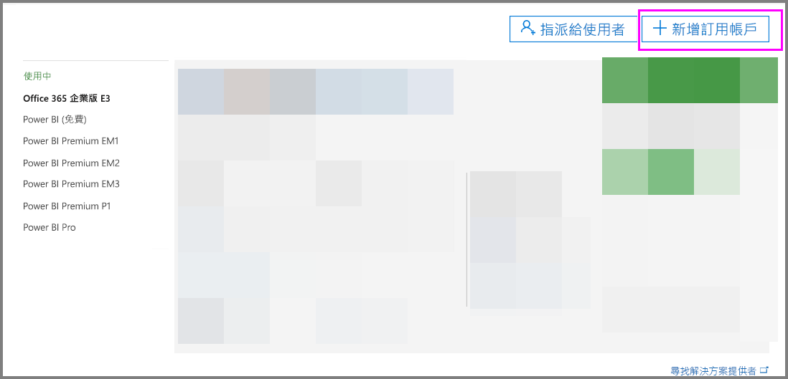
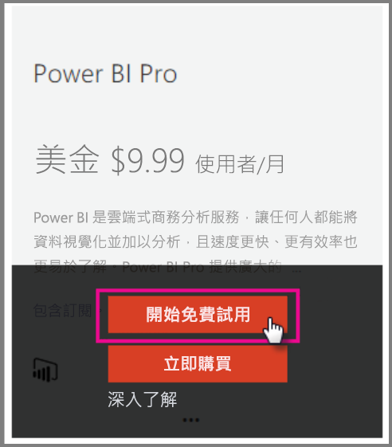
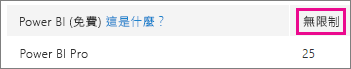
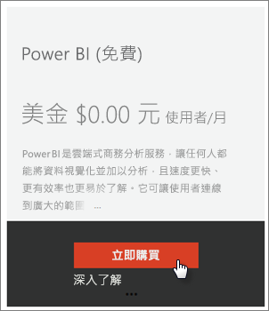
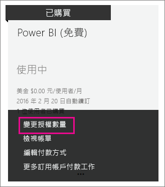
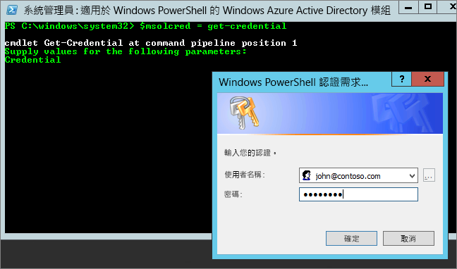

# <a name="power-bi-licensing-in-your-organization"></a>組織中的 Power BI 授權

在 Power BI 服務中，使用者已根據兩種授權類型來定義功能：

* **每位使用者** - 免費授權和 Power BI Pro 授權。 免費授權可讓您存取 Power BI 服務的某些功能。 Pro 授權允許存取 Power BI 服務中的所有內容和功能，包括能與其他 Pro 使用者共用內容和共同作業。 只有 Pro 使用者能將內容發行到應用程式工作區、從應用程式工作區中取用內容、共用儀表板，以及訂閱儀表板和報表。 如需詳細資訊，請參閱[依授權類型排列的 Power BI 服務功能](service-features-license-type.md)。

* **容量為基礎** - Power BI Premium 授權。 Premium 提供專用容量，以傳遞更一致的效能，並在 Power BI 中支援更大的資料量。 對於個人使用者，Premium 也讓 Pro 使用者能廣泛散發內容，而且檢視內容的收件者並不需要 Pro 授權。 如需詳細資訊，請參閱[什麼是 Power BI Premium？](service-premium.md)。

本文著重於從系統管理員觀點的每位使用者授權。

## <a name="manage-power-bi-pro-licenses"></a>管理 Power BI Pro 授權

身為系統管理員，您可以購買和指派 Power BI Pro 授權，也可以為您的組織註冊 Power BI Pro 試用版。 個人也可以註冊 Power BI Pro 試用版。

### <a name="purchasing-power-bi-pro"></a>購買 Power BI Pro

您透過 Microsoft Office 365 或透過認證的 Microsoft 合作夥伴，來購買 Power BI Pro 授權。 購買授權之後，請將它們指派給個別使用者。 如需詳細資訊，請參閱[購買及指派 Power BI Pro 授權](service-admin-purchasing-power-bi-pro.md)。

### <a name="power-bi-pro-trial-for-individuals"></a>Power BI Pro 個人試用版

在您組織中的個人可以註冊 Power BI Pro 試用。 如需詳細資訊，請參閱[以個人身分註冊 Power BI](service-self-service-signup-for-power-bi.md)。

利用產品中 Power BI Pro 試用版的使用者，不會在 Office 365 管理入口網站顯示為 Power BI Pro 試用版使用者 (他們會顯示為 Power BI 免費版使用者)。 不過在 Power BI [管理儲存體] 頁面中會顯示為 Power BI Pro 試用版使用者。

### <a name="power-bi-pro-trial-for-organizations"></a>Power BI Pro 組織試用版

如果想要取得並部署 Power BI 試用版授權至組織中的多個使用者，而不需要讓個別使用者個別接受試用版條款，請註冊 Power BI Pro 組織試用版。

遵循註冊步驟之前，請記住下列事項：

* 若要註冊，您必須是 Office 365 中[**全域管理員**或**計費管理員**](https://support.office.com/article/about-office-365-admin-roles-da585eea-f576-4f55-a1e0-87090b6aaa9d?ui=en-US&rs=en-US&ad=US)角色的成員。

* 每個租用戶只限使用一個組織試用版。 這表示，如果有人已將 Power BI Pro 試用版套用至您的租用戶，您就無法再次套用。 如果您需要這方面的協助，請連絡 [Office 365 帳單支援](https://support.office.microsoft.com/article/contact-support-for-business-products-admin-help-32a17ca7-6fa0-4870-8a8d-e25ba4ccfd4b?CorrelationId=552bbf37-214f-4202-80cb-b94240dcd671&ui=en-US&rs=en-US&ad=US)。

1. 導覽到 [Office 365 系統管理中心](https://portal.office.com/adminportal/home#/homepage)。

1. 在左邊的功能窗格中，依序選取 [帳單]、[訂閱]。

   

1. 在右邊，選取 [新增訂閱]。

   

1. 在 [其他方案] 下，將滑鼠停留在 Power BI Pro 的省略符號 (**. . .**)，然後選取 [開始免費試用]。

    

1. 在 [訂單確認] 畫面上，選取 [立即試用]。

1. 在 [訂單收據] 上，選取 [繼續]。

現在您可以[在 Office 365 中指派授權](https://support.office.com/article/assign-licenses-to-users-in-office-365-for-business-997596b5-4173-4627-b915-36abac6786dc)。

## <a name="manage-power-bi-free-licenses"></a>管理 Power BI 免費授權

組織中的使用者可以使用兩種不同方式存取 Power BI 免費授權。 他們可以個別註冊 Power BI，或您可以在 Office 365 系統管理入口網站中為其指派 Power BI 授權。

藉由允許對 Power BI 感興趣的使用者免費註冊，允許個人註冊可減少組織系統管理員的負擔。

不過，停用個人使用者註冊可讓您有更多控制權，而且很適合您需要稽核服務使用量的情況。

### <a name="power-bi-free-for-individuals"></a>Power BI 免費個人版

在您組織中的個人預設可以註冊 Power BI 免費授權。 如需詳細資訊，請參閱[以個人身分註冊 Power BI](service-self-service-signup-for-power-bi.md)。

若要封鎖個人註冊，請參閱本文稍後的[在 Azure Active Directory 中啟用或停用個人使用者註冊](service-admin-licensing-organization.md#enable-or-disable-individual-user-sign-up-in-azure-active-directory)。

### <a name="requesting-and-assigning-free-licenses"></a>要求及指派免費授權

如果您打算集中管理授權要求和指派，請先檢查是否已有無限制的 Power BI (免費) 授權區塊。

在首次有人以個人身分註冊 Power BI 之後，便可使用此區塊的授權。 在此過程中，這個授權區塊會附加到您的組織，並將授權指派給註冊的使用者。

1. 在 Office 365 系統管理中心 [帳單] > [授權] 底下，檢查是否為**無限制**。

    

1. 如果有可用的區塊，您現在可以[在 Office 365 中指派授權](https://support.office.com/article/assign-licenses-to-users-in-office-365-for-business-997596b5-4173-4627-b915-36abac6786dc)。 如果沒有可用的區塊，您會有兩個選擇：

    * 讓組織的成員以個人身分註冊，這樣會觸發無限制區塊的建立。

    * 移至下一個程序，您可以在該處註冊固定數目的授權。

如果無法使用無限制的 Power BI (免費) 授權區塊，而且您不想要進行個人註冊，請遵循此程序。

1. 導覽到 [Office 365 系統管理中心](https://portal.office.com/admin/default.aspx)。

1. 在左邊的瀏覽窗格中，選取 [帳單] > [訂閱]。

1. 在右邊，選取 [新增訂閱 +]。

1. 在 [其他方案] 下，將滑鼠停留在 Power BI (免費) 的省略符號 (**. . .**)，然後選取 [立即購買]。

    

1. 輸入您想要新增的授權數量，然後選取 [立即結帳] 或 [新增至購物車]。

1. 在結帳流程中，輸入所需的資訊。

    使用這種方法時，不會購買任何產品，但是您必須輸入信用卡帳單資訊，或選擇開立發票。

1. 現在您可以[在 Office 365 中指派授權](https://support.office.com/article/assign-licenses-to-users-in-office-365-for-business-997596b5-4173-4627-b915-36abac6786dc)。

1. 如果您稍後決定您想要新增更多授權，您可以移回至 \[新增訂閱]，然後對 Power BI \(免費) 選取 \[Change license quantity] \(變更授權數量)。

    

### <a name="enable-or-disable-individual-user-sign-up-in-azure-active-directory"></a>在 Azure Active Directory 中啟用或停用個人使用者註冊

身為系統管理員，您可以選擇透過 Azure Active Directory (AAD) 啟用或停用個人使用者註冊。 文章的本節會示範如何使用 PowerShell 命令管理註冊。 如需 Azure PowerShell 的詳細資訊，請參閱 [Azure PowerShell 概觀](/powershell/azure/overview)。

控制註冊的 AAD 設定為**AllowAdHocSubscriptions**。 在大多數的租用戶，此會設定為 *true*，表示已啟用此設定。 如果您透過合作夥伴取得 Power BI，這可能設為 *false*，表示已停用此設定。 如果您將設定從 *true* 變更為 *false*，則組織中的新使用者會遭到封鎖，無法以個人身分註冊。 在設定變更前已註冊 Power BI 的使用者，會保留其授權。

1. 使用 Office 365 認證登入 Azure Active Directory。 下列 PowerShell 指令碼的第一行會提示您輸入您的認證。 第二行連接到 Azure Active Directory。

    ```powershell
     $msolcred = get-credential
     connect-msolservice -credential $msolcred
    ```

   

1. 當您登入之後，請執行下列命令，查看租用戶目前的設定情形。

    ```powershell
     Get-MsolCompanyInformation | fl AllowAdHocSubscriptions
    ```
1. 請執行下列命令啟用 ($true) 或停用 ($false) **AllowAdHocSubscriptions**。

    ```powershell
     Set-MsolCompanySettings -AllowAdHocSubscriptions $true
    ```

> [!NOTE]
> AllowAdHocSubscriptions 旗標可用以控制貴組織的數個使用者功能，包括使用者註冊 Azure Rights Management Service 的能力。 變更此旗標會影響所有這些功能。

## <a name="next-steps"></a>後續步驟

[Power BI 的自助式註冊](service-self-service-signup-for-power-bi.md)  

[購買及指派 Power BI Pro 授權](service-admin-purchasing-power-bi-pro.md)

有其他問題嗎？ [嘗試在 Power BI 社群提問](http://community.powerbi.com/)