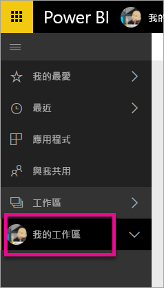
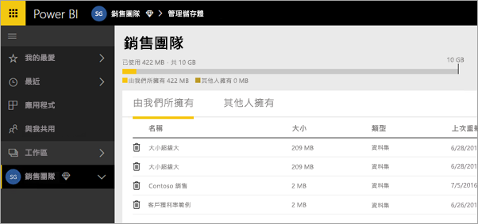
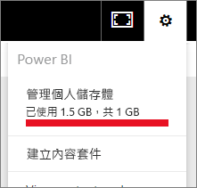
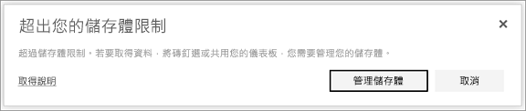

# 管理 Power BI 工作區中的資料儲存體

了解如何管理您個人或應用程式工作區中的資料儲存體，以確保您可以繼續發佈報表和資料集。

使用者和應用程式工作區有自己的資料容量：

* 所有使用者都有最多 10 GB 的資料儲存體。
* 具有 Power BI Pro 授權的使用者可以建立應用程式工作區，而每個工作區都有最多 10 GB 的資料儲存體。
* Premium 容量中的應用程式工作區不會計入 Power BI Pro 使用者的儲存體。

在租用戶層級，每位 Pro 使用者在租用戶中的所有 Pro 使用者和應用程式工作區之間的總使用量不能超過 10 GB。

請閱讀 [Power BI 定價模型](https://powerbi.microsoft.com/pricing)之其他功能的相關資訊。

資料儲存空間包含您自己的資料集和 Excel 報表，以及其他人已與您共用的項目。 資料集可以是您已上傳或連線到的任何資料來源。 這些資料來源包含您正在使用的 Power BI Desktop 檔案和 Excel 活頁簿。 下列項目也包含在資料容量中。

* 已釘選到儀表板的 Excel 範圍。
* 已釘選到 Power BI 儀表板的 Reporting Services 內部部署視覺效果。
* 已上傳的影像。

您共用的儀表板大小會因釘選到它的內容而有所不同。 例如，如果您釘選屬於兩個不同資料集之兩份報表中的項目，則大小會包含這兩個資料集。

<a name="manage"/>

## 管理您擁有的項目

查看您在 Power BI 帳戶中使用的資料儲存空間，並管理您的帳戶。

1. 若要管理您自己的儲存空間，請移至左側功能窗格的 [我的工作區] 。
   
    
2. 選取右上角的齒輪圖示  \> [管理個人儲存體]。
   
    頂端列會顯示您已使用的儲存空間限制量。
   
    
   
    資料集和報表會分成兩個索引標籤：
   
    **由我所擁有：** 您已將這些報表和資料集上傳至 Power BI 帳戶，包括 Salesforce 和 Dynamics CRM 等服務資料集。  
    **由他人所擁有：** 其他人已與您共用這些報表和資料集。
1. 若要刪除資料集或報表，請選取垃圾桶圖示 .

請記住，您或其他人可能會有依據某個資料集的報表和儀表板。 如果您刪除該資料集，這些報表和儀表板將無法再運作。

## 管理您的應用程式工作區
1. 選取 [工作區] 旁的箭號 \> 選取應用程式工作區的名稱。
   
    
2. 選取右上角的齒輪圖示  \> [管理群組儲存體]。
   
    頂端列會顯示已使用的群組儲存空間限制量。
   
    
   
    資料集和報表會分成兩個索引標籤：
   
    **由我們所擁有：** 您或其他人已將這些報表和資料集上傳至群組的 Power BI 帳戶，包括 Salesforce 和 Dynamics CRM 等服務資料集。
    **由他人所擁有：** 其他人已與您的群組共用這些報表和資料集。
3. 若要刪除資料集或報表，請選取垃圾桶圖示 .
   
   > [!NOTE]
   > 應用程式工作區具有編輯權限的所有成員，都有權從應用程式工作區刪除資料集和報表。
   > 
   > 

請記住，您或群組中的其他人可能會有依據某個資料集的報表和儀表板。 如果您刪除該資料集，這些報表和儀表板將無法再運作。

## 資料集限制
可匯入 Power BI 的每個資料集限制為 1 GB。 如果您選擇保留 Excel 體驗，而不是匯入資料，則資料集的限制為 250 MB。

## 達到限制時會發生什麼事
當您達到可執行的資料容量限制時，您會在服務中看到提示。 

當您選取齒輪圖示 時，您會看到一個紅色橫條，指出您已超出資料容量限制。

這項限制也會在 [管理個人儲存體] 中指出。

 ![[管理個人儲存體]，已達儲存體限制](media/service-admin-manage-your-data-storage-in-power-bi/manage-storage-limit2.png)

 當您嘗試執行將會達到其中一個限制的動作時，您會看到訊息，指出您已超過限制。 您可以[管理](#manage)儲存體，以減少儲存體數量並通過限制。

 

 有其他問題嗎？ [嘗試在 Power BI 社群提問](http://community.powerbi.com/)

