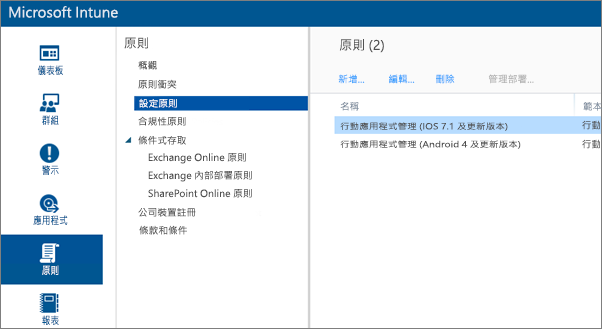
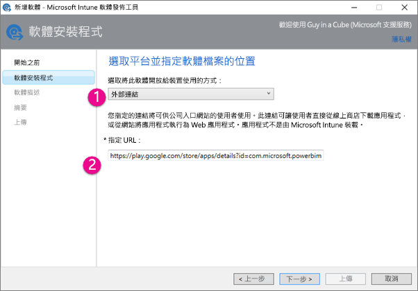
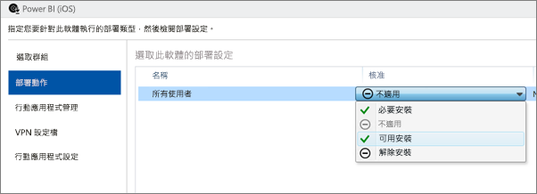
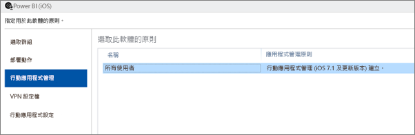
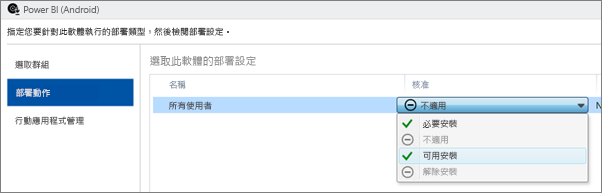
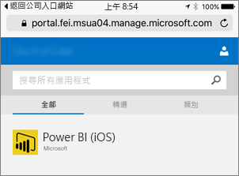
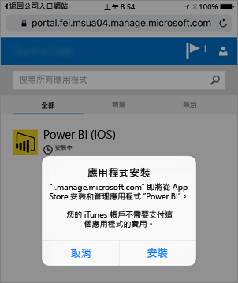
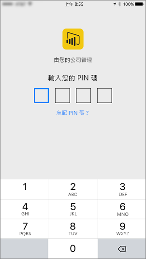

# 使用 Microsoft Intune 設定行動裝置應用程式

Microsoft Intune 可讓組織管理裝置和應用程式。 iOS 與 Android 版 Power BI 行動裝置應用程式與 Intune 整合。 這個整合可讓您在您的裝置上管理應用程式，並控制安全性。 您可以透過設定原則，控制像是要求存取 PIN、控制應用程式處理資料的方式，甚至是在未使用應用程式時加密應用程式資料等項目。

## 一般行動裝置管理設定

本文假設您已正確設定 Intune 並向 Intune 註冊裝置。 此文章並不是要做為完整的 Microsoft Intune 設定指南。 如需有關 Intune 的詳細資訊，請參閱[什麼是 Intune？](/intune/introduction-intune/)。

Microsoft Intune 可以與行動裝置管理 (MDM) 同時存在 Office 365 中。 若您使用 MDM，裝置將會在 MDM 中顯示為已註冊，但可在 Intune 中管理。

> [!NOTE]
> 設定 Intune 之後，會針對您 iOS 或 Android 裝置上的 Power BI 行動裝置應用程式關閉背景資料重新整理。 當您進入應用程式時，Power BI 會從網路上的 Power BI 服務重新整理資料。

## 步驟 1：取得應用程式的 URL

在 Intune 中建立應用程式之前，我們需要取得應用程式的 URL。 若是 iOS，可以從 iTunes 取得。 若是 Android，可以從 Power BI 行動裝置頁面取得。

儲存 URL，因為建立應用程式時將會需要用到。

### 取得 iOS URL

若要取得 iOS 的應用程式 URL，必須從 iTunes 取得。

1. 開啟 iTunes。

1. 搜尋 Power BI。 

1. 您應該會看到 [iPhone Apps]  和 [iPad Apps]  下列出 [Microsoft Power BI]  。 您可以擇一使用，這兩者都會取得相同的 URL。

1. 選取 [取得]  下拉式清單，然後選取 [複製連結]  。

    

它看起來應該像下面這樣： *https://itunes.apple.com/us/app/microsoft-power-bi/id929738808?mt=8* 。

### 取得 Android URL

您可以從 [Power BI 行動版頁面](https://powerbi.microsoft.com/mobile/)取得 Google Play 的 URL。 按一下 [從 Google Play 下載]  圖示將帶您前往應用程式頁面。 您可以從瀏覽器網址列複製 URL。 它看起來應該像下面這樣： *https://play.google.com/store/apps/details?id=com.microsoft.powerbim* 。

## 步驟 2：建立行動應用程式管理原則

行動應用程式管理原則可讓您強制執行 Access PIN 碼等項目。 您可以在 Intune 入口網站中建立一個原則。

您可以先建立應用程式，或先建立原則。 新增應用程式和原則的順序並不重要。 只要執行部署步驟時，兩者都存在即可。

1. 在 Intune 入口網站中，選取 [原則]   > [設定原則]  。

    

1. 選取 [新增...]  。

1. 在 [軟體]  下，您可以選取 Android 或 iOS 的行動應用程式管理。 您可以選取 [使用建議的設定建立原則]  快速開始進行，也可以建立自訂原則。

1. 編輯原則以設定您要套用至應用程式的限制。

## 步驟 3：建立應用程式

應用程式是儲存到 Intune 進行部署的參考或封裝。 我們將需要建立應用程式，並參考從 Google Play 或 iTunes 取得的應用程式 URL。

您可以先建立應用程式，或先建立原則。 新增應用程式和原則的順序並不重要。 只要執行部署步驟時，兩者都存在即可。

1. 移至 Intune 入口網站，然後從從左功能表中選取 [應用程式]  。

1. 選取 [新增應用程式]  。 這會啟動 [新增軟體]  應用程式。

### 針對 iOS 建立

1. 從下拉式清單中選取 [App Store 中所管理的 iOS 應用程式]  。

1. 輸入從[步驟 1](#step-1-get-the-url-for-the-application) 取得的應用程式 URL，然後選取 [下一步]  。

    

1. 提供 [發行者]  、[名稱]  和 [描述]  。 您也可以提供一個**圖示**。 [類別]  是針對公司入口網站應用程式。 完成後，選取 [下一步]  。

1. 您可以決定要以 [任一]  \(預設)、[iPad]  或 [iPhone]  發行應用程式。 預設會顯示 [任一]  ，此選項適用於這兩種裝置類型。 iPhone 和 iPad 的 Power BI 應用程式 URL 相同。 選取 [下一步]  。

1. 選取 [上傳]  。

1. 如果您在清單中沒有看到應用程式，請重新整理頁面：移至 [概觀]  然後返回 [應用程式]  。

    ![[應用程式] 索引標籤](media/service-admin-mobile-intune/intune-add-software-ios2.png)

### 為 Android 建立

1. 從下拉式清單中選取 [外部連結]  。

1. 輸入從[步驟 1](#step-1-get-the-url-for-the-application) 取得的應用程式 URL，然後選取 [下一步]  。

    

1. 提供 [發行者]  、[名稱]  和 [描述]  。 您也可以提供一個**圖示**。 [類別]  是針對公司入口網站應用程式。 完成後，選取 [下一步]  。

1. 選取 [上傳]  。

1. 如果您在清單中沒有看到應用程式，請重新整理頁面：移至 [概觀]  然後返回 [應用程式]  。

    ![[應用程式] 索引標籤](media/service-admin-mobile-intune/intune-add-software-android2.png)

## 步驟 4：部署應用程式

新增應用程式之後，您必須加以部署，才能提供給使用者使用。 在此步驟中，您將會繫結以此應用程式建立的原則。

### 為 iOS 部署

1. 在應用程式畫面上，選取您建立的應用程式。 然後選取 [管理部署...]  連結。

    

1. 在 [選取群組]  畫面中，您可以選擇要部署此應用程式的目標群組。 選取 [下一步]  。

1. 在 [部署動作]  畫面中，您可以選擇要部署此應用程式的方式。 選取 [可用安裝]  或 [必要安裝]  ，即可在公司入口網站中提供應用程式給使用者隨選安裝。 完成選取之後，選取 [下一步]  。

    

1. 在 [行動應用程式管理]  畫面中，您可以選取在[步驟 2](#step-2-create-a-mobile-application-management-policy) 中建立的行動應用程式管理原則。 如果您建立的原則是唯一可用的 iOS 原則，預設為此原則。 選取 [下一步]  。

    

1. 在 [VPN 設定檔]  畫面中，如果您的組織有一個原則，則可以選取此原則。 預設為 [無]  。 選取 [下一步]  。

1. 在 [行動應用程式設定]  畫面中，如果已建立一個原則，則可以選取 [應用程式設定原則]  。 預設為 [無]  。 這不是必要項。 選取 [完成]  。

部署應用程式之後，該應用程式應該會在應用程式頁面中顯示 [是]  表示已部署。

### 為 Android 部署

1. 在應用程式畫面上，選取您建立的應用程式。 然後選取 [管理部署...]  連結。

    
1. 在 [選取群組]  畫面中，您可以選擇要部署此應用程式的目標群組。 選取 [下一步]  。

1. 在 [部署動作]  畫面中，您可以選擇要部署此應用程式的方式。 選取 [可用安裝]  或 [必要安裝]  ，即可在公司入口網站中提供應用程式給使用者隨選安裝。 完成選取之後，選取 [下一步]  。

    

1. 在 [行動應用程式管理]  畫面中，您可以選取在[步驟 2](#step-2-create-a-mobile-application-management-policy) 中建立的行動應用程式管理原則。 如果您建立的原則是唯一可用的 Android 原則，預設為此原則。 選取 [完成]  。

    

部署應用程式之後，該應用程式應該會在應用程式頁面中顯示 [是]  表示已部署。

## 步驟 5：在裝置上安裝應用程式

您會透過*公司入口網站*應用程式安裝應用程式。 如果您尚未安裝公司入口網站，可以透過 iOS 或 Android 平台上的 App Store 取得。 您將會以組織的登入資訊登入公司入口網站。

1. 開啟公司入口網站應用程式。

1. 如果 Power BI 應用程式未列為熱門應用程式，請選取 [公司應用程式]  。

    

1. 選取您部署的 Power BI 應用程式。

    

1. 選取 [安裝]  。

    

1. 如果您在 iOS 上，它會將應用程式推送給您。 在推送對話方塊上選取 [安裝]  。

    

1. 安裝應用程式之後，您會看到它是**由您的公司管理**。 如果在原則中啟用以 PIN 碼存取，則會看到下列畫面。

    

## 後續步驟

[在 Microsoft Intune 主控台中設定及部署行動應用程式管理原則](/intune/app-protection-policies/)  

[行動裝置的 Power BI 應用程式](consumer/mobile/mobile-apps-for-mobile-devices.md)  

有其他問題嗎？ [嘗試在 Power BI 社群提問](https://community.powerbi.com/)  
