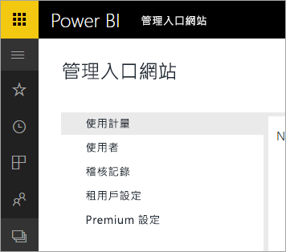

# Power BI for Office 365 已停用
Power BI for Office 365 是舊版 Power BI，已轉換至目前的 [Power BI](https://powerbi.microsoft.com) 版本。 曾經使用過 **Power BI for Office 365** 的使用者可以使用目前的 Power BI 版本。 您可以[深入了解 Power BI](service-get-started.md)。

## 管理入口網站
現在已無法再存取 **Power BI for Office 365** 管理入口網站。 系統管理員可以使用新的[管理入口網站](https://app.powerbi.com/admin-portal)，進而管理組織的 Power BI 訂用帳戶。

如需詳細資訊，請參閱 [Power BI 管理入口網站](service-admin-portal.md)。

## 後續步驟
[開始使用 Power BI](service-get-started.md)

[開始使用 Power BI Desktop](desktop-getting-started.md)

[管理貴組織中的 Power BI](service-admin-administering-power-bi-in-your-organization.md)