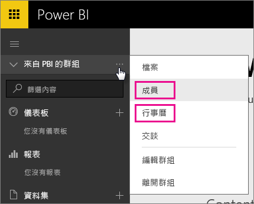
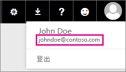

# Office 365 專用客戶 - 已知問題
Power BI 現在支援 Office 365 專用客戶。  如果您是 O365 專用客戶，您可以從該租用戶的帳戶登入並使用 Power BI。 目前已知有兩個問題。

## 群組
選取 [群組] 操作功能表中的 [成員]  或 [行事曆]  時，會改為將您重新導向至郵件應用程式。  [檔案] 和 [交談] 則如預期作般運作。

## iPhone 應用程式 - 使用虛名網域登入會導致發生錯誤
當您在 iPhone 應用程式上使用虛名網域的登入帳戶進行登入時，可能會發生錯誤。

*登入錯誤*  
*發生非預期的內部錯誤。請再試一次。*

若要解決這個問題，請使用按一下 Power BI 服務中的使用者圖示時所列出的電子郵件地址登入，而不是使用虛名網域登入。

有其他問題嗎？ [試試 Power BI 社群](http://community.powerbi.com/)

