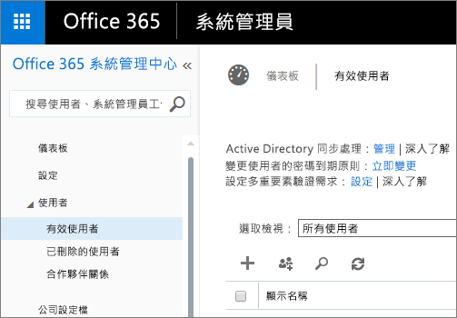

# Power BI 管理入口網站
管理入口網站可讓您管理貴組織的 Power BI 租用戶。 包含項目如使用計量、存取 Office 365 系統管理中心及設定等。

透過 Power BI 管理入口網站可管理貴公司的 Power BI 租用戶。 Office 365 的全域管理員或已指派 Power BI 服務系統管理員角色的所有使用者，都可以存取管理入口網站。 如需 Power BI 服務系統管理員角色的詳細資訊，請參閱[了解 Power BI 系統管理員角色](service-admin-role.md)。

所有使用者會在齒輪圖示下看到**管理入口網站**。 如果他們不是系統管理員，則只會看到 [Premium 設定] 區段，而且只會看到他們有權管理的容量。

## 如何取得管理入口網站
您的帳戶必須在 Office 365或 Azure Active Directory 中標示為**全域管理員**，或已指派 Power BI 服務系統管理員角色，才能存取 Power BI 管理入口網站。 如需 Power BI 服務系統管理員角色的詳細資訊，請參閱[了解 Power BI 系統管理員角色](service-admin-role.md)。 若要取得 Power BI 管理入口網站，請執行下列步驟。

1. 選取 Power BI 服務右上角的設定齒輪。
2. 選取 [管理入口網站]。

入口網站中有五個索引標籤。 說明如下。

* [使用計量](#usage-metrics)
* [使用者](#users)
* [稽核記錄](#audit-logs)
* [租用戶設定](#tenant-settings)
* [Premium 設定](#premium-settings)

## 使用計量
管理入口網站的第一個索引標籤是 [使用計量]。 使用計量報告可讓您監視貴組織內的 Power BI 使用量。 它也能讓您查看貴組織 Power BI 中最活躍的使用者和群組。

> [!NOTE]
> 第一次存取儀表板，或經過長時間未檢視儀表板而再次瀏覽時，您可能會在載入儀表板時看到載入畫面。
> 
> 

只要載入儀表板，您就會看到兩個區段的磚。 第一個區段包含個別使用者的使用量資料，第二個區段則是貴組織群組的類似資訊。

以下是每個磚的內容分工︰

* 使用者工作區中所有儀表板、報表和資料集的相異計數
  
    
* 最常用儀表板，依有其存取權限的使用者數目排列。 例如，如果您有一個和 3 位使用者共用的儀表板，又把它加入另兩位使用者連接的內容套件中，其計數為 6 (1 + 3 + 2)。
  
    
* 使用者連接的最受歡迎內容。 這可以是使用者能夠透過 Get Data 程序接觸的任何項目，如 SaaS 內容套件、組織內容套件、檔案或資料庫。
  
    
* 使用者排行榜檢視，名次根據他們擁有的儀表板數排列，包括自己建立和共用的儀表板。
  
    
* 使用者排行榜檢視，名次排列依據為報表數。
  
    

第二個區段顯示相同類型的資訊，但以群組為依據。 這可讓您查看貴組織中最活躍的群組，以及他們使用的資訊類型。

利用這項資訊，您就可以真正了解組織中人員如何使用 Power BI，而且能夠識別出貴組織中活躍的使用者和群組。

## 使用者
管理入口網站的第二個索引標籤是 [管理使用者]。 就 Power BI 而言，使用者管理是在 Office 365 系統管理中心內完成，所以這個區段可讓您快速到達管理 Office 365 使用者、系統管理員和群組的區域。

當您按一下 [前往 O365 系統管理中心] 時，就會直接移至 Office 365 系統管理中心的登入頁面以管理租用戶的使用者。

## 稽核記錄
管理入口網站的第三個索引標籤是 [稽核記錄]。 記錄位於 Office 365 安全規範中心內。 此區段可讓您快速存取 Office 365 內的該區域。 

如需稽核記錄的詳細資訊，請參閱[稽核貴組織的 Power BI](service-admin-auditing.md)

## 租用戶設定
管理入口網站的第三個索引標籤是 [租用戶設定]。 [租用戶設定] 能讓您更充分掌控貴組織可用的功能。 如果您對敏感性資料有疑慮、我們的某些功能可能不適合您的組織，或您可能希望特定群組只能使用指定的功能。 有這種情況時，您可以在租用戶中關閉設定。

> [!NOTE]
> 設定可能需要 10 分鐘才會對租用戶中所有人生效。
> 
> 

設定依據您提供的設定，可以有三個狀態。

### 禁止整個組織使用
您可以停用功能，並將其設為此狀態，這樣使用者就無法使用。

### 允許整個組織使用
您可以允許整個組織使用某功能，讓所有使用者都有該功能的存取權。

### 允許組織的一部份使用
您也可以允許一部份的組織使用某功能。 這可以用其他幾種方式實踐。 您可以允許整個組織使用，特定使用者群組除外。

您也可以只允許特定使用者群組使用功能，同時禁止一群使用者使用該功能。 如此可確保特定使用者沒有功能的存取權，即使他們在允許的群組中亦然。

## 匯出及共用設定
### 將內容共用給外部使用者
組織中的使用者可以和組織外的使用者共用儀表板。

### 發佈至網路
組織中的使用者可以將報表發行到網路。 [深入了解](service-publish-to-web.md)

> [!NOTE]
> 這項設定適用於整個組織，而不限於特定群組。
> 
> 

### 匯出資料
組織中的使用者可以從磚或視覺效果匯出資料。 [深入了解](power-bi-visualization-export-data.md)

> [!NOTE]
> 停用**匯出資料**會讓使用者無法使用**在 Excel 中進行分析**功能，也無法使用 Power BI 服務即時連線。
> 
> 

### 將報表匯出為 PowerPoint 簡報
組織中的使用者可以將 Power BI 報表匯出為 PowerPoint 檔案。 [深入了解](service-publish-to-powerpoint.md)

### 列印儀表板和報表
組織中的使用者可以列印儀表板和報表。 [深入了解](service-print.md)

## 內容套件設定
### 將內容套件發行至全組織
組織中的使用者可以將內容套件發行到全組織。

### 建立範本組織內容套件
組織中的使用者可以建立內容套件，其中使用建基於 Power BI Desktop 中一個資料來源的資料集。

## 整合設定
### 使用 Cortana 詢問資料相關問題
組織中的使用者可以使用 Cortana 提出關於資料的問題。

> [!NOTE]
> 這項設定適用於整個組織，而不限於特定群組。
> 
> 

### 在內部部署資料集使用 [在 Excel 中進行分析]
組織中的使用者可以使用 Excel 來檢視內部部署 Power BI 資料集，並與其互動。 [深入了解](service-analyze-in-excel.md)

> [!NOTE]
> 停用 [匯出資料] 會讓使用者無法使用 [在 Excel 中進行分析] 功能。
> 
> 

### 使用 ArcGIS Maps for Power BI (預覽)
組織中的使用者可以使用 Esri 提供的 ArcGIS Maps for Power BI (預覽) 視覺效果。 [深入了解](power-bi-visualization-arcgis.md)

## R 視覺效果設定
### 共用 R 視覺效果並與其互動
組織中的使用者可以共用以 R 指令碼建立的視覺效果，並與其互動。 [深入了解](service-r-visuals.md)

> [!NOTE]
> 這項設定適用於整個組織，而不限於特定群組。
> 
> 

## 稽核設定
### 建立稽核記錄以進行內部活動稽核與合規性
組織中的使用者可以使用稽核來監視組織中其他使用者在 Power BI 中執行的動作。 [深入了解](service-admin-auditing.md)

必須啟用這項設定，才能記錄稽核記錄項目。

> [!NOTE]
> 這項設定適用於整個組織，而不限於特定群組。
> 
> 

## 儀表板設定
### 儀表板的資料分類
組織中的使用者可以用指出儀表板安全性層級的分類來標記儀表板。 [深入了解](service-data-classification.md)

> [!NOTE]
> 這項設定適用於整個組織，而不限於特定群組。
> 
> 

## 開發人員設定
### 在應用程式中內嵌內容
組織中的使用者可以在軟體即服務 (SaaS) 應用程式中內嵌 Power BI 儀表板和報告。 停用此設定會讓使用者無法使用 REST API 在其應用程式中內嵌 Power BI 內容。

## Premium 設定
[進階設定] 索引標籤可讓您管理組織已購買的任何 Power BI Premium 容量。 組織內的所有使用者都會看到 [進階設定] 索引標籤，但如果他們被指派為**容量管理員**或具有指派權限的使用者，則只會看到其中的內容。 如果使用者沒有任何權限，他們會看到下列訊息。

如需有關如何管理 Premium 設定的詳細資訊，請參閱[管理 Power BI Premium](service-admin-premium-manage.md)。

## 後續步驟
[了解 Power BI 系統管理員角色](service-admin-role.md)  
[稽核貴組織的 Power BI](service-admin-auditing.md)  
[管理 Power BI Premium](service-admin-premium-manage.md)  
[管理貴組織中的 Power BI](service-admin-administering-power-bi-in-your-organization.md)  

有其他問題嗎？ [嘗試在 Power BI 社群提問](http://community.powerbi.com/)

