# 在系統管理入口網站中管理 Power BI

系統管理入口網站可讓您管理您組織的 Power BI 租用戶。 入口網站包含如使用計量、存取 Office 365 系統管理中心與設定等項目。

Office 365 的全域系統管理員或已獲指派 Power BI 服務系統管理員角色的所有使用者，都可以存取整個系統管理入口網站。 若您不屬於任何這些角色，您只會看到入口網站中的 [容量設定]。 如需 Power BI 服務系統管理員角色的詳細資訊，請參閱[了解 Power BI 系統管理員角色](service-admin-role.md)。

## 如何取得管理入口網站

您的帳戶必須在 Office 365或 Azure Active Directory 中標示為**全域管理員**，或已指派 Power BI 服務系統管理員角色，才能存取 Power BI 管理入口網站。 如需 Power BI 服務系統管理員角色的詳細資訊，請參閱[了解 Power BI 系統管理員角色](service-admin-role.md)。 若要取得 Power BI 管理入口網站，請執行下列步驟。

1. 選取 Power BI 服務右上角的設定齒輪。

1. 選取 [系統管理入口網站]。

    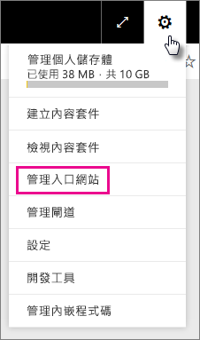

入口網站中有七個索引標籤。 此文章其餘部分提供有關這些索引標籤的資訊。

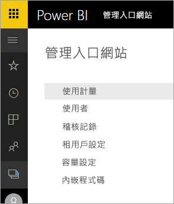

* [使用計量](#usage-metrics)
* [使用者](#users)
* [稽核記錄](#audit-logs)
* [租用戶設定](#tenant-settings)
* [Premium 設定](#premium-settings)
* [內嵌程式碼](#embed-codes)
* [組織視覺效果](#organization-visuals)

## 使用計量

[使用計量] 可讓您監視您組織的 Power BI 使用量。 它也能讓您查看貴組織 Power BI 中最活躍的使用者和群組。

> [!NOTE]
> 第一次存取儀表板，或經過長時間未檢視儀表板而再次瀏覽時，您可能會在載入儀表板時看到載入畫面。

只要載入儀表板，您就能看到兩個區段的圖格。 第一個區段包含個別使用者的使用量資料，第二個區段則是貴組織群組的類似資訊。

以下是您可以在每個圖格中看到的內容明細︰

* 使用者工作區中所有儀表板、報表和資料集的相異計數
  
    

* 最常用儀表板，依有其存取權限的使用者數目排列。 例如，如果您有一個和 3 位使用者共用的儀表板，又把它加入另兩位使用者連接的內容套件中，其計數為 6 (1 + 3 + 2)
  
    

* 使用者連接的最受歡迎內容。 這可以是使用者能夠透過 Get Data 程序接觸的任何項目，如 SaaS 內容套件、組織內容套件、檔案或資料庫。
  
    

* 使用者排行榜檢視，名次根據他們擁有的儀表板數排列，包括自己建立和共用的儀表板。
  
    

* 使用者排行榜檢視，名次排列依據為報表數。
  
    

第二個區段顯示相同類型的資訊，但以群組為依據。 這可讓您查看貴組織中最活躍的群組，以及他們取用的內容類型。

利用此資訊，您可以真正了解組織中人員如何使用 Power BI，而且能夠識別出貴組織中活躍的使用者與群組。

## 使用者

您可以在 Office 365 系統管理中心管理 Power BI 使用者、群組與系統管理員。 [使用者] 索引標籤提供您租用戶系統管理中心的連結。

## 稽核記錄

您可以在 Office 365 安全性與合規性中心管理 Power BI 稽核記錄。 [稽核記錄] 索引標籤提供您租用戶安全性與合規性中心的連結。 [深入了解](service-admin-auditing.md)

若要使用稽核記錄，請確定已啟用[**建立內部活動稽核以及合規性的稽核記錄**](#create-audit-logs-for-internal-activity-auditing-and-compliance)設定。

## 租用戶設定

[租用戶設定] 索引標籤可讓您更精細地控制為您的組織提供的功能。 如果您對敏感性資料有疑慮、我們的某些功能可能不適合您的組織，或您可能希望特定群組只能使用特定功能。

下圖顯示 [租用戶設定] 索引標籤的前兩個區段。

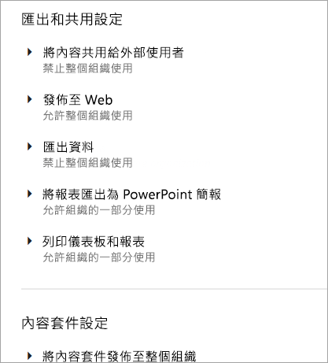

> [!NOTE]
> 設定變更可能需要 10 分鐘才會對租用戶中所有人生效。

設定可以有三個狀態：

* **已為整個組織停用**：組織中沒有人可以使用這項功能。

    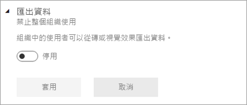

* **已為整個組織啟用**：組織中每個人都可以使用這項功能。

    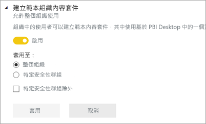

* **已為組織子集合啟用**：您組織中特定使用者或群組子集合可以使用此功能。

    您可以為整個組織啟用功能，特定使用者群組除外。

    

    您也可以只針對特定使用者群組啟用功能，同時為另一個使用者群組停用該功能。 此用此方式可確保特定使用者沒有功能的存取權，即使他們位於允許的群組中亦然。

    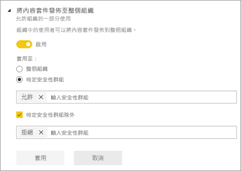

下面幾節將提供不同類型的租用戶設定概觀。

## 工作區設定

### 建立工作區 (預覽)

組織中的使用者可以建立應用程式工作區，以在儀表板、報表及其他內容共同作業。 [深入了解](service-create-the-new-workspaces.md)

## 匯出及共用設定

### 將內容共用給外部使用者

組織中的使用者可以和組織外的使用者共用儀表板。 [深入了解](service-share-dashboards.md#share-a-dashboard-or-report-with-people-outside-your-organization)

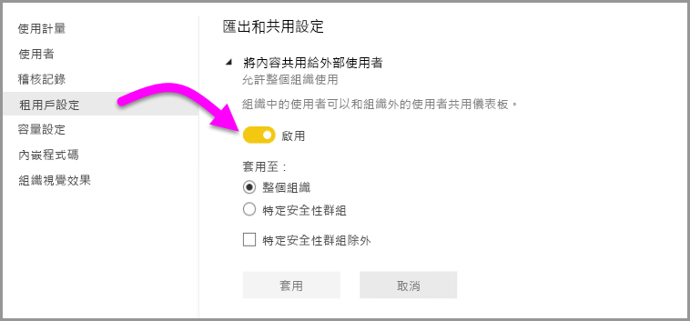

下圖顯示您與外部使用者共用時會出現的訊息。

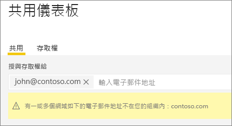

### 發佈至 Web

組織中的使用者可以將報表發行到網路。 [深入了解](service-publish-to-web.md)

下圖顯示當啟用 [發行到 Web] 設定時，報表的 [檔案] 功能表。

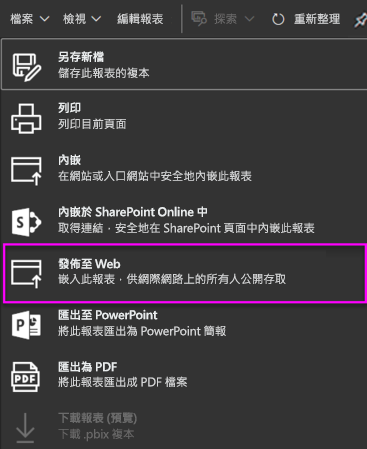

視 [發行到 Web] 設定而定，使用者會在 UI 中看到不同的選項。

|功能 |允許整個組織使用 |不允許整個組織使用 |特定安全性群組   |
|---------|---------|---------|---------|
|報告 [檔案] 功能表下的 [發佈至 web]。|針對全部啟用|並非所有人都可看到|只有經授權的使用者或群組才可看到。|
|[設定] 下的 [管理內嵌程式碼]|針對全部啟用|針對全部啟用|針對全部啟用  [刪除]*  選項僅適用於經授權的使用者或群組。 針對全部啟用 [取得驗證碼]* 。|
|系統管理員入口網站內的 [內嵌程式碼]|狀態會反映下列其中一項： * 使用中 * 不支援 * 已封鎖|狀態顯示「已停用」|狀態會反映下列其中一項： * 使用中 * 不支援 * 已封鎖  如果使用者不是依租用戶設定獲得授權，狀態會顯示成「侵害」。|
|現有的已發佈報告|全部已啟用|全部已停用|報告會繼續針對全部項目呈現。|

### 匯出資料

組織中的使用者可以從磚或視覺效果匯出資料。 [深入了解](visuals/power-bi-visualization-export-data.md)

下圖顯示從圖格匯出資料的選項。

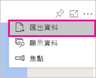

> [!NOTE]
> 停用 [匯出資料] 會讓使用者無法使用「在 Excel 中進行分析」功能，也無法使用 Power BI 服務即時連線。

### 將報表匯出成 PowerPoint 簡報或 PDF 文件

組織中的使用者可將 Power BI 報表匯出成 PowerPoint 檔案或 PDF 文件。 [深入了解](consumer/end-user-powerpoint.md)

下圖顯示當啟用 [Export reports as PowerPoint presentations or PDF documents] \(將報表匯出為 PowerPoint 簡報或 PDF 文件\) 設定時，報表的 [檔案] 功能表。

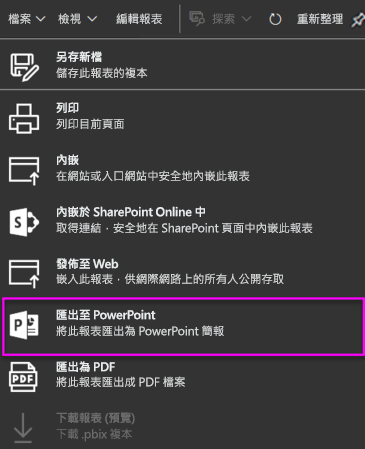

### 列印儀表板與報表

組織中的使用者可以列印儀表板和報表。 [深入了解](consumer/end-user-print.md)

下圖顯示列印儀表板的選項。

下圖顯示當啟用 [列印儀表板與報表] 設定時，報表的 [檔案] 功能表。

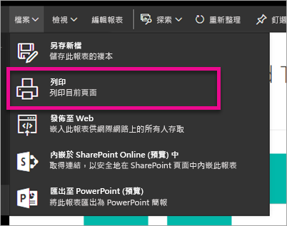

### 允許外部來賓使用者編輯和管理組織中的內容
Azure B2B 來賓使用者可編輯及管理組織中的內容。 [深入了解](service-admin-azure-ad-b2b.md)

以下影像顯示可讓外部來賓使用者編輯及管理組織中內容的選項。

## 內容套件及應用程式設定

### 將內容套件及應用程式發佈到整個組織

組織中的使用者可將內容套件與應用程式發佈到整個組織，而非只是發佈到特定群組。 [深入了解](service-organizational-content-pack-manage-update-delete.md)

下圖顯示建立內容套件時的 [我的整個組織] 選項。

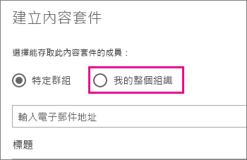

### 建立範本應用程式

組織中的使用者可以建立範本應用程式，其中使用在 Power BI Desktop 中建置的資料集。 深入了解[範本應用程式](template-content-pack-authoring.md)

### 將應用程式推送給終端使用者

使用者無須從 AppSource 進行安裝，就能將應用程式直接提供給終端使用者共用。 [深入了解](service-create-distribute-apps.md)

## 整合設定

### 使用 Cortana 詢問資料相關問題

組織中的使用者可以使用 Cortana 提出關於資料的問題。 [深入了解](service-cortana-enable.md)

> [!NOTE]
> 這項設定適用於整個組織，而無法限於特定群組。

### 在內部部署資料集使用 [在 Excel 中進行分析]

組織中的使用者可以使用 Excel 來檢視內部部署 Power BI 資料集，並與其互動。 [深入了解](service-analyze-in-excel.md)

> [!NOTE]
> 停用 [匯出資料] 也會讓使用者無法使用「在 Excel 中進行分析」功能。

### 使用 ArcGIS Maps for Power BI

組織中的使用者可使用由 Esri 所提供的 ArcGIS Maps for Power BI 視覺效果。 [深入了解](visuals/power-bi-visualization-arcgis.md)

### 為 Power BI 使用全域搜尋 (預覽)

組織中的使用者可以使用依賴 Azure 搜尋的外部搜尋功能。 例如，使用者可以使用 Cortana，直接從 Power BI 儀表板和報表擷取關鍵資訊。 [深入了解](service-cortana-intro.md)

## 自訂視覺效果設定

### 新增並使用自訂視覺效果

組織中的使用者可以共用自訂視覺效果，並與其互動。 [深入了解](power-bi-custom-visuals.md)

> [!NOTE]
> 這項設定可以套用於整個組織，也可以限於特定群組。

Power BI Desktop (自 3 月 19 日版起) 支援使用**群組原則**，讓組織的部署電腦無法使用自訂視覺效果。

<table>
<tr><th>屬性</th><th>值</th>
</tr>
<td>索引鍵</td>
    <td>Software\Policies\Microsoft\Power BI Desktop\</td>
<tr>
<td>valueName</td>
<td>EnableCustomVisuals</td>
</tr>
</table>

值為 1 (十進位) 會使 Power BI 中的自訂視覺效果可用 (此為預設)。

值為 0 (十進位) 會使 Power BI 中的自訂視覺效果無法使用。

### 僅允許認證的視覺效果

組織中已獲得新增和使用自訂視覺效果權限的使用者 (由「新增和使用自訂視覺效果」設定表示)，將只能使用[受認證的自訂視覺效果](https://go.microsoft.com/fwlink/?linkid=2002010) (未經認證的視覺效果將遭封鎖，並在使用時顯示錯誤訊息)。 

Power BI Desktop (自 3 月 19 日版起) 支援使用**群組原則**，讓組織的部署電腦無法使用未經認證的自訂視覺效果。

<table>
<tr><th>屬性</th><th>值</th>
</tr>
<td>索引鍵</td>
    <td>Software\Policies\Microsoft\Power BI Desktop\</td>
<tr>
<td>valueName</td>
<td>EnableUncertifiedVisuals</td>
</tr>
</table>

值為 1 (十進位) 會使 Power BI 中未經認證的自訂視覺效果可用 (此為預設)。

值為 0 (十進位) 會使 Power BI 中未經認證的自訂視覺效果無法使用 (此選項僅會使[經認證的自訂視覺效果可用](https://go.microsoft.com/fwlink/?linkid=2002010))。

## R 視覺效果設定

### 共用 R 視覺效果並與其互動

組織中的使用者可以共用以 R 指令碼建立的視覺效果，並與其互動。 [深入了解](visuals/service-r-visuals.md)

> [!NOTE]
> 這項設定適用於整個組織，而無法限於特定群組。

## 稽核與使用方式設定

### 建立稽核記錄以進行內部活動稽核與合規性

組織中的使用者可以使用稽核來監視組織中其他使用者在 Power BI 中執行的動作。 [深入了解](service-admin-auditing.md)

必須啟用此設定，才能記錄稽核記錄項目。 啟用稽核到能夠檢視稽核資料之間，有最多 48 小時的延遲。 若您未立即看到資料，請稍候再查看稽核記錄。 取得檢視稽核記錄的權限，以及能夠存取記錄的延遲可能相近。

> [!NOTE]
> 這項設定適用於整個組織，而無法限於特定群組。

### 內容建立者的使用計量

組織中的使用者可以看到自己所建立之儀表板與報表的使用計量。 [深入了解](service-usage-metrics.md)

### 內容建立者之使用計量中的個別使用者資料

內容建立者的使用計量，會公開正在存取內容之使用者的顯示名稱與電子郵件地址。 [深入了解](service-usage-metrics.md)

根據預設，已啟用使用計量的個別使用者資料，而且會將內容建立者帳戶資訊併入計量報表中。 如果您不想要針對部分或所有使用者包括這項資訊，則請停用指定安全性群組或整個組織的功能。 帳戶資訊接著會在報表中顯示為「未命名」。

## 儀表板設定

### 儀表板的資料分類

組織中的使用者可以用指出儀表板安全性層級的分類來標記儀表板。 [深入了解](service-data-classification.md)

> [!NOTE]
> 這項設定適用於整個組織，而無法限於特定群組。

## 開發人員設定

### 在應用程式中內嵌內容

組織中的使用者可以在軟體即服務 (SaaS) 應用程式中內嵌 Power BI 儀表板和報告。 停用此設定會讓使用者無法使用 REST API 在其應用程式中內嵌 Power BI 內容。 [深入了解](developer/embedding.md)

## 資料流程設定 (預覽)

### 建立及使用資料流程 (預覽)

組織內的使用者可建立及使用資料流程。 如需資料流程的概觀，請參閱 [Power BI 的自助資料準備 (預覽)](service-dataflows-overview.md)。 若要啟用 Premium 容量中的資料流程，請參閱[設定工作負載](service-admin-premium-workloads.md)。

> [!NOTE]
> 這項設定適用於整個組織，而無法限於特定群組。

## 範本應用程式設定 (預覽)

兩個設定了控制範本應用程式。 

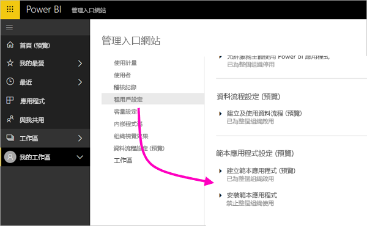

第一個設定 [建立範本應用程式] 控制您組織中有誰可建立範本應用程式。 範本應用程式建立者隨後可透過 AppSource 或其他散發方法，將這些應用程式散發至組織外部的用戶端。

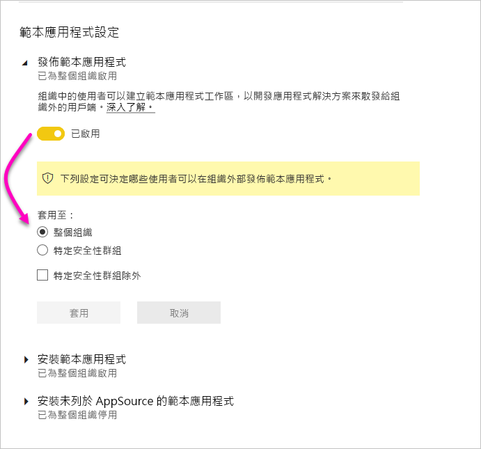

第二個設定 [安裝範本應用程式] 可讓您控制組織中有誰可以從 AppSource 或另一個來源下載並安裝範本應用程式

## 容量設定

### Power BI Premium

[Power BI Premium] 索引標籤可讓您管理已為您的組織購買的任何 Power BI Premium 容量 (EM 或 P SKU)。 組織內的所有使用者都可以看到 [Power BI Premium] 索引標籤，但如果他們被指派為*容量系統管理員*或具有指派權限的使用者，則只會看到其中的內容。 如果使用者沒有任何權限，系統會顯示下列訊息。

### Power BI Embedded

[Power BI Embedded] 索引標籤可讓您檢視您已為您的客戶購買的 Power BI Embedded (A SKU) 容量。 因為您只能從 Azure 購買 A SKU，您可以從 **Azure 入口網站**[管理 Azure 中的內嵌容量](developer/azure-pbie-create-capacity.md)。

如需有關如何管理 Power BI Embedded (A SKU) 設定的詳細資訊，請參閱[什麼是 Power BI Embedded](developer/azure-pbie-what-is-power-bi-embedded.md)。

## 內嵌程式碼

身為管理員，您可以檢視針對您租用戶產生的內嵌程式碼。 您也可以撤銷或刪除程式碼。 [深入了解](service-publish-to-web.md)

## 組織視覺效果

[組織視覺效果] 索引標籤可讓您部署及管理組織內的自訂視覺效果。 使用組織視覺效果時，您可以輕鬆地在您的組織中部署專屬視覺效果，供報表作者從 Power BI Desktop 探索並匯入到其報表。 [深入了解](power-bi-custom-visuals-organization.md)

> [!WARNING]
> 自訂視覺效果可能包含具有安全性或隱私權風險的程式碼；在您將自訂視覺效果部署到組織存放庫之前，請確定您信任自訂視覺效果的作者與來源。

下圖顯示目前部署在組織存放庫中的所有自訂視覺效果。

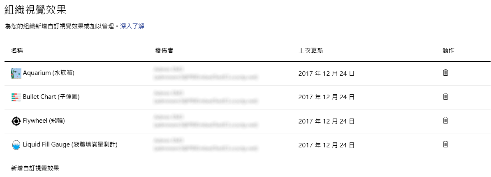

### 新增自訂視覺效果

若要將新的自訂視覺效果新增到清單中，請依照下列步驟執行。 

1. 在右窗格中，選取 [新增自訂視覺效果]。

    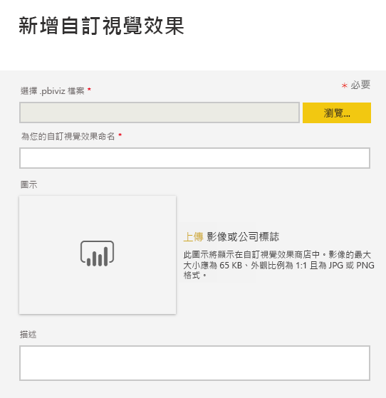

1. 填寫 [新增自訂視覺效果] 表單：

    * [選擇 .pbiviz 檔案] (必要)：選取要上傳的自訂視覺效果。 僅支援版本化 API 自訂視覺效果 (請參閱此處以了解其意義)。

    上傳自訂視覺效果之前，您應該先檢閱該視覺效果的安全性和隱私權，確定它符合組織的標準。

    * [命名您的自訂視覺效果] (必要)：提供視覺效果一個簡短標題，以便 Power BI Desktop 使用者了解其用途

    * **圖示**：在 Power BI Desktop UI 中顯示的圖示檔案。

    * [描述]：視覺效果的簡短描述，以提供使用者更多相關內容與資訊

1. 選取 [新增] 以起始上傳要求。 如果成功，您可以在清單中看到新項目。 如果失敗，您會收到一則適當的錯誤訊息

### 從清單刪除自訂視覺效果

若要永久刪除視覺效果，請為存放庫中的視覺效果選取資源回收筒圖示。

> [!IMPORTANT]
> 刪除動作無法復原。 一旦刪除，視覺效果會立即停止在現有的報表中轉譯。 即使您重新上傳相同的視覺效果，它也不會取代已刪除的先前視覺效果。 不過，使用者可以重新匯入新視覺效果，並取代他們報表中的執行個體。

### 刪除清單中的自訂視覺效果

若要從組織市集停用視覺效果，請選取齒輪圖示。 在 [存取] 區段中，停用自訂視覺效果。

停用視覺效果之後，視覺效果將不會在現有報表中轉譯，而且它會顯示下面的錯誤訊息。

*此自訂視覺效果已無法使用。如需詳細資訊，請連絡您的系統管理員。*

不過，已加入書籤的視覺效果仍會繼續運作。

進行任何更新或系統管理員變更之後， Power BI Desktop 使用者應該在 Power BI 服務中重新啟動應用程式或重新整理瀏覽器以查看更新。

### 更新視覺效果

若要從組織市集更新視覺效果，請選取齒輪圖示。 瀏覽並上傳視覺效果的新版本。

確定視覺效果識別碼會維持不變。 新檔案會取代先前的檔案，供整個組織內的所有報表使用。 不過，如果新版的視覺效果可能會中斷舊版視覺效果的任何使用方式或資料結構，則不要取代舊版。 您應該改以為新版視覺效果建立新的清單。 例如，將新的版本號碼 (版本 X.X) 新增至最新列出的視覺效果標題中。 透過這種方法，可以很清楚地表示它只是具有更新版本號碼的相同視覺效果，讓現有的報表不會中斷其功能。 再次提醒，請確定視覺效果識別碼維持不變。 之後，當使用者下一次從 Power BI Desktop 進入組織存放庫時，就能匯入新版本，這會提示他們取代報表中的目前版本。

如需詳細資訊，請前往[組織自訂視覺效果的常見問題集](https://docs.microsoft.com/power-bi/power-bi-custom-visuals-faq#organizational-custom-visuals)

## 資料流程儲存體 (預覽)

根據預設，搭配 Power BI 使用的資料儲存在 Power BI 提供的內部儲存體中。 透過整合資料流程與 Azure Data Lake Storage Gen2 (ADLS Gen2)，您可以在組織的 Azure Data Lake Storage Gen2 帳戶中儲存資料流程。 如需詳細資訊，請參閱[資料流程及 Azure Data Lake 整合 (預覽)](service-dataflows-azure-data-lake-integration.md)。

## 工作區 (預覽)

作為系統管理員，您可以檢視存在於租用戶中的工作區。 您可以排序和篩選工作區的清單，及顯示各工作區的詳細資料。 請注意，資料表資料行對應到工作區 [Power BI 管理 Rest API](/rest/api/power-bi/admin) 傳回的屬性。 個人工作區的類型為 **PersonalGroup**，舊版工作區的類型為 **Group**，新式工作區的類型為 **Workspace**。 如需詳細資訊，請參閱[在 Power BI 中建立新的工作區 (預覽)](service-create-the-new-workspaces.md)。

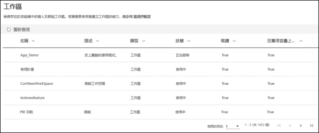

## 後續步驟

[管理貴組織中的 Power BI](service-admin-administering-power-bi-in-your-organization.md)  [了解 Power BI 系統管理角色](service-admin-role.md)  
[稽核貴組織的 Power BI](service-admin-auditing.md)  

有其他問題嗎？ [嘗試在 Power BI 社群提問](http://community.powerbi.com/)
