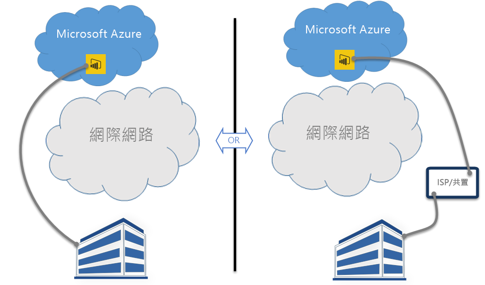

# Power BI 和 ExpressRoute

**ExpressRoute** 是 Azure 服務，可讓您在 Azure 資料中心 (Power BI 的所在位置) 與內部部署基礎結構之間建立私人連線，或在 Azure 資料中心與代管環境之間建立私人連線。

透過 **Power BI** 和 **ExpressRoute**，您可以建立從組織到 Power BI (或使用 ISP 設備代管) 的私人網路連線，藉由略過網際網路，更妥善地保護您的 Power BI 機密資料和連線。

如需詳細資訊，請參閱 [ExpressRoute 概觀](/azure/expressroute/expressroute-introduction)。 Power BI 符合 ExpressRoute 規範，但在一些例外狀況下，Power BI 會透過公用網際網路取得或傳送資料。 如需 Power BI 使用的 URL 清單，請參閱 [Power BI URL](power-bi-whitelist-urls.md)。

