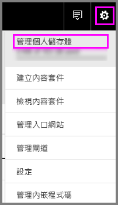
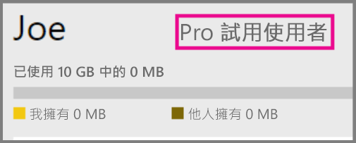
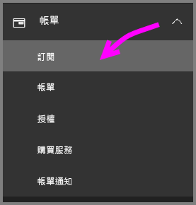
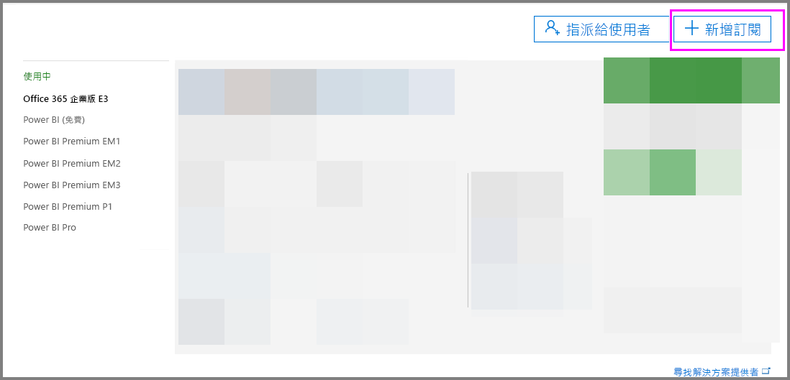
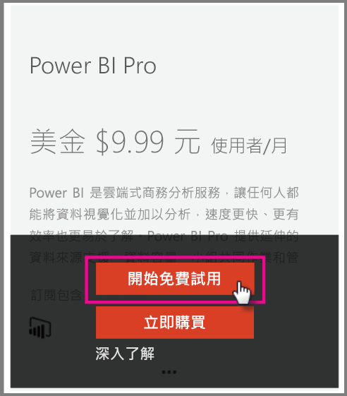

# 組織的 Power BI Pro

Power BI Pro 是啟用更多功能的付費授權。 Power BI Pro 授權適用於想要與其他人共用及共同作業，以制定資料驅動決策的小組。  建立或檢視共用 Power BI 內容的每個小組成員都需要 Pro 授權，除非該內容使用 Power BI Premium 與專用容量建立關聯。

下列功能需要 Power BI Pro 授權：

* **在 Excel 或 Power BI Desktop 中分析資料** - 使用 Excel 或 Power BI Desktop，檢視 Power BI 中發行的資料集並與其互動。 如需詳細資訊，請參閱[使用 Excel 分析](service-analyze-in-excel.md)。

* **共用儀表板並與工作區共同作業** - Power BI 工作區有助於與同事在儀表板、報表和資料集上共同作業。 如需詳細資訊，請參閱[在 Power BI 應用程式工作區中共同作業](service-collaborate-power-bi-workspace.md)。

* **檢視共用的內容** - Pro 使用者可以檢視與其共用的儀表板和報表、與共用的儀表板和報表互動，並重新共用與其共用的儀表板和報表 (如果允許)。 不過，Pro 使用者無法編輯這些儀表板或報表。 如需詳細資訊，請參閱[與同事和其他人共用您的 Power BI 儀表板和報表](service-share-dashboards.md)。

* **與 Microsoft Teams 整合內容** - 您可以在 Microsoft (MS) Teams 頻道中新增 [Power BI] 索引標籤。 MS Teams 會自動偵測工作區中的所有報表。 如需詳細資訊，請參閱 [Power BI 與 Microsoft Teams 合作](https://powerbi.microsoft.com/en-us/blog/power-bi-teams-up-with-microsoft-teams/)。 

## Power BI Pro 60 天個人試用版

當您已註冊免費帳戶之後，可以選擇免費試用 Pro 版 60 天。 在試用期間您將可存取所有的 Pro 功能。 Power BI Pro 有 Power BI 免費版本的所有功能，還有其他共用和共同作業功能。 如需詳細資訊，請參閱 [Power BI 定價](https://powerbi.microsoft.com/en-us/pricing/)。 若要嘗試 Power BI Pro 的 60 天免費試用版，請登入 Power BI，然後嘗試 Power BI Pro 的功能。

* [建立工作區](consumer/end-user-create-apps.md)
* [共用儀表板](service-share-dashboards.md)

當您嘗試任何一項功能時，系統會提示您開始使用免費試用版。 您也可以移至齒輪圖示，並選取 [管理個人儲存體]，選擇使用該功能。 然後選取右邊的 [免費試用專業版]。

   
    
   

接著，您可以選取 [開始試用]。

   

> [!NOTE]
> 利用此產品中 Power BI Pro 試用版的使用者不會在 Office 365 管理入口網站顯示為 Power BI Pro 試用版的使用者 (它們顯示為 Power BI 免費版使用者)。 不過在 Power BI [管理儲存體] 頁面中會顯示為 Power BI Pro 試用版使用者。
>

> [!NOTE]
> 如果您是 IT 系統管理員，想要取得並部署 Power BI 試用版授權至組織中的多個使用者，而不需要讓個別使用者個別接受試用版條款，您可以註冊 Power BI Pro 訂閱試用版。 您必須是 Office 365 全域或帳單的系統管理員，否則要建立新的租用戶以註冊系統管理員試用版。 如需詳細資訊，請參閱[購買 Power BI Pro](service-admin-purchasing-power-bi-pro.md)。
>

當您在服務內時，您可以確認您有 Pro 試用帳戶，方法是移至齒輪圖示，然後選取 [管理個人儲存體]。

   

## Office 365 中的訂閱試用

您可以為您的組織取得 Power BI Pro 試用版。 訂閱之後，您可以將 Power BI Pro 的授權指派給您的使用者。 如需如何指派授權的詳細資訊，請參閱[在 Office 365 中將授權指派給使用者](https://support.office.com/en-us/article/assign-licenses-to-users-in-office-365-for-business-997596b5-4173-4627-b915-36abac6786dc?ui=en-US&rs=en-US&ad=US)。

> [!NOTE]
> 每個租用戶只限使用一個組織試用版。 這表示，如果有人已將 Power BI Pro 試用版套用至您的租用戶，您就無法再次套用。 如果您需要這方面的協助，可以參閱[連絡商務用 Office 365 支援人員 - 系統管理協助](https://support.office.microsoft.com/en-us/article/contact-support-for-business-products-admin-help-32a17ca7-6fa0-4870-8a8d-e25ba4ccfd4b?CorrelationId=552bbf37-214f-4202-80cb-b94240dcd671&ui=en-US&rs=en-US&ad=US)。
>

請執行下列步驟來取得 Offiec 365 的試用訂閱：

1. 導覽到 [Office 365 系統管理中心](https://portal.office.com/adminportal/home#/homepage)。
2. 在左側瀏覽窗格上，選取 [計費]，然後按一下 [訂閱]。

   

3. 選取右邊的 [新增訂閱]。

   

4. 在 [其他方案] 下，將滑鼠停留在 Power BI Pro 的省略符號 (...)，然後選取 [開始免費試用]。

    

5. 在 [確認訂單] 畫面上，選取 [立即試用]。
6. 選取訂單收據上的 [繼續]。

## 購買 Power BI Pro

您可以透過 Microsoft Office 365 或透過認證的 Microsoft 合作夥伴，來購買 Power BI Pro。 如需如何購買 Power BI Pro 的詳細資訊，請參閱[購買 Power BI Pro](service-admin-purchasing-power-bi-pro.md)。

## 後續步驟
[Power BI 的自助式註冊](service-admin-signing-up-for-power-bi-with-a-new-office-365-trial.md)
 
[組織的 Power BI (免費)](service-admin-service-free-in-your-organization.md)
 
[購買 Power BI Pro](service-admin-purchasing-power-bi-pro.md)
 
[Pro 延長試用版啟用](service-extended-pro-trial.md)
 
[指派 Power BI Pro 授權](service-admin-assigning-power-bi-pro-licenses.md)
 
[何謂 Power BI Premium](service-admin-premium-manage.md)
 
[如何購買 Power BI Premium](service-admin-premium-purchase.md)
 
[Power BI Premium 技術白皮書](https://aka.ms/pbipremiumwhitepaper)

有其他問題嗎？ [嘗試在 Power BI 社群提問](https://community.powerbi.com/)