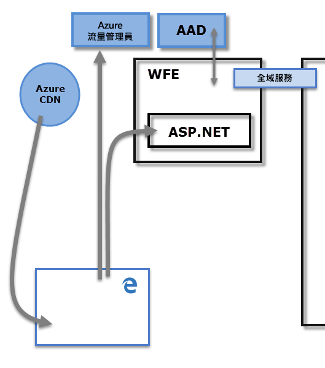
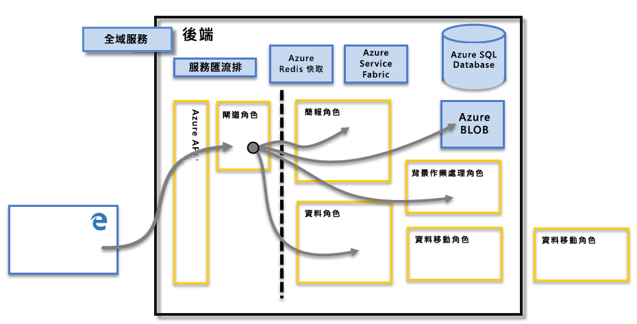

# Power BI 安全性
如需 Power BI 安全性的詳細說明，請[下載 Power BI 安全性技術白皮書](http://go.microsoft.com/fwlink/?LinkId=829185)：

Power BI 服務是建置在 Microsoft 的雲端運算基礎結構和平台 **Azure**之上。 Power BI 服務架構的基礎包含兩個叢集：Web 前端 (**WFE**) 叢集和 **後端** 叢集。 WFE 叢集負責 Power BI 服務的初始連接和驗證；驗證後，便會由後端來處理所有後續使用者互動。 Power BI 分別使用 Azure Active Directory (AAD) 來儲存及管理使用者身分識別，以及使用 Azure BLOB 和 Azure SQL Database 來管理資料和中繼資料的儲存。

## Power BI 架構
每個 Power BI 部署都是由兩個叢集所組成：Web 前端 (**WFE**) 叢集和 **後端** 叢集。

**WFE** 叢集管理 Power BI 的初始連接和驗證程序，其使用 AAD 驗證用戶端並提供權杖，以便進行 Power BI 服務的後續用戶端連接。 Power BI 也會使用 **Azure 流量管理員** (ATM)，將使用者流量導向至由用戶端嘗試連接的 DNS 記錄所決定的最近資料中心，以便進行驗證程序及下載靜態內容和檔案。 Power BI 使用 **Azure 內容傳遞網路** (CDN)，以根據地區設定有效率地散發必要的靜態內容和檔案給使用者。

**後端** 叢集是已驗證的用戶端與 Power BI 服務的互動方式。 **後端** 叢集管理視覺效果、使用者儀表板、資料集、報表、資料儲存、資料連接、資料重新整理，以及與 Power BI 服務互動的其他層面。 **閘道角色** 擔任使用者要求與 Power BI 服務之間的閘道。 使用者無法與 **閘道角色**以外的任何角色直接互動。 最終會由 **Azure API 管理**來操控**閘道角色**。

> [!IMPORTANT]
> 請務必注意，只有 **Azure API 管理** (APIM) 和 **閘道** (GW) 角色可以透過公用網際網路存取。 這些角色提供驗證、授權、DDoS 保護、節流、負載平衡、路由及其他功能。
> 
> 

## 資料儲存安全性
Power BI 使用兩個主要的儲存機制來儲存及管理資料：使用者上傳的資料通常會傳送至 **Azure BLOB** 儲存體，而所有中繼資料及系統本身的成品則會儲存在 **Azure SQL Database**中。

上方 **後端** 叢集圖中的虛線清楚顯示只有使用者可存取的兩個元件 (虛線左側)，以及只有系統可存取的角色之間的界限。 當已驗證的使用者連接到 Power BI 服務時，會由 **閘道角色** (最終由 **Azure API 管理**來操控) 接受及管理用戶端所進行的連接和任何要求，該角色接著會代表使用者與 Power BI 服務的其餘部分互動。 例如，當用戶端嘗試檢視儀表板時， **閘道角色** 會接受該要求，然後另外傳送要求給 **簡報角色** ，以擷取瀏覽器呈現儀表板所需的資料。

## 使用者驗證
Power BI 使用 Azure Active Directory ([AAD](http://azure.microsoft.com/services/active-directory/)) 來驗證登入 Power BI 服務的使用者，而 Azure Active Directory 則會在每次使用者嘗試存取需要驗證的資源時使用 Power BI 登入認證。 如果使用者以用來建立 Power BI 帳戶的電子郵件地址登入 Power BI 服務，Power BI 會使用該登入電子郵件做為「有效的使用者名稱」 ，並在每次使用者嘗試連接到資料時，將該名稱傳遞給資源。 「有效的使用者名稱」接著會對應到「使用者主體名稱」([UPN](https://msdn.microsoft.com/library/windows/desktop/aa380525\(v=vs.85\).aspx))，並依據所套用的驗證，解析為相關聯的 Windows 網域帳戶。

針對使用公司電子郵件 (例如 *david@contoso.com*) 登入 Power BI 的組織，「有效的使用者名稱」與 UPN 的對應相當直接。 針對未使用公司電子郵件(例如 *david@contoso.onmicrosoft.com*) 登入 Power BI 的組織，AAD 與內部部署認證之間的對應需要[目錄同步作業](https://technet.microsoft.com/library/jj573653.aspx)才能正常運作。

Power BI 的平台安全性還包括多租用戶環境安全性、網路安全性，以及增加其他以 AAD 為基礎之安全性措施的能力。

## 資料和服務安全性
如需詳細資訊，請瀏覽 [Microsoft 信任中心](https://www.microsoft.com/trustcenter)。

如本文稍早所述，內部部署 Active Directory 伺服器利用使用者的 Power BI 登入來對應至 UPN 以取得認證。 不過，請 **務必** 注意，使用者對所要共用的資料負有責任：如果使用者使用自己的認證連接到資料來源，然後共用依據該資料的報表 (或儀表板、資料集)，則共用儀表板的其他使用者不會經過原始資料來源的驗證，便會取得報表的存取權。

唯一的例外是使用**內部部署資料閘道**連線到 **SQL Server Analysis Services**；這些儀表板會在 Power BI 中快取，但存取基礎報表或資料集會對嘗試存取該報表 (或資料集) 的使用者起始驗證，使用者必須具備足以存取該資料的認證，才能存取該資料。 如需詳細資訊，請參閱[內部資料閘道深入探討](service-gateway-onprem-indepth.md)。

