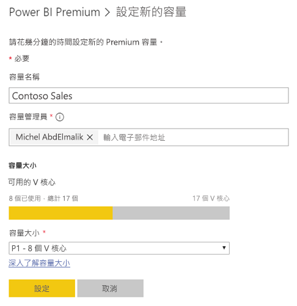
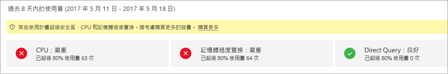
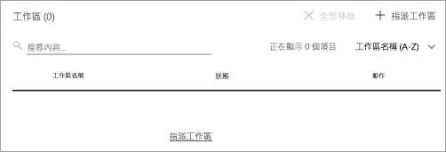
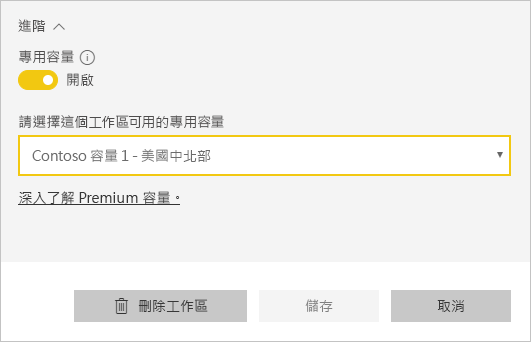
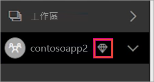

# 管理 Power BI Premium 和 Power BI Embedded 內的容量
了解如何管理提供內容專用資源的 Power BI Premium 和 Power BI Embedded 容量。

容量是一群 Power BI Premium 和 Power BI Embedded 供應項目。

## 什麼是容量？
容量是專門保留供您使用的資源集。 擁有容量可讓您將儀表板、報表和資料集發佈給整個組織的使用者，不必購買其授權。 它也會保證容量中所裝載內容的可靠且一致效能。

容量對一般使用者完全透明。 他們可以如常繼續使用 Power BI 或您的應用程式。 他們甚至不需要知道有些 (或全部) 內容裝載在專用容量中。 對您的使用者而言，運作都會與之前完全相同。

[!INCLUDE [powerbi-premium-illustration](./includes/powerbi-premium-illustration.md)]

如需詳細資訊，請參閱[什麼是 Power BI Premium？](service-premium.md)。

## 購買容量
若要利用專用容量，您需要在 Office 365 系統管理中心內購買 Power BI Premium 訂閱，或在 Microsoft Azure 入口網站內建立 Power BI Embedded 資源。 如需詳細資訊，請參閱下列內容：

* **Power BI Premium：**[如何購買 Power BI Premium](service-admin-premium-purchase.md)
* **Power BI Embedded：** [在 Azure 入口網站中建立 Power BI Embedded 容量](https://docs.microsoft.com/en-us/azure/power-bi-embedded/create-capacity)

當您購買 Power BI Premium SKU 時，您的租用戶會收到供執行中容量使用的對應 V 核心數目。 例如，購買 Power BI Premium P3 SKU 可提供租用戶 32 個 V 核心。

## 容量管理員
> [!NOTE]
> Power BI Embedded 容量的容量管理員是在 Microsoft Azure 入口網站內定義。
> 
> 

當您被指派為容量的容量管理員時，您就可以全權掌控容量和其系統管理功能。 從 Power BI 管理入口網站，您可以新增更多容量管理員 (僅限 Power BI Premium)，或將容量指派權限授與使用者。 您可以將工作區大量指派給容量，並檢視容量的使用量計量。

每個容量都有其自己的管理員。 定義某個容量的容量管理員，並不會提供他們對您組織內所有容量的存取權。 容量管理員預設無法存取所有的 Power BI 管理區域，例如使用計量、稽核記錄檔或租用戶設定。 容量管理員也沒有設定新容量或變更現有容量 SKU 的權限。 只有全域管理員或 Power BI 服務系統管理員可以存取這些項目。

所有的 Office 365 全域管理員和 Power BI 管理員都會自動成為 Power BI Premium 容量和 Power BI Embedded 容量的容量管理員。

## 管理容量
在 Office 365 中購買容量節點之後，您即需要設定新的容量。 這會透過 [Power BI 管理入口網站](service-admin-portal.md)完成。 在管理入口網站內，您會看到名為 [容量設定] 的區段。 這是您要在其中管理貴組織之 Power BI Premium 容量的位置。

選取 [容量設定] 即會前往 Power BI Premium 預設的容量管理畫面。

### 設定新的容量 (Power BI Premium)
V 核心數目會反映已使用的數量以及可用來建立容量的數量。 貴組織可使用的 V 核心數量是以您已購買的 Premium SKU 為基礎。 例如，購買 P3 和 P2 會得到 48 個可用的核心，P3 有 32 個和 P2 有 16 個。

如有可用的 V 核心，請執行下列作業來設定新容量。

1. 選取 [設定新的容量]。
2. 提供您容量的**名稱**。
3. 定義誰是這個容量的容量管理員。
   
    容量管理員不需要是 Power BI 管理員或 Office 365 全域管理員。如需詳細資訊，請參閱 [Power BI Premium 容量管理員](#capacity-admins)。
4. 選取容量大小。 可用的選項取決於您有多少可用的 V 核心。 您無法選取超過可用數量的選項。
   
    
5. 選取 [設定]。

容量管理員以及 Power BI 管理員和 Office 365 全域管理員，接著會看到管理入口網站內所列的容量。

### 容量設定
在進階容量管理畫面內，您可以在動作下選取**齒輪圖示 (設定)**。 這可讓您重新命名或刪除容量。 它也會指出誰是服務管理員、容量的 SKU/大小，以及容量所在的地區。

![Power BI Premium 中的容量設定 [刪除] 和 [套用] 按鈕](media/service-admin-premium-manage/capacity-settings-delete.png)

> [!NOTE]
> Power BI Embedded 容量設定是在 Microsoft Azure 入口網站內管理。
> 
> 

### 變更容量大小 (Power BI Premium)
Power BI 管理員和 Office 365 全域管理員可選取 [變更容量大小]，來變更 Power BI Premium 容量大小。 不是 Power BI 管理員或 Office 365 全域管理員的容量管理員沒有此選項。

如有可用的資源，[變更容量大小] 畫面可讓您升級或降級容量大小。 系統管理員可隨意建立、調整大小和刪除節點，只要他們有必要的 V 核心數量。 

P SKU 無法降級為 EM SKU。 您可以將滑鼠停留在提供說明的已停用選項上。

### 容量指派
您可以選取容量的名稱來管理容量。 這會將您帶到容量管理畫面。

如果未將任何工作區指派給容量，您會看到可讓您**指派工作區**的訊息。

#### 使用者權限
您可以為 Power BI Premium 容量指派額外的**容量管理員**。 也可以指派具有**容量指派權限**的使用者。 如果具有指派權限的使用者是應用程式工作區的管理員，則他們可以將該工作區指派給容量。 他們也可以將其個人的「我的工作區」指派給容量。 具有指派權限的使用者將無法存取管理入口網站。

> [!NOTE]
> Power BI Embedded 容量的容量管理員是在 Microsoft Azure 入口網站內指派。
> 
> 

## 使用量度量 (Power BI Premium)
針對每個容量，您可以使用 CPU、記憶體和直接查詢的使用量度量。 每個 KPI 都有三個指標：[好 (綠色)]、[臨界 (黃色)] 和 [嚴重 (紅色)]。 建議您監視這些計量，確保您的使用者在使用進階內容時看到良好的效能。

**Power BI Embedded 容量使用量是在 Azure 入口網站中監視。**

| 計量 | 描述 |
| --- | --- |
| CPU |您核心的 CPU 使用量。 |
| 記憶體 |代表後端核心的記憶體壓力。 具體而言，這個計量是因使用多個模型的記憶體壓力而從記憶體收回模型的頻率。 |
| DQ/s |* 我們限制每秒的 DirectQuery 和即時連線查詢總數。 * P1 的限制為 30/s、P2 為 60/s，而 P3 為 120/s。 * DirectQuery 和即時連線查詢計數等於上面的節流。 例如，如果您每秒有 15 個 DirectQuery 和 15 個即時連線，請按節流。 * 這會平均套用至內部部署和雲端連線。 |

這些計量是臨界/嚴重時，您的使用者可能會看到報表和重新整理效能降低，特別是尖峰負載時間。

計量會反映過去一週的使用率，並且設計成在容量多載時計算執行個體數目，因此為使用者提供小於最佳效能的效能。

每次出現「使用率超過 80%」都應該視為效能可能會降低。 有許多案例是使用者之關鍵效能問題的良好指標。

## 將工作區指派給容量
有幾種方法可以將工作區指派給容量。

### 管理入口網站中的容量管理
容量管理員以及 Power BI 管理員和 Office 365 全域管理員，可以在管理入口網站的進階容量管理區段內大量指派工作區。 當您管理容量時，會看到可讓您指派工作區的 [工作區] 區段。

1. 選取 [指派工作區]。 這會列在多個位置，而且全部都執行相同的工作。
2. 選取 [The entire organization's workspaces] (整個組織的工作區) 或 [Specific workspaces by user] (使用者的特定工作區)。
   
   | 選取項目 | 描述 |
   | --- | --- |
   | **The entire organization's workspaces (整個組織的工作區)** |將整個組織的工作區指派給進階容量，會將組織中的所有「應用程式工作區」和「我的工作區」指派給這個進階容量。 此外，所有目前和未來使用者都有權將個別工作區重新指派給這個容量。 |
   | **Specific workspaces by user (使用者的特定工作區)** |當您指派使用者或群組的工作區時，會將這些使用者所擁有的所有工作區都指派給進階容量，包括使用者的個人工作區。 就是使用者會自動取得工作區指派權限。 這包括已指派給不同容量的工作區。 |
3. 選取 [ **套用**]。

這個選項不允許您將特定工作區指派給容量。

### 應用程式工作區設定
您也可以從該工作區的設定中，將應用程式工作區指派給進階容量。 若要將應用程式工作區指派給進階容量，請執行下列動作。

若要將工作區移至容量，您必須具有該工作區的管理員權限，同時具有該容量的容量指派權限。 請注意，工作區管理員一律可以從進階容量中移除工作區。

1. 選取省略符號 (...) 並選取 [編輯工作區]，來編輯應用程式工作區。
   
    
2. 在 [編輯工作區] 內，展開 [進階]。
3. 如果您已經獲提供任何容量的容量指派權限，則可以選擇開啟這個工作區的 [進階]。
4. 選取您想要將這個應用程式工作區指派至其中的容量。
   
    
5. 選取 [儲存]。

儲存之後，工作區和其所有內容都會移至進階容量，而不會干擾一般使用者的任何體驗。

## Premium 對使用者而言是什麼
在大部分的情況下，使用者甚至不需要知道它們位在進階容量中。 其儀表板和報表也能夠運作。 您會看到進階容量中工作區旁的菱形圖示，這是視覺效果提示。 

## Power BI 報表伺服器產品金鑰)
在 Power BI 管理入口網站的 [容量設定] 索引標籤內，您可以存取 Power BI 報表伺服器產品金鑰。 這只適用於全域管理員，或已獲指派 Power BI 服務系統管理員角色的使用者，如已購買 Power BI Premium SKU。

![[容量設定] 內的 Power BI 報表伺服器金鑰](media/service-admin-premium-manage/pbirs-product-key.png)

選取 [Power BI 報表伺服器金鑰] 會顯示一個包含產品金鑰的對話方塊。 您可以複製金鑰，並在安裝時使用。

如需詳細資訊，請參閱[安裝 Power BI 報表伺服器](report-server/install-report-server.md)。

## 後續步驟
當您將工作區指派給 Premium 容量時，請與免費使用者共用已發佈的應用程式。 如需詳細資訊，請參閱[在 Power BI 中建立和散發應用程式](service-create-distribute-apps.md)。

有其他問題嗎？ [嘗試在 Power BI 社群提問](http://community.powerbi.com/)

