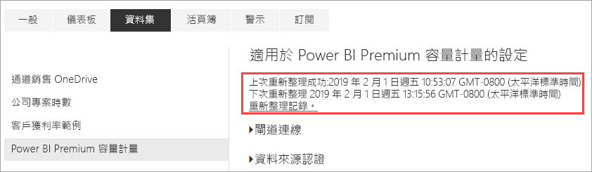
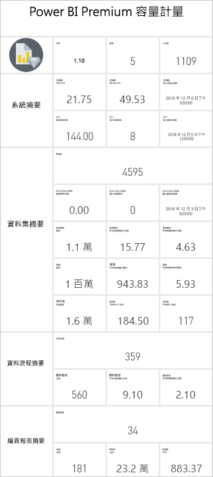

# 使用應用程式監視 Premium 容量

監視您的容量對於明智地決定如何最有效地利用 Premium 容量資源至關重要。 您可以在系統管理入口網站中或使用 **Power BI Premium 容量計量**應用程式來監視容量。 本文說明如何使用 Premium 容量計量應用程式。 此應用程式提供您容量如何執行的最深入資訊。 如需過去七天平均使用計量的更高階概觀，您可以使用系統管理入口網站。 若要深入了解入口網站中的監視，請參閱[在系統管理入口網站中監視 Premium 容量](service-admin-premium-monitor-portal.md)。

應用程式會定期更新，加入新特性和功能。 請確定您執行的是最新版本。 如果您已安裝舊版應用程式，最好從您的應用程式中刪除它，然後按下 CTRL + F5 重新整理。

> [!IMPORTANT]
> 如果 Power BI Premium 容量遇到高資源使用量，因而發生效能或可靠性問題，您可收到通知電子郵件以找出問題並加以解決。 這是對超載容量進行疑難排解的簡單方式。 如需詳細資訊，請參閱[容量和可靠性通知](service-interruption-notifications.md#capacity-and-reliability-notifications)。

## 安裝應用程式

您可以直接移至 [Premium 容量計量應用程式](https://app.powerbi.com/groups/me/getapps/services/capacitymetrics)，或在 Power BI 中如同安裝其他應用程式一樣安裝它。

1. 在 Power BI 中，按一下 [應用程式]  。

    ![移至 [應用程式]](media/service-admin-premium-monitor-capacity/apps.png)

2. 在右側，按一下 [取得應用程式]  。
3. 在 [應用程式]  類別中，搜尋 **Power BI Premium 容量計量應用程式**。
4. 訂閱以安裝該應用程式。

請耐心等候。 需要幾分鐘的時間來安裝和重新整理計量。 如果應用程式顯示空白計量，請按 F5 重新整理您的瀏覽器。

## 取得應用程式重新整理記錄

若要檢查您上次重新整理 Premium 計量應用程式的時間，請按一下 [設定]   > [資料集]   > [Power BI Premium 容量計量]   > [重新整理記錄]  。 

即會顯示上次重新整理，或按一下 [重新整理記錄]  ，來查看已排定的重新整理和隨選重新整理。

## 使用應用程式監視容量

既然您已安裝應用程式，就可以查看您組織中容量的計量。 應用程式提供儀表板，其中顯示計量摘要，以及詳細的計量報告。

### 儀表板

若要查看您是系統管理員之功能的摘述主要計量，請在 [儀表板]  中按一下 [Power BI Premium 容量計量]  。 隨即出現儀表板。

儀表板包括下列計量：

#### 頂端

| Metric | 描述 |
| --- | --- |
| 版本 | 應用程式版本。 | 
| 容量 | 您身為系統管理員所擁有的容量數目。 | 
| 工作區 | 容量中會回報計量的工作區數目。|
|||

#### 系統摘要

| Metric | 描述 |
| --- | --- |
| CPU 最高使用率容量 | 過去七天內 CPU 超過閾值 80% 最大次數的容量。 |
| CPU 最高使用率計數 | 過去七天內 CPU 超出指定容量閾值 80% 的次數。 | 
| 記憶體最大使用率容量 | 過去七天內已達最大記憶體限制的最大次數容量 (分割為三分鐘的貯體)。  |
| 記憶體最大使用率計數| 過去七天內指定容量超過最大記憶體限制的次數 (分割為三分鐘的貯體)。 |
|||

#### 資料集摘要

| Metric | 描述 |
| --- | --- |
| 資料集 | 在您容量中所有工作區的資料集總數。|
| 資料集平均大小 (MB) | 在您容量中所有工作區的資料集平均大小。|  
| 資料集平均載入計數 | 載入記憶體之資料集的平均計數。 |  
| 資料集 - 平均作用中資料集 (%)| 過去七天內的平均作用中資料集。 若使用者在過去三分鐘內在視覺效果上有互動，則將資料集定義為作用中。 |
| CPU - 資料集最大 (%)| 過去七天內資料集工作負載的最大 CPU 取用量。 |
| CPU - 資料集平均 (%)| 過去七天內資料集工作負載的平均 CPU 取用量。 |
| 記憶體 - 資料集平均 (GB) | 過去七天內資料集工作負載的平均記憶體取用量。 |
| 記憶體 - 資料集最大 (GB) | 過去七天內資料集工作負載的最大記憶體取用量。|
| 資料集區撤出 | 由於記憶體壓力而撤出的資料集總數。 |
| DirectQuery/即時高使用率計數| 過去七天內 DirectQuery/即時連線超過閾值 80% 的次數 (分割為三分鐘的貯體)。 |
| DirectQuery/即時最大使用率計數| 過去七天內 DirectQuery/即時連線超過 80% 的最多次數 (分割為一小時的貯體)。 |
| DirectQuery/即時最大高使用率 | 過去七天內 DirectQuery/即時連線超過閾值 80% 的最大次數 (分割為三分鐘的貯體)。|
| DirectQuery/即時最大發生時間 | 一小時內 DirectQuery/即時連線超過 80% 最多次數的 UTC 時間。 |
| 重新整理總計 | 過去七天內的重新整理總數。 |
| 重新整理可靠性 (%) | 過去七天內成功重新整理數目除以重新整理總數。 |
| 重新整理平均持續期間 (分鐘) | 完成重新整理的平均時間。 |
| 重新整理平均等候時間 (分鐘)| 開始重新整理前的平均時間。 |
| 查詢總計 |  過去七天內執行的查詢總數。 |
| 查詢總計等候計數 | 執行前必須等候的查詢總數。 |
| 查詢平均持續期間 (毫秒) | 完成查詢花費的平均時間。 |
| 查詢平均等候時間 (毫秒) | 執行前查詢在系統資源上等候的平均時間。 |
|||

#### 資料流程摘要

| Metric | 描述 |
| --- | --- |
| 資料流程 |  容量中所有工作區的資料流程總數。|
| 重新整理總計 | 過去七天內的重新整理總數。|  
| 重新整理平均持續期間 (分鐘) | 完成重新整理花費的時間。 |
| 重新整理平均等候時間 (分鐘) | 重新整理的排程時間與實際開始時間的差異。|
| CPU - 資料流程最大值 (%) | 過去七天內資料流程工作負載的最大 CPU 取用量。 |
| CPU - 資料流程平均 (%) | 過去七天內資料流程工作負載的平均 CPU 取用量。 |
| 記憶體 - 資料流程最大值 (GB) | 過去七天內資料流程工作負載的最大記憶體取用量。 |
| 記憶體 - 資料流程平均 (GB) | 過去七天內資料流程工作負載的平均記憶體取用量。 |
|||

#### 編頁報表摘要

| Metric | 描述 |
| --- | --- |
| 編頁報表 |  容量中所有工作區的編頁報表總數。 |
| 檢視總數 | 使用者檢視過所有報表的總次數。 | 
| 資料列總數 | 所有報表資料的資料列總數。|
| 總時間 | 所有報表在全部階段 (擷取、處理和轉譯資料) 所花費的總時間 (以毫秒為單位)。 |
| CPU - 編頁報告最大值 (%) | 過去七天內編頁報告工作負載的最大 CPU 取用量。 |
| CPU - 編頁報表平均 (%) | 過去七天內編頁報告工作負載的平均 CPU 取用量。 |
| 記憶體 - 編頁報告最大值 (GB) | 過去七天內編頁報告工作負載的最大記憶體取用量。 |
| 記憶體 - 編頁報告平均 (GB) | 過去七天內編頁報告工作負載的平均記憶體取用量。 |
|||

#### AI 摘要

| Metric | 描述 |
| --- | --- |
| AI 函式執行 | 過去七天內的執行總數。 |
| AI 函式執行可靠性 (%) | 過去七天內成功執行數目除以執行總數。 |
| CPU 最大值 (%)| 過去七天內 AI 工作負載的最大 CPU 取用量。 |
| 記憶體最大值 (GB) | 過去七天內 AI 工作負載的最大記憶體取用量。|
| AI 函式執行最長等候時間 (毫秒) | 開始執行前的最長時間。 |
| AI 函式執行平均等候時間 (毫秒)| 開始執行前的平均時間。 |
| AI 函式執行最長持續時間 (毫秒) | 完成執行的最長時間。 |
| AI 函式執行平均持續時間 (毫秒)| 完成執行的平均時間。 |
| | |

### 報表

報告提供更多詳細計量。 若要查看報告以了解您為其系統管理員的容量，請在 [報告]  中按一下 [Power BI Premium 容量計量]  。 或者，從儀表板按一下計量儲存格以移至底層報告。 

報告底部有五個*索引標籤*：

[**資料集**](#datasets) - 提供關於您容量中 Power BI 資料集健康情況的詳細計量。
[**編頁報表**](#paginated-reports) - 提供關於您容量中編頁報表健康情況的詳細計量。
[**資料流程**](#dataflows) - 提供關於您容量中資料流程的詳細重新整理計量。
[**AI**](#ai) - 提供您容量中所使用之 AI 函式健全狀況的詳細計量。
[**資源耗用量**](#resource-consumption) - 提供詳細的資源計量，包括記憶體及 CPU 高使用率。
[**識別碼和資訊**](#ids-and-info) - 容量、工作區和工作負載的名稱、識別碼及擁有者。

每個索引標籤都會開啟您可以依據容量和日期範圍來篩選計量的頁面。 若未選取任何篩選條件，報表預設為顯示會回報計量之所有容量過去一週的計量。 

### 資料集

[資料集] 頁面有不同的「區域」  ，包括 [重新整理]  、[查詢持續時間]  、[查詢等候]  與 [資料集]  。 使用頁面頂端的按鈕來瀏覽不同的區域。

#### [重新整理] 區域

| [報告] 區段 | 計量 |
| --- | --- |
| 重新整理 |  總計數：每個資料集的重新整理次數總計。   可靠性：已針對每個資料集完成的重新整理次數百分比。   平均等候時間：已排程的時間與開始重新整理資料集之間的平均延隔時間 (以分鐘為單位)。   等候時間上限：資料集的等候時間上限 (以分鐘為單位)。   平均持續時間：重新整理資料集的平均持續時間 (以分鐘為單位)。   持續時間上限：重新整理資料集的最長持續時間 (以分鐘為單位)。 |
| 依平均持續時間列出的前 5 個資料集 (分鐘) |  這五個資料集具有最長的平均重新整理持續時間 (以分鐘為單位)。 |
| 依平均等候時間列出的前 5 個資料集 (分鐘) |  這五個資料集具有最長的平均重新整理等候時間 (以分鐘為單位)。 |
| 每小時重新整理計數和記憶體耗用量 (GB) |  成功、失敗和記憶體耗用量 (分割為一小時的貯體) 會以 UTC 時間回報。 |
| 每小時平均重新整理等候時間 (分鐘) |  平均重新整理等候時間 (分割為一小時的貯體) 會以 UTC 時間回報。 具有高重新整理等候時間的多個尖峰表示容量使用率很高。 |
|  |  |

#### [查詢持續時間] 區域

| [報告] 區段 | 計量 |
| --- | --- |
| 查詢持續時間 |  此區段中的資料會依過去七天內的資料集、工作區與每小時貯體進行分割。   總計：針對資料集執行的查詢總數。   平均：資料集的平均查詢持續時間 (以毫秒為單位)   最大值︰資料集中執行查詢的最長持續時間 (以毫秒為單位)。|
| 查詢持續時間分佈 |  查詢持續時間長條圖會依查詢持續時間 (以毫秒為單位) 貯存為下列類別：<= 30 毫秒、30-100 毫秒、100-300 毫秒、300 毫秒 - 1 秒、1 秒 - 3 秒、3 秒 - 10 秒、10 秒 - 30 秒和 > 30 秒的時間間隔。 較長的查詢期間和較長的等待時間表示容量過度使用。 它也可能表示單一資料集正在造成問題，需要進一步的調查。 |
| 依平均持續時間列出的前 5 個資料集 |  這五個資料集具有最長的平均查詢持續時間 (以毫秒為單位)。 |
| 每小時查詢持續時間分佈 |  查詢計數和平均持續時間 (以毫秒為單位) 與記憶體耗用量 (以 GB 為單位) (分割為一小時的貯體) 會以 UTC 時間回報。 |
| DirectQuery /即時連線 (> 80% 使用率) |  DirectQuery 或即時連線已超過 80% CPU 使用率的時間 (分割為一小時的貯體) 會以 UTC 時間回報。 |
|  |  |

#### [查詢等候] 區域

| [報告] 區段 | 計量 |
| --- | --- |
| 查詢等候時間 |  此區段中的資料會依過去七天內的資料集、工作區與每小時貯體進行分割。   總計：針對資料集執行的查詢總數。   等候計數：在開始執行之前，資料集中已於系統資源上等候的查詢數目。   平均：資料集的平均查詢等候時間 (以毫秒為單位)。   最大值︰資料集中等候查詢的最長持續時間 (以毫秒為單位)。|
| 依平均等候時間列出的前 5 個資料集 |  這五個資料集具有在開始執行查詢之前最長的平均等候時間 (以毫秒為單位)。 |
| 等候時間分佈 |  查詢持續時間長條圖會依查詢持續時間 (單位為毫秒) 貯存為下列類別：<= 50 毫秒、50-100 毫秒、100-200 毫秒、200-400毫秒、400 毫秒 - 1秒、1 秒 - 5 秒和 > 5 秒的時間間隔。 |
| 每小時查詢等候時間分佈 |  查詢等候計數和平均等候時間 (以毫秒為單位) 與記憶體耗用量 (以 GB 為單位) (分割為一小時的貯體) 會以 UTC 時間回報。 |
|  |  |

#### [資料集] 區域

| **報表區段** | **計量** |
| --- | --- |
| 資料集大小  |  大小上限：所顯示的期間內的資料集大小上限 (MB)。 |
| 資料集撤出計數 |  總計：每個容量的資料集「收回」  總數。 當容量面臨記憶體壓力時，節點就會從記憶體「收回」一或多個資料集。 非使用中的資料集 (沒有任何正在執行的查詢/重新整理作業) 會優先收回。 然後，依據「最近最少使用的」(LRU) 量值來決定收回的順序。|
| 每小時載入的資料集計數 |  載入記憶體中資料集的數目，以及分割為一小時的貯體時，以 UTC 時間回報的耗用記憶體 (GB)。 |
| 每小時資料集撤出和記憶體耗用量 |  資料集收回與記憶體耗用量 (以 GB 為單位) (分割為一小時的貯體) 會以 UTC 時間回報。 |
| 耗用記憶體百分比 |  記憶體中的作用中資料集總數，以總記憶體百分比表示。 作用中資料集和可收回的所有定義資料集之間的差異。 針對過去七天每小時顯示。 |
|  |  |

### 編頁報表

| **報表區段** | **計量** |
| --- | --- |
| 整體使用情況 |  檢視總數：使用者已檢視報告的次數。   資料列計數：報告中資料的資料列數。   擷取 (平均)：擷取報表資料所需的平均時間量 (以毫秒為單位)。 持續時間很長，可能表示查詢速度緩慢或其他資料來源的問題。    處理 (平均)：處理報告資料所需的平均時間量 (以毫秒為單位)。  轉譯 (平均)：在瀏覽器中轉譯報告所需的平均時間量 (以毫秒為單位)。   總時間：報告在所有階段所需的時間 (以毫秒為單位)。 |
| 依平均資料擷取時間列出的前 5 份報表 |  這五份報告具有最長的平均資料擷取時間 (以毫秒為單位)。 |
| 依平均報表處理時間列出的前 5 份報表 |  這五份報告具有最長的平均報表處理時間 (以毫秒為單位)。 |
| 每小時的結果 |  成功、失敗和記憶體耗用量 (分割為一小時的貯體) 會以 UTC 時間回報。 |
| 每小時持續時間 |  資料擷取與處理和轉譯時間 (分割為一小時的貯體) 會以 UTC 時間回報。 |
|  |  |

### 資料流程

| **報表區段** | **計量** |
| --- | --- |
| 重新整理 |  總計：每個資料流程的重新整理次數總計。   可靠性：已針對每個資料流程完成的重新整理次數百分比。   平均等候時間：已排程的時間與開始重新整理資料流程之間的平均延隔時間 (以分鐘為單位)。   等候時間上限：資料流程的等候時間上限 (以分鐘為單位)。   平均持續時間：重新整理資料流程的平均持續時間 (以分鐘為單位)。   持續時間上限：重新整理資料流程的最長持續時間 (以分鐘為單位)。 |
| 依平均重新整理持續時間列出的前 5 個資料流程 |  這五個資料流程具有最長的平均重新整理持續時間 (以分鐘為單位)。 |
| 依平均等候時間列出的前 5 個資料流程 |  這五個資料流程具有最長的平均重新整理等候時間 (以分鐘為單位)。 |
| 每小時平均重新整理等候時間 |  平均重新整理等候時間 (分割為一小時的貯體) 會以 UTC 時間回報。 具有高重新整理等候時間的多個尖峰表示容量使用率很高。 |
| 每小時重新整理計數和記憶體使用量 |  成功、失敗和記憶體耗用量 (分割為一小時的貯體) 會以 UTC 時間回報。 |
|  |  |

### AI

| **報表區段** | **計量** |
| --- | --- |
| AI 記憶體使用量 | 記憶體耗用量 (以 GB 為單位) (分割為一小時的貯體) 會以 UTC 時間回報。 |
| 每小時的 AI 函式執行和平均等候時間 | 執行次數和平均等候時間 (以毫秒為單位) (分割為一小時的貯體) 會以 UTC 時間回報。 |
| 整體使用情況 | 總計數：工作區或資料流程中的 AI 函式數目。   系統可靠性：已完成執行次數的百分比。  平均等候時間：已排程時間與開始執行之間的平均延隔時間 (以毫秒為單位)。  等候時間上限：最長等候時間 (以毫秒為單位)。  平均持續時間：執行的平均持續時間 (以毫秒為單位)。  持續時間上限：最長時間執行的最長持續時間 (以毫秒為單位)。  平均總大小：AI 函式的輸入和輸出資料平均大小 (以位元組為單位)。 |
| | |

### 資源使用量

| **報表區段** | **計量** |
| --- | --- |
| CPU 使用量 |  該小時內的 CPU 最大使用量，會依工作負載以對 CPU 容量的佔比顯示。 針對過去七天每小時顯示。 |
| 記憶體使用量 |  一小時內工作負載 (實線) 與工作負載限制 (虛線) 重疊的最大記憶體耗用量，以 GB 表示。 針對過去七天每小時顯示。 |
|  |  |

### 識別碼和資訊

[識別碼與資訊]  索引標籤包含 [容量]  、[工作區]  、[資料集]  、[分頁報表]  與 [資料流程]  區域。

#### 容量區域

| [報告] 區段 | 計量 |
| --- | --- |
| SKU 和工作負載資訊 | 容量的 SKU 與工作負載設定。 |
| Administrators | 容量的系統管理員名稱。 |
|||

#### 工作區區域

| [報告] 區段 | 計量 |
| --- | --- |
| 工作區 | 所有工作區的名稱與識別碼。 |
|||

#### [資料集] 區域

| [報告] 區段 | 計量 |
| --- | --- |
| 資料集 | 所有資料集的工作區名稱與識別碼。 |
|||

#### [編頁報表] 區域

| [報告] 區段 | 計量 |
| --- | --- |
| 編頁報表 | 所有編頁報表的名稱、工作區名稱與識別碼。 |
|||

#### [資料流程] 區域

| [報告] 區段 | 計量 |
| --- | --- |
| 資料流程 | 所有資料流程的資料流程名稱、工作區名稱與識別碼。 |
|||

## 監視 Power BI Embedded 容量

您可以使用 Power BI Premium 容量計量應用程式來監視 Power BI Embedded 中的 *A SKU* 容量。 只要您是容量的系統管理員，那些容量就會顯示在報表中。 不過，除非您在 A SKU 上獲授與 Power BI 的特定權限，否則報表重新整理作業會失敗。

1. 在 Azure 入口網站中開啟您的容量。

1. 按一下 [存取控制 (IAM)]  ，然後將 **Power BI Premium** 應用程式新增到讀者角色。 若您無法依名稱找到該應用程式，您也可以透過用戶端識別碼來加以新增：`cb4dc29f-0bf4-402a-8b30-7511498ed654`。

    

> [!NOTE]
> 您可以在應用程式中或 Azure 入口網站中監視 Power BI Embedded 容量使用狀況，但無法在 Power BI 系統管理入口網站中這樣做。

## 後續步驟

> [!div class="nextstepaction"]
> [將 Power BI Premium 容量最佳化](service-premium-capacity-optimize.md)
