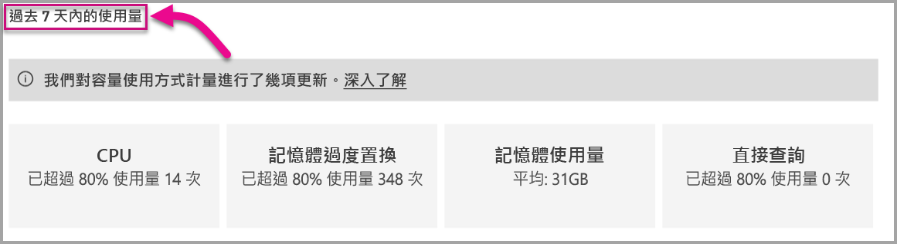

# 監視 Power BI Premium 及 Power BI Embedded 容量

此文章提供為您的 Power BI Premium 容量監視計量的概觀。 監視容量使用狀況可讓您據以管理您的容量。

您可以使用 Power BI Premium 容量計量應用程式或在系統管理入口網站中監視容量。 我們建議使用該應用程式，因為它提供更多詳細資料，但此文章同時涵蓋這兩個選項。

**目前的應用程式版本是 1.10 (2018 年 12 月 13 日發行)。**

.

<iframe width="560" height="315" src="https://www.youtube.com/embed/UgsjMbhi_Bk?rel=0&amp;showinfo=0" frameborder="0" allowfullscreen></iframe>

## 安裝 Premium 容量計量應用程式

您可以直接移至 [Premium 容量計量應用程式](https://app.powerbi.com/groups/me/getapps/services/capacitymetrics)，或在 Power BI 中如同安裝其他應用程式一樣安裝它。

1. 在 Power BI 中，按一下 [應用程式]。

    ![移至 [應用程式]](media/service-admin-premium-monitor-capacity/apps.png)

1. 在右側，按一下 [取得應用程式]。

1. 在 [應用程式] 類別中，搜尋 **Power BI Premium 容量計量應用程式**。

1. 訂閱以安裝該應用程式。

現在您已安裝該應用程式，您可以查看您組織中關於容量的計量。 讓我們看看一些可用的重要計量。

## 使用計量應用程式

### 計量儀表板

當您開啟應用程式時，它會先顯示一個儀表板，其中包含您擁有系統管理權限之所有容量的摘要。

儀表板包括下列計量。

| **報表區段** | **計量** |
| --- | --- |
| **系統摘要** | * 應用程式的版本  * 您身為系統管理員所擁有的容量數目  * 容量中會回報計量的工作區數目  * 過去七天內的平均記憶體耗用量 (GB)  * 過去七天內的最大記憶體耗用量 (GB)  * 發生最大記憶體耗用量的當地時間  * 過去七天內 CPU 超過閾值 80% 的次數 (分割為三分鐘的貯體)  * 過去七天內 CPU 超過 80% 的最多次數 (分割為一小時的貯體)  * 一小時內 CPU 超過 80% 最多次數的當地時間 |
| **資料集摘要** | * 在您容量中所有工作區的資料集總數  * 過去七天內直接查詢/即時連線超過閾值 80% 的次數 (分割為三分鐘的貯體)  * 過去七天內直接查詢/即時連線超過 80% 的最多次數 (分割為一小時的貯體)  * 一小時內直接查詢/即時連線超過 80% 最多次數的當地時間  * 過去七天內的重新整理總數  * 平均重新整理等候時間 - 已排程的時間與開始重新整理之間的平均延隔時間 (以分鐘為單位)  * 平均重新整理持續時間 - 完成重新整理所需的時間 (以分鐘為單位)  * 過去七天內執行的查詢總數  * 平均查詢等候時間 - 在開始執行之前，查詢已於系統資源上等候的時間 (以毫秒為單位)  * 平均查詢持續時間 - 完成查詢所需的時間 (以毫秒為單位)  * 由於記憶體壓力而撤出的模型總數  * 資料集平均大小   * 載入記憶體之資料集的平均計數 |
| **資料流程摘要** | * 容量中所有工作區的資料流程總數  * 過去七天內的重新整理總數  * 平均重新整理等候時間 - 已排程的時間與開始重新整理之間的平均延隔時間 (以分鐘為單位)  * 平均重新整理持續時間 - 完成重新整理所需的時間 (以分鐘為單位) |
| **編頁報表摘要** | * 容量中所有工作區的編頁報表總數  * 使用者檢視過所有報表的總次數  * 所有報表資料的資料列總數  * 所有報表在全部階段 (擷取、處理和轉譯資料) 所花費的總時間 (以毫秒為單位) |
|  |  |

### 計量報表

按一下儀表板以移至基礎報表。 報表有五個索引標籤，我們將在下列各節中更詳細地加以說明。

* **資料集**：關於您容量中 Power BI 資料集健康情況的詳細計量。

* **編頁報表**：關於您容量中編頁報表健康情況的詳細計量。

* **資料流程**：對於您容量中資料流程的詳細重新整理計量。

* **資源耗用量**：整體容量計量，包括記憶體及 CPU 高使用率。

* **識別碼和資訊**：容量、工作區和工作負載的名稱、識別碼及擁有者。

在每個索引標籤中，您可以依據容量和日期範圍來篩選計量。 若未選取任何篩選條件，報表預設為顯示會回報計量之所有容量過去一週的計量。

#### [資料集] 索引標籤

使用 [資料集] 索引標籤頂端的按鈕，巡覽至不同區域：[摘要]、[重新整理]、[查詢持續時間]、[查詢等候] 以及 [資料集]。

![[資料集] 索引標籤](media/service-admin-premium-monitor-capacity/datasets-tab.png)

##### [重新整理] 區域

[重新整理] 區域包含下列計量。

| **報表區段** | **計量** |
| --- | --- |
| **重新整理可靠性** | * 總計數：每個資料集的重新整理次數總計  * 可靠性：已針對每個資料夾完成的重新整理次數百分比  * 平均等候時間：已排程的時間與開始重新整理資料集之間的平均延隔時間 (以分鐘為單位)  * 等候時間上限：資料集的等候時間上限 (以分鐘為單位)   * 平均持續時間：重新整理資料集的平均持續時間 (以分鐘為單位)  * 持續時間上限：重新整理資料集的最長持續時間 (以分鐘為單位) |
| **依平均重新整理持續期間列出的前 5 個資料集** | * 這五個資料集具有最長的平均重新整理持續時間 (以分鐘為單位) |
| **依平均等候時間列出的前 5 個資料集** | * 這五個資料集具有最長的平均重新整理等候時間 (以分鐘為單位) |
| **每小時平均重新整理等候時間** | * 平均重新整理等候時間 (分割為一小時的貯體) 會以當地時間回報。 具有高重新整理等候時間的多個尖峰表示容量使用率很高。 |
| **每小時重新整理計數和記憶體耗用量** | * 成功、失敗和記憶體耗用量 (分割為一小時的貯體) 會以當地時間回報 |
|  |  |

##### [查詢持續時間] 區域

[查詢持續時間] 區域包含下列計量。

| **報表區段** | **計量** |
| --- | --- |
| **查詢持續時間** | * 此區段中的資料會依過去七天內的資料集、工作區與每小時貯體進行分割。  * 總計：針對資料集執行的查詢總數  * 平均︰資料集的平均查詢持續時間 (以毫秒為單位)  * 最大值︰資料集中執行查詢的最長持續時間 (以毫秒為單位)|
| **查詢持續時間分佈** | * 查詢持續時間長條圖會依查詢持續時間 (以毫秒為單位) 貯存為下列類別：<= 30 毫秒、30-100 毫秒、100-300 毫秒、300 毫秒 - 1 秒、1 秒 - 3 秒、3 秒 - 10 秒、10 秒 - 30 秒和 > 30 秒的時間間隔。 較長的查詢期間和較長的等待時間表示容量過度使用。 它也可能表示單一資料集正在造成問題，需要進一步的調查。 |
| **依平均持續時間列出的前 5 個資料集** | * 這五個資料集具有最長的平均查詢持續時間 (以毫秒為單位) |
| **直接查詢 / 即時連接 (> 80% 使用率)** | * 直接查詢或即時連接已超過 80% CPU 使用率的時間 (分割為一小時的貯體) 會以當地時間回報 |
| **每小時查詢持續時間分佈** | * 查詢計數和平均持續時間 (以毫秒為單位) 與記憶體耗用量 (以 GB 為單位) (分割為一小時的貯體) 會以當地時間回報。 |
|  |  |

##### [查詢等候] 區域

[查詢等候] 區域包含下列計量。

| **報表區段** | **計量** |
| --- | --- |
| **查詢等候時間** | * 此區段中的資料會依過去七天內的資料集、工作區與每小時貯體進行分割。  * 總計：針對資料集執行的查詢總數  * 等候計數：在開始執行之前，資料集中已於系統資源上等候的查詢數目   * 平均︰資料集的平均查詢等候時間 (以毫秒為單位)  * 最大值︰資料集中等候查詢的最長持續時間 (以毫秒為單位)|
| **等候時間分佈** | * 查詢持續時間長條圖會依查詢持續時間 (單位為毫秒) 貯存為下列類別：<= 50 毫秒、50-100 毫秒、100-200 毫秒、200-400毫秒、400 毫秒 - 1秒、1 秒 - 5 秒、和 > 5 秒的時間間隔。 |
| **依平均等候時間列出的前 5 個資料集** | * 這五個資料集具有在開始執行查詢之前最長的平均等候時間 (以毫秒為單位) |
| **每小時查詢等候計數和時間** | * 查詢等候計數和平均等候時間 (以毫秒為單位) 與記憶體耗用量 (以 GB 為單位) (分割為一小時的貯體) 會以當地時間回報 |
|  |  |

##### [資料集] 區域

[資料集] 區域包含下列計量。

| **報表區段** | **計量** |
| --- | --- |
| **資料集收回計數** | * 總計：每個容量的資料集「收回」總數。 當容量面臨記憶體壓力時，節點就會從記憶體「收回」一或多個資料集。 非使用中的資料集 (沒有任何正在執行的查詢/重新整理作業) 會優先收回。 然後，依據「最近最少使用的」(LRU) 量值來決定收回的順序。|
| **每小時資料集收回和記憶體耗用量** | * 資料集收回與記憶體耗用量 (以 GB 為單位) (分割為一小時的貯體) 會以當地時間回報 |
| **每小時載入的資料集計數** | * 載入記憶體中資料集的數目，以及分割為一小時的貯體時，以當地時間回報的耗用記憶體 (GB) |
| **資料大小**  | * 大小上限：所顯示的期間內，資料集的大小上限 (MB) |
|  |  |

#### [編頁報表] 索引標籤

[編頁報表] 索引標籤會顯示關於您容量中編頁報表健康情況的詳細計量。

![[編頁報表] 索引標籤](media/service-admin-premium-monitor-capacity/paginated-reports-tab.png)

[編頁報表] 索引標籤包含下列計量。

| **報表區段** | **計量** |
| --- | --- |
| **整體使用情況** | * 檢視次數總計：使用者已檢視報表的次數  * 資料列計數：報表中資料的資料列數  * 擷取 (平均)：擷取報表資料所需的平均時間量 (以毫秒為單位)。 持續時間很長，可能表示查詢速度緩慢或其他資料來源的問題。   * 處理 (平均)：處理報表資料所需的平均時間量 (以毫秒為單位) * 轉譯 (平均)：在瀏覽器中轉譯報表所需的平均時間量 (以毫秒為單位)  * 總時間：報表在所有階段所需的時間 (以毫秒為單位)|
| **依平均資料擷取時間列出的前 5 份報表** | * 這五份報表具有最長的平均資料擷取時間 (以毫秒為單位) |
| **依平均報表處理時間列出的前 5 份報表** | * 這五份報表具有最長的平均報表處理時間 (以毫秒為單位) |
| **每小時持續時間** | * 資料擷取與處理和轉譯時間 (分割為一小時的貯體) 會以當地時間回報 |
| **每小時的結果** | * 成功、失敗和記憶體耗用量 (分割為一小時的貯體) 會以當地時間回報 |
|  |  |

#### [資料流程] 索引標籤

[資料流程] 索引標籤會顯示對於您容量中資料流程的詳細重新整理計量。

![[資料流程] 索引標籤](media/service-admin-premium-monitor-capacity/dataflows-tab.png)

[資料流程] 索引標籤包含下列計量。

| **報表區段** | **計量** |
| --- | --- |
| **重新整理** | * 總計：每個資料流程的重新整理次數總計  * 可靠性：已針對每個資料流程完成的重新整理次數百分比  * 平均等候時間：已排程的時間與開始重新整理資料流程之間的平均延隔時間 (以分鐘為單位)  * 等候時間上限：資料流程的等候時間上限 (以分鐘為單位)   * 平均持續時間：重新整理資料流程的平均持續時間 (以分鐘為單位)  * 持續時間上限：重新整理資料流程的最長持續時間 (以分鐘為單位) |
| **依平均重新整理持續時間列出的前 5 個資料流程** | * 這五個資料流程具有最長的平均重新整理持續時間 (以分鐘為單位) |
| **依平均等候時間列出的前 5 個資料流程** | * 這五個資料流程具有最長的平均重新整理等候時間 (以分鐘為單位) |
| **每小時平均重新整理等候時間** | * 平均重新整理等候時間 (分割為一小時的貯體) 會以當地時間回報。 具有高重新整理等候時間的多個尖峰表示容量使用率很高。 |
| **每小時重新整理計數和記憶體耗用量** | * 成功、失敗和記憶體耗用量 (分割為一小時的貯體) 會以當地時間回報 |
|  |  |

#### [資源耗用量] 索引標籤

[資源耗用量] 索引標籤會顯示所有容量和工作負載上的 CPU 和記憶體耗用量。

![[資源耗用量] 索引標籤](media/service-admin-premium-monitor-capacity/resource-consumption-tab.png)

[資源耗用量] 索引標籤包含下列計量。

| **報表區段** | **計量** |
| --- | --- |
| **CPU 使用量** | * 過去七天內 CPU 超過閾值 80% 的次數 (分割為三分鐘的貯體) |
| **記憶體耗用量** | * 過去七天內的記憶體耗用量 (分割為三分鐘的貯體) |
|  |  |

#### [識別碼和資訊] 索引標籤

[識別碼和資訊] 索引標籤包含容量、工作區和工作負載的名稱、識別碼及擁有者。

![[識別碼和資訊] 索引標籤](media/service-admin-premium-monitor-capacity/info-tab.png)

## 監視 Power BI Embedded 容量

我們也使用 Power BI Premium 容量計量應用程式來監視 Power BI Embedded 中的 *A SKU* 容量。 只要您是容量的系統管理員，那些容量就會顯示在報表中。 不過，除非您在 A SKU 上獲授與 Power BI 的特定權限，否則報表重新整理作業會失敗。

1. 在 Azure 入口網站中開啟您的容量。

1. 按一下 [存取控制 (IAM)]，並將 “Power BI Premium” 應用程式新增到讀者角色。 若您無法依名稱找到該應用程式，您也可以透過其用戶端識別碼來新增它：cb4dc29f-0bf4-402a-8b30-7511498ed654。

    

> [!NOTE]
> 您可以在應用程式中或 Azure 入口網站中監視 Power BI Embedded 容量使用狀況，但無法在 Power BI 系統管理入口網站中這樣做。

## 系統管理入口網站中的基本監視

系統管理入口網站的 [容量設定] 區域提供四個量測計，這些量測計指出過去七天內您的容量所產生的負載與使用的資源量。 這四個圖格每小時更新一次，而且會指出過去七天內對應的計量超過 80% 的時數。 此計量指出可能的使用者體驗降級。

| **計量** | **描述** |
| --- | --- |
| CPU |CPU 超過 80% 使用率的次數。 |
| 記憶體過度置換 |代表後端核心的記憶體壓力。 具體而言，這個計量是因使用多個資料集的記憶體壓力而從記憶體收回資料集的次數。 |
| 記憶體使用量 |平均記憶體使用量，以吉位元組 (GB) 表示。 |
| DQ/s | 「直接查詢」和「即時連線」計數超過 80% 限制的次數。   * 我們限制每秒的 DirectQuery 和即時連線查詢總數。* P1 的限制為每秒 30 個、P2 的限制為每秒 60 個，而 P3 的限制為每秒 120 個。 *「直接查詢」和即時連線查詢計數會新增至上面的節流。 例如，如果您每秒有 15 個 DirectQuery 和 15 個即時連線，您就達到節流標準。 * 這會平均套用至內部部署和雲端連線。 |
|  |  |

計量會反映過去一週的使用率。  如果您想要看到更詳細的計量檢視，則可以按一下任何摘要磚。  這會將您帶往進階容量之每個計量的詳細圖表。 下圖顯示 CPU 計量的詳細資料。

這些圖表在過去一週每小時都會彙總一次，並有助於找出您何時可能已有進階容量的特定效能相關事件。

您也可以將任何計量的基礎資料匯出至 csv 檔案。  這項匯出會依每三分鐘的間隔提供過去一週每天的詳細資訊。

## 後續步驟

現在您已了解如何監視 Power BI Premium 容量，請繼續學習如何最佳化容量。

> [!div class="nextstepaction"]
> [Power BI Premium 容量資源管理與最佳化](service-premium-understand-how-it-works.md)
