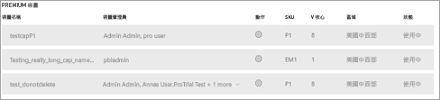

# 設定 Power BI Premium 的多地理位置支援

多地理位置是一項 Power BI Premium 功能，可協助跨國客戶滿足區域性、產業特有或組織的資料落地需求。 身為 Power BI Premium 客戶，您可以將內容部署到 Power BI 租用戶主要區域以外區域內的資料中心。 一個地理位置可以包含多個區域。 例如，美國是一個地理位置，而美國中西部和美國中南部是美國境內的區域。 您可以選擇將內容部署到下列任何地理位置：

- 美國
- 加拿大
- 英國
- 巴西
- 歐洲
- 日本
- 印度
- 亞太地區
- 澳洲
- 非洲

多地理位置不適用於 Power BI Germany、由 21Vianet 經營的 Power BI China 或 US Gov 的 Power BI。

您現在也可以在 Power BI Embedded 中找到多地理位置功能。 如需詳細資訊，請參閱 [Power BI Embedded 中的多地理位置支援](developer/embedded/embedded-multi-geo.md)。

## 啟用及設定

針對新的容量，請從下拉式清單中選取預設區域以外的區域，以啟用多地理位置。  每個可用的容量都會顯示其目前所在的區域，例如**美國中西部**。

建立容量之後，它會保留在該區域中，而所建立的任何工作區都會將其內容儲存於該區域中。 您可以透過工作區設定畫面上的下拉式清單，將工作區從某個區域遷移至另一個區域。

您會看到此確認變更的訊息。

在移轉期間，此時不需要重設閘道認證。  將認證儲存於 Premium 容量區域之後，您必須在遷移時重設認證。

在遷移期間，某些作業可能會失敗，例如，發佈新的資料集或已排程的資料重新整理。  

啟用多地理位置時，會將下列項目儲存於 Premium 區域中：

- 適用於匯入的模型 (.ABF 檔案) 和 Direct Query 資料集
- 查詢快取
- R 映像

這些項目均保留於租用戶的主要區域中：

- 推送資料集
- Excel 活頁簿
- 儀表板/報表中繼資料：例如，圖格名稱、圖格查詢
- 適用於閘道查詢或已排程重新整理作業的服務匯流排
- 權限
- 資料集認證

## 檢視容量區域

在管理入口網站中，可以檢視適用於 Power BI 租用戶的所有容量，以及其目前所在的區段。

 

## 變更現有內容的區域

有兩種方式可以變更現有內容的區域。

- 建立第二個容量並移動工作區。 只要租用戶具有備用的虛擬核心，免費使用者將不會經歷任何停機時間。
- 如果無法選擇建立第二個容量，則可以暫時將內容從 Premium 移回到共用的容量。 您不需要額外的虛擬核心，但免費使用者將會經歷一些停機時間。

## 將內容移出多地理位置  

您可以採取下列兩種方法之一，將工作區移出多地理位置容量：

- 刪除工作區所在位置目前的容量。  這會將工作區移回到主要區域中的共用容量。
- 將個別工作區遷移回到位於主租用戶中的 Premium 容量。

## 限制與考量

- 初始資料轉送之前，請確認在區域之間開始進行的任何移動都會遵循所有公司與政府的合規性需求。
- 儲存於遠端區域中的快取查詢會在該區域中保持待用狀態。 不過，傳輸過程中的其他資料可能會往返於多個地理位置之間。
- 在多地理位置的環境中，將資料從某個區域移至另一個區域時，來源資料可能會在已移動資料的區域中最多保留 30 天。 在該段期間內，使用者無法存取該資料。 系統會在 30 天的期間內，將資料從這個區域中移除並加以銷毀。

- 目前多地理位置不支援[資料流程](service-dataflows-overview.md)功能。

## 後續步驟

- [什麼是 Power BI Premium？](service-premium-what-is.md)
- [Power BI Embedded 容量的多地理位置](developer/embedded/embedded-multi-geo.md)

有其他問題嗎？ [嘗試在 Power BI 社群提問](https://community.powerbi.com/)
