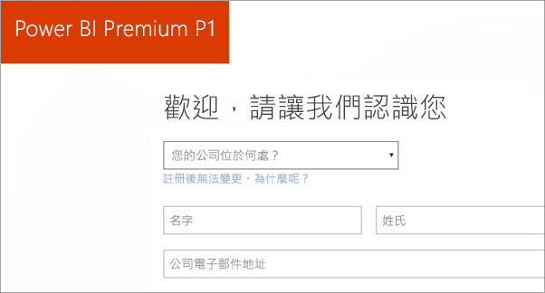
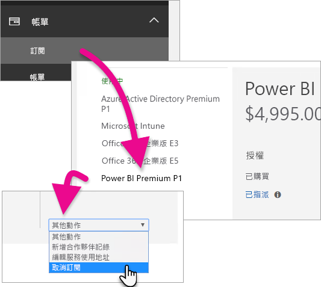
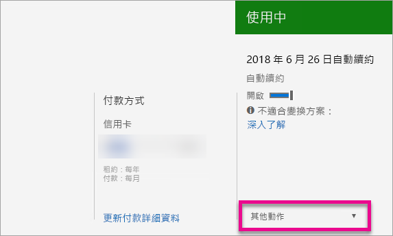

# 如何購買 Power BI Premium
了解如何為您的組織購買 Power BI Premium 容量。

<iframe width="640" height="360" src="https://www.youtube.com/embed/NkvYs5Qp4iA?rel=0&amp;showinfo=0" frameborder="0" allowfullscreen></iframe>

您可以透過 Office 365 系統管理中心購買 Power BI Premium 容量節點。 在您的組織內，您也可以有進階容量 SKU 的任意組合 (P1 至 P3)。 它們提供不同的資源功能。

如需 Power BI Premium 是什麼的詳細資訊，請參閱 [Power BI Premium - 這是什麼？](service-premium.md)。 若要查看 Power BI 的目前定價，請參閱 [Power BI 定價頁面](https://powerbi.microsoft.com/pricing/)。 您也可以使用 [Power BI Premium 計算機](https://powerbi.microsoft.com/calculator/)來規劃 Power BI Premium 的成本。

> [!IMPORTANT]
> 即使您購買 Power BI Premium，內容的作者仍然需要 Power BI Pro 授權。
> 
> 

## 建立具有 Power BI Premium P1 的新租用戶
如果您目前沒有租用戶並想建立一個，您可以同時購買 Power BI Premium。 下列連結將會引導您完成建立新租用戶的程序，以便搭配 Office 365 使用並可讓您購買 Power BI Premium。 建立租用戶之後，您必須為使用者購買 Power BI Pro 授權。 當您建立租用戶時，您會自動成為該租用戶的全域管理員。

若要進行這項購買，請參閱 [Power BI Premium P1 供應項目](https://signup.microsoft.com/Signup?OfferId=b3ec5615-cc11-48de-967d-8d79f7cb0af1)。

## 為現有的組織購買 Power BI Premium 容量
如果您目前隸屬於任何組織，您必須是全域管理員或帳務管理員，才能購買訂用帳戶和授權。 如需詳細資訊，請參閱[關於 Office 365 系統管理員角色](https://support.office.com/article/About-Office-365-admin-roles-da585eea-f576-4f55-a1e0-87090b6aaa9d)。

若要購買進階容量，您必須執行下列動作。

1. 從 Power BI 服務內，選取 [Office 365 應用程式選擇器] > [系統管理員]。或者，您可以瀏覽至 Office 365 系統管理中心。 您可以前往 https://portal.office.com，再選取 [系統管理]，如此就能進入系統管理中心。
   
    
2. 選取 [計費] > [購買服務]。
3. 在 [其他方案] 下，尋找 Power BI Premium 供應項目。 如此會列出 P1 到 P3、EM3 以及 P1 (逐月)。
4. 將滑鼠停留在**省略符號 (...)**，然後選取 [立即購買]。
   
    
5. 請依照下列步驟完成購買程序。

您也可選取下列連結，引導您進入直接購買這些項目的頁面。 如需這些 SKU 的相關資訊，請參閱 [Power BI Premium - 這是什麼？](service-premium.md#premiumskus)。

***您必須是租用戶內的全域或帳務管理員***，才能購買 Power BI Premium SKU。 如果您不是管理員，選取下列連結會發生錯誤。

| 直接購買連結 |
| --- |
| [EM3 (逐月) SKU](https://portal.office.com/commerce/completeorder.aspx?OfferId=4004702D-749C-4F74-BF47-3048F1833780&adminportal=1) |
| [P1 SKU](https://portal.office.com/commerce/completeorder.aspx?OfferId=b3ec5615-cc11-48de-967d-8d79f7cb0af1&adminportal=1) |
| [P1 (逐月) SKU](https://portal.office.com/commerce/completeorder.aspx?OfferId=E4C8EDD3-74A1-4D42-A738-C647972FBE81&adminportal=1) |
| [P2 SKU](https://portal.office.com/commerce/completeorder.aspx?OfferId=062F2AA7-B4BC-4B0E-980F-2072102D8605&adminportal=1) |
| [P3 SKU](https://portal.office.com/commerce/completeorder.aspx?OfferId=40c7d673-375c-42a1-84ca-f993a524fed0&adminportal=1) |

完成購買之後，[購買服務] 畫面會顯示項目已購買且在使用中。

您現在可以在 Power BI 系統管理中心內管理這個容量。 如需詳細資訊，請參閱[管理 Power BI Premium](service-admin-premium-manage.md)。

## 購買更多的容量
當您在 Power BI 管理入口網站的 [進階設定] 區段時，如果您是系統管理員，您會看到 [購買更多] 按鈕。 這個按鈕會帶您到 Office 365 入口網站。 到達 Office 365 系統管理中心之後，您可以執行下列動作。

1. 選取 [計費] > [購買服務]。
2. 在 [其他方案] 下，尋找您要購買更多的 Power BI Premium 項目。
3. 將滑鼠停留在**省略符號 (...)**，然後選取 [變更授權數量]。
   
    
4. 針對此項目，變更為您想要的執行個體數目。 完成時選取 [送出]。
   
   > [!IMPORTANT]
   > 選取 [送出] 會從已登記的信用卡扣款。
   > 
   > 

[購買服務] 頁面將會指出您擁有的執行個體數目。 在 Power BI 管理入口網站的 [容量設定] 下，可用的 V 核心反映新購買的容量。

您現在可以在 Power BI 系統管理中心內管理這個容量。 如需詳細資訊，請參閱[管理 Power BI Premium](service-admin-premium-manage.md)。

## 取消您的訂用帳戶
您可以從 Office 365 系統管理中心取消訂用帳戶。 若要取消您的 Premium 訂閱，請執行下列動作。

1. 瀏覽至 Office 365 系統管理中心。
2. 選取 [計費] > [訂用帳戶]。
3. 從清單中選取您的 Power BI Premium 訂用帳戶。
4. 在 [其他動作] 下拉式清單中，選取 [取消訂用帳戶]。
   
    
5. [取消訂用帳戶] 頁面會指出您是否對[提早取消費用](https://support.office.com/article/early-termination-fees-6487d4de-401a-466f-8bc3-c0beb5cc40d3)負有責任。 此頁面也會讓您知道何時將會刪除訂用帳戶的資料。
6. 請完成閱讀此資訊，如果您想要繼續，請選取 [取消訂用帳戶]。

## 後續步驟
[Power BI 定價頁面](https://powerbi.microsoft.com/pricing/)  
[Power BI Premium 計算機](https://powerbi.microsoft.com/calculator/)  
[Power BI Premium - 這是什麼？](service-premium.md)  
[管理 Power BI Premium](service-admin-premium-manage.md)  
[Power BI Premium 常見問題集](service-premium-faq.md)  
[Power BI Premium 版本資訊](service-premium-release-notes.md)  
[Microsoft Power BI Premium 白皮書](https://aka.ms/pbipremiumwhitepaper)  
[規劃 Power BI 企業部署白皮書](https://aka.ms/pbienterprisedeploy)  
[Power BI 管理入口網站](service-admin-portal.md)  
[管理貴組織中的 Power BI](service-admin-administering-power-bi-in-your-organization.md)  

有其他問題嗎？ [嘗試在 Power BI 社群提問](http://community.powerbi.com/)

