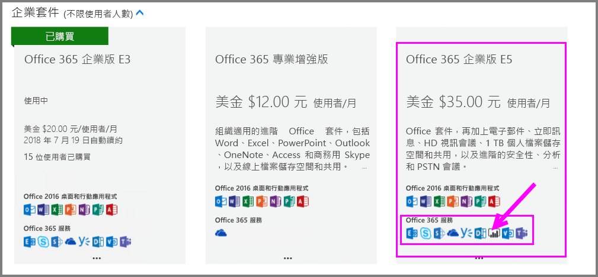
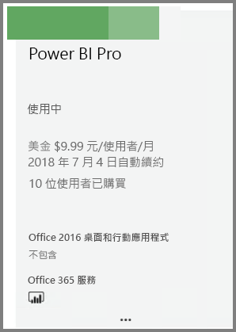
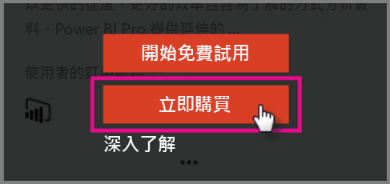
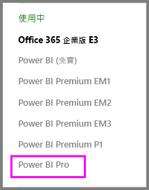

# 快速入門：購買 Power BI Pro 授權

Power BI Pro 是個別的授權，允許存取 Power BI 服務中的所有內容和功能，包括能與其他 Pro 使用者分享內容和共同作業。 只有 Pro 使用者能將內容發行到應用程式工作區、從應用程式工作區中取用內容、共用儀表板，以及訂閱儀表板和報表。 本文說明如何在 Office 365 中購買 Power BI Pro 授權。

## 先決條件

您必須是 Office 365 中[**全域管理員**或**計費管理員**](https://support.office.com/article/about-office-365-admin-roles-da585eea-f576-4f55-a1e0-87090b6aaa9d?ui=en-US&rs=en-US&ad=US)角色的成員。 

## 透過 Office 365 購買 Power BI Pro 授權

請遵循以下步驟來購買 Power BI Pro 授權：

1. 開啟 [Office 365 系統管理中心](https://portal.office.com/adminportal/home#/homepage)。

2. 在左邊的瀏覽窗格中，選取 [帳單] > [訂閱]。

    ![[瀏覽] 窗格](media/service-admin-purchasing-power-bi-pro/service-purchasing-power-bi-pro/service-purchasing-power-bi-pro-01.png)

3. 在 [訂閱] 頁面的右上角，選取 [新增訂閱]。

    

4. 找出所需的訂閱供應項目：

    在 [企業套件] 下方，選取 [Office 365 Enterprise E5]。

    

    在 [其他方案] 下，選取 [Power BI Pro]。

    

5. 將滑鼠停留在所需訂閱的省略符號 (...) 上方，然後選取 [立即購買]。

    

6. 根據您的計費喜好設定，選擇 [按月支付] 或 [支付全年費用]。

7. 在 [您想要多少使用者?] 下，輸入所需的授權數目，然後選取 [立即結帳] 以完成交易。

8. 確認所取得的訂閱現在會列於 [訂閱] 頁面上。

   

9. 若要在初次購買之後新增更多授權，請從 [訂閱] 頁面選取 [Power BI Pro]，然後取 [新增/移除授權]。

## 後續步驟

您現在已經購買授權，接著可以將它們指派給租用戶中的使用者。

[在 Office 365 中將授權指派給使用者](service-admin-assigning-power-bi-pro-licenses.md)

[在 Azure 中將授權指派給使用者](service-admin-assigning-power-bi-pro-licenses-azure.md)

[Power BI 定價](https://powerbi.microsoft.com/en-us/pricing/)
