# 購買及指派 Power BI Pro 授權

Power BI Pro 是個別的授權，允許存取 Power BI 服務中的所有內容和功能，包括能與其他 Pro 使用者分享內容和共同作業。 只有 Pro 使用者能將內容發行到應用程式工作區、從應用程式工作區中取用內容、共用儀表板，以及訂閱儀表板和報表。 如需詳細資訊，請參閱[依授權類型排列的 Power BI 功能](service-features-license-type.md)。

本文先說明如何在 Office 365 中購買 Power BI Pro 授權。 文章接著會說明您可用來將那些授權指派給個人使用者的兩個選項：Office 365 和 Azure (選擇一個選項)。

## 先決條件

您必須是 Office 365 中[**全域管理員**或**計費管理員**](https://support.office.com/article/about-office-365-admin-roles-da585eea-f576-4f55-a1e0-87090b6aaa9d)角色的成員。

若要在 Azure 中指派授權，針對 Power BI 用於 Active Directory 查詢的 Azure 訂用帳戶，您必須是訂用帳戶的擁有者。

## 在 Office 365 中購買授權

請遵循以下步驟來購買 Power BI Pro 授權：

1. 開啟 [MIcrosoft 365 系統管理中心](https://portal.office.com/adminportal/home#/homepage)。

2. 在左邊的瀏覽窗格中，選取 [帳單] > [訂閱]。

    ![[瀏覽] 窗格](media/service-admin-purchasing-power-bi-pro/service-purchasing-power-bi-pro-01.png)

3. 在 [訂閱] 頁面的右上角，選取 [新增訂閱]。

    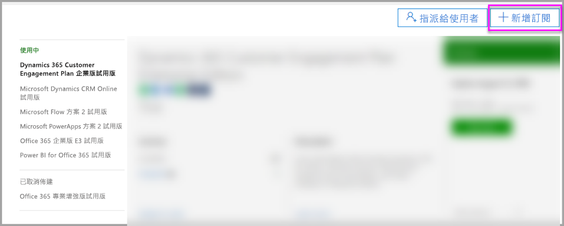

4. 找出所需的訂閱供應項目：

    在 [企業套件] 下方，選取 [Office 365 Enterprise E5]。

    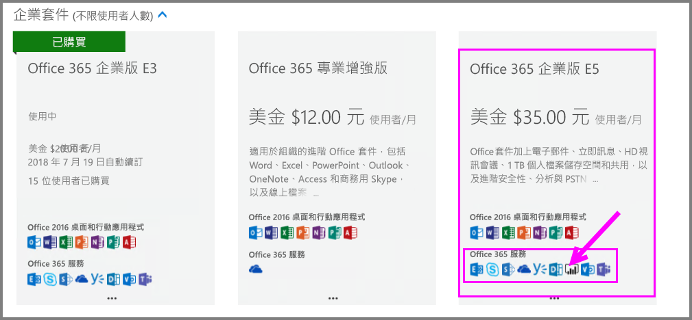

    在 [其他方案] 下，選取 [Power BI Pro]。

    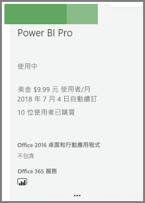

5. 將滑鼠停留在所需訂閱的省略符號 (**. . .**) 上方，然後選取 [立即購買]。

    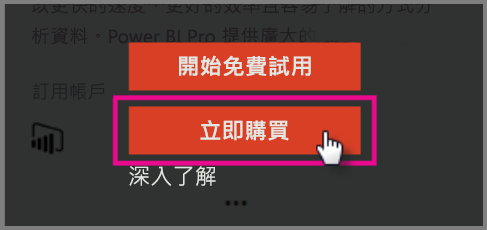

6. 根據您的計費喜好設定，選擇 [按月支付] 或 [支付全年費用]。

7. 在 [您想要多少使用者?] 下，輸入所需的授權數目，然後選取 [立即結帳] 以完成交易。

8. 確認所取得的訂閱現在會列於 [訂閱] 頁面上。

   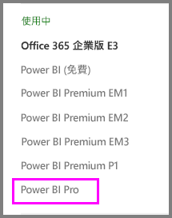

9. 若要在初次購買之後新增更多授權，請從 [訂閱] 頁面選取 [Power BI Pro]，然後取 [新增/移除授權]。

## 在 Office 365 中指派授權

按照以下步驟操作，將 Power BI Pro 授權指派給個別使用者帳戶：

1. 開啟 [MIcrosoft 365 系統管理中心](https://portal.office.com/adminportal/home#/homepage)。

2. 在左側瀏覽窗格中，展開 [使用者]，然後選取 [作用中使用者]。

    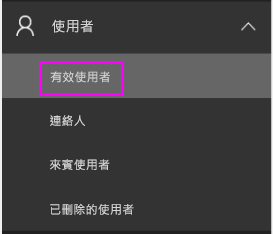

3. 選取使用者，然後在 [產品授權] 下方，選取 [編輯]。

    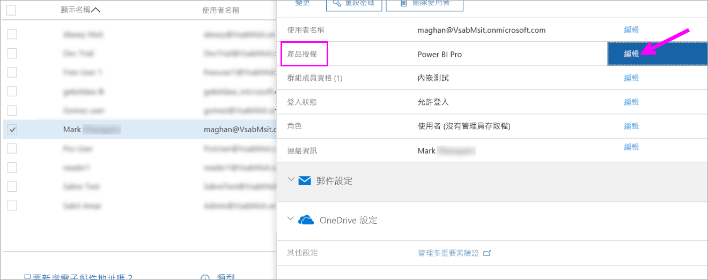

4. 在 [Power BI Pro] 下方，將設定切換成 [開啟]，然後選取 [儲存]。

    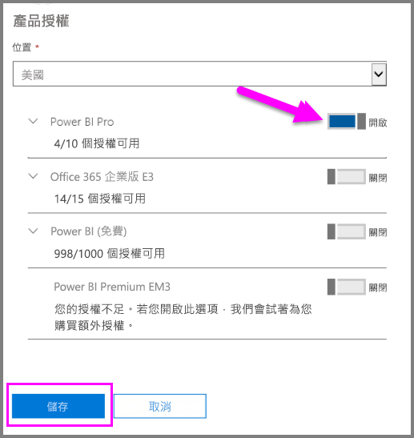

5. 在所選取帳戶的 [狀態] 下方，確認已成功指派 Power BI Pro 授權。

    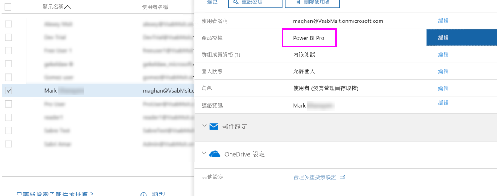

## 在 Azure 中指派授權

按照以下步驟操作，將 Power BI Pro 授權指派給個別使用者帳戶：

1. 開啟 [Azure 入口網站](https://ms.portal.azure.com/#@microsoft.onmicrosoft.com/dashboard/private/39bc3cf7-31a4-43f6-954c-f2d69ca2f0)。

2. 在左側的導覽列中，選取 [Azure Active Directory]。

    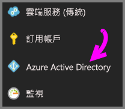

3. 在 [Azure Active Directory] 下方，選取 [授權]。

    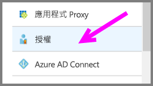

4. 在 [授權] 下方，選取 [所有產品]，然後選取 [Power BI Pro] 以顯示已授權使用者的清單。

    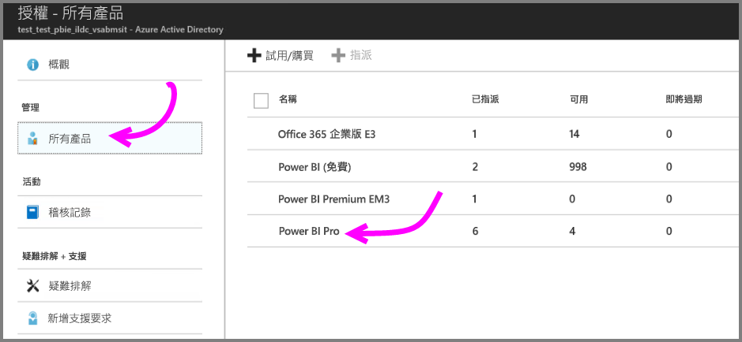

5. 選取 [指派] 將 Power BI Pro 授權新增至其他使用者帳戶。

    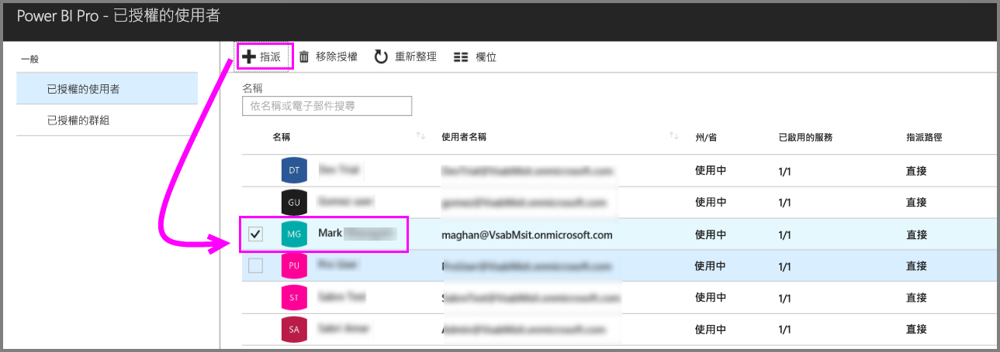

## 後續步驟

您現在已經指派授權，接著可以深入了解 Power BI Pro。

[組織中的 Power BI 授權](service-admin-licensing-organization.md)

[尋找已登入的 Power BI 使用者](service-admin-access-usage.md)

有其他問題嗎？ [嘗試在 Power BI 社群提問](https://community.powerbi.com/)
