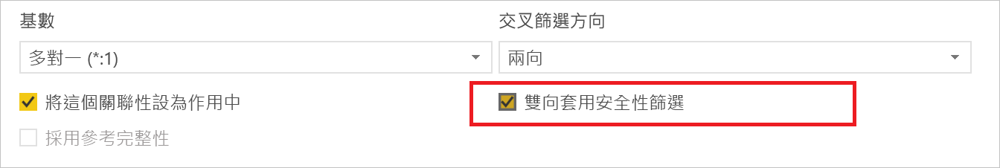
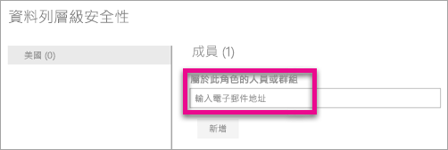
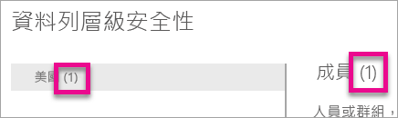
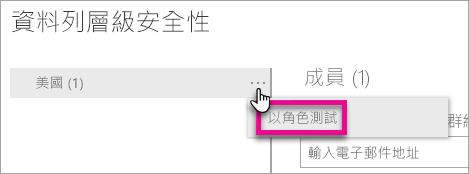

# Power BI 的資料列層級安全性 (RLS)

Power BI 的資料列層級安全性 (RLS) 可用以限制指定使用者的資料存取。 篩選會限制資料列層級的資料存取，您可以在角色中定義篩選。 請注意，在 Power BI 服務中，工作區的成員具有工作區中資料集的存取權。 RLS 不會限制這項資料存取權。

您可以使用 Power BI Desktop 為匯入 Power BI 的資料模型設定 RLS。 您也可以針對使用 DirectQuery (如 SQL Server) 的資料集設定 RLS。 先前，您只能夠在 Power BI 外部的內部部署 Analysis Services 模型實作 RLS。 您可以在內部部署模型上，為 Analysis Services 即時連線設定資料列層級安全性。 即時連線資料集不會顯示安全性選項。

[!INCLUDE [include-short-name](./includes/rls-desktop-define-roles.md)]

根據預設，資料列層級安全性篩選使用單一方向的篩選條件，不論關聯性設定為單向或雙向。 您可以手動啟用雙向交叉篩選與資料列層級安全性，方法是選取關聯性，並核取 [雙向套用安全性篩選]  核取方塊。 實作[動態資料列層級安全性](https://docs.microsoft.com/sql/analysis-services/tutorial-tabular-1200/supplemental-lesson-implement-dynamic-security-by-using-row-filters) (其中您根據使用者名稱或登入識別碼提供資料列層級安全性) 時，請核取此方塊。

如需詳細資訊，請參閱[在 Power BI Desktop 中使用 DirectQuery 雙向交叉篩選](desktop-bidirectional-filtering.md)和[保護表格式 BI 語意模型](http://download.microsoft.com/download/D/2/0/D20E1C5F-72EA-4505-9F26-FEF9550EFD44/Securing%20the%20Tabular%20BI%20Semantic%20Model.docx)技術文件。

[!INCLUDE [include-short-name](./includes/rls-desktop-view-as-roles.md)]

## 管理模型的安全性

若要管理資料模型的安全性，需要執行下列動作。

1. 針對資料集選取**省略符號 (...)** 。
2. 選取 [安全性]  。
   
   

這樣會帶您到 RLS 頁面上，以將成員加入您在 Power BI Desktop 中建立的角色。 只有資料集的擁有者會看到 [安全性] 可供使用。 如果資料集是在群組中，只有群組的系統管理員會看到安全性選項。 

您只能在 Power BI Desktop 中建立或修改角色。

## 使用成員

### 新增成員

您可以輸入想要新增的使用者、安全性群組或通訊群組清單的電子郵件地址或名稱，將成員加入角色中。 您無法加入在 Power BI 中建立的群組。 您可以新增[組織的外部成員](whitepaper-azure-b2b-power-bi.md#data-security-for-external-partners)。

您也可以根據角色名稱或 [成員] 旁括弧內的數字，知道有多少成員屬於該角色。

### 移除成員

您可以選取成員名稱旁的 X 來移除成員。 

## 在 Power BI 服務中驗證角色

您可以測試角色以驗證您定義的角色是否正常運作。 

1. 選取角色旁的**省略符號 (...)** 。
2. 選取 [以角色測試資料]  。

就會看到這個角色可以使用的報表。 這個檢視未顯示儀表板。 在上方的藍色列中，您會看到套用的功能。

您可以選取 \[Now viewing as]  \(現在檢視為) 來測試其他角色或角色組合。

您可以選擇以特定人員身分檢視資料，或者選取可用的角色組合來驗證它們是否作用。 

若要返回正常檢視，請選取 [返回資料列層級安全性]  。

[!INCLUDE [include-short-name](./includes/rls-usernames.md)]

## 在 Power BI 中對應用程式工作區使用 RLS

如果您將 Power BI Desktop 報告發佈至 Power BI 服務內的應用程式工作區，角色會套用至唯讀成員。 您必須在應用程式工作區設定內指出成員只能檢視 Power BI 內容。

> [!WARNING]
> 如果您已將應用程式工作區設定為讓成員具有編輯權限，則 RLS 角色不會套用至成員。 使用者可以查看所有的資料。

[!INCLUDE [include-short-name](./includes/rls-limitations.md)]

[!INCLUDE [include-short-name](./includes/rls-faq.md)]

## 後續步驟
[使用 Power BI Desktop 的資料列層級安全性 (RLS)](desktop-rls.md)  

有其他問題嗎？ [嘗試在 Power BI 社群提問](http://community.powerbi.com/)
