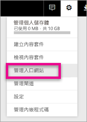

# <a name="understanding-the-power-bi-admin-role"></a>了解 Power BI 系統管理員角色
了解如何在組織內使用 Power BI 系統管理員角色。

<iframe width="640" height="360" src="https://www.youtube.com/embed/PQRbdJgEm3k?showinfo=0" frameborder="0" allowfullscreen></iframe>

Power BI 服務管理員角色可以指派給應該能存取 Power BI 管理入口網站，但不會同時授與其他 Office 365 系統管理存取權的使用者。 例如，全域管理員角色。 它適用於負責管理組織之 Power BI 的人員。

Office 365 使用者系統管理員可以在 Office 365 系統管理中心內或透過 PowerShell 指令碼，將使用者指派為 Power BI 系統管理員。 一旦使用者獲得指派，就能夠存取 [Power BI 管理入口網站](service-admin-portal.md)。 在這裡，他們將能夠存取整個租用戶的使用計量，並可控制整個租用戶使用 Power BI 功能的方式。



## <a name="using-the-office-365-admin-center-to-assign-a-role"></a>使用 Office 365 系統管理中心指派角色
若要在 Office 365 系統管理中心內將使用者指派給 Power BI 系統管理員角色，您可以執行下列動作。

1. 瀏覽至 Office 365 系統管理中心，然後選取 [使用者] > [作用中使用者]。
   
    
2. 選取您想要指派角色的使用者。
3. 針對角色選取 [編輯]。
   
    
4. 選取 [Customized administrator]\(自訂系統管理員) > [Power BI service administrator]\(Power BI 服務管理員)
   
    
5. 選取 [儲存] 。

您應該會看到該使用者的角色列出 [Power BI service administrator]\(Power BI 服務管理員)。 這些角色現在可以存取 [Power BI 管理入口網站](service-admin-portal.md)。


## <a name="using-powershell-to-assign-a-role"></a>使用 PowerShell 指派角色
若要執行 PowerShell 命令，您必須已安裝 Azure Active Directory PowerShell 模組。

### <a name="download-azure-ad-powershell-module"></a>下載 Azure AD PowerShell 模組
[下載 Azure Active Directory PowerShell 2 版](https://github.com/Azure/azure-docs-powershell-azuread/blob/master/Azure%20AD%20Cmdlets/AzureAD/index.md)

[下載 Azure Active Directory PowerShell 1.1.166.0 GA 版](http://connect.microsoft.com/site1164/Downloads/DownloadDetails.aspx?DownloadID=59185)

### <a name="command-to-add-role-to-member"></a>新增角色至成員的命令
**Azure AD PowerShell v2 命令**

您必須取得 [Power BI 服務管理員] 角色的 **ObjectId**。 您可以執行 [Get-AzureADDirectoryRole](https://docs.microsoft.com/powershell/azuread/v2/get-azureaddirectoryrole) 以取得 **ObjectId**

```
PS C:\Windows\system32> Get-AzureADDirectoryRole

ObjectId                             DisplayName                        Description
--------                             -----------                        -----------
00f79122-c45d-436d-8d4a-2c0c6ca246bf Power BI Service Administrator     Full access in the Power BI Service.
250d1222-4bc0-4b4b-8466-5d5765d14af9 Helpdesk Administrator             Helpdesk Administrator has access to perform..
3ddec257-efdc-423d-9d24-b7cf29e0c86b Directory Synchronization Accounts Directory Synchronization Accounts
50daa576-896c-4bf3-a84e-1d9d1875c7a7 Company Administrator              Company Administrator role has full access t..
6a452384-6eb9-4793-8782-f4e7313b4dfd Device Administrators              Device Administrators
9900b7db-35d9-4e56-a8e3-c5026cac3a11 AdHoc License Administrator        Allows access manage AdHoc license.
a3631cce-16ce-47a3-bbe1-79b9774a0570 Directory Readers                  Allows access to various read only tasks in ..
f727e2f3-0829-41a7-8c5c-5af83c37f57b Email Verified User Creator        Allows creation of new email verified users.
```

在本例中，角色的 objectid 是 00f79122-c45d-436d-8d4a-2c0c6ca246bf。

您也需要知道使用者的 **ObjectID**。 您可以藉由執行 [Get-AzureADUser](https://docs.microsoft.com/powershell/azuread/v2/get-azureaduser) 來查明。

```
PS C:\Windows\system32> Get-AzureADUser -SearchString 'tim@contoso.com'

ObjectId                             DisplayName UserPrincipalName      UserType
--------                             ----------- -----------------      --------
6a2bfca2-98ba-413a-be61-6e4bbb8b8a4c Tim         tim@contoso.com        Member
```

若要將成員新增至角色，請執行 [Add-AzureADDirectoryRoleMember](https://docs.microsoft.com/powershell/azuread/v2/add-azureaddirectoryrolemember)。

| 參數 | 描述 |
| --- | --- |
| ObjectId |角色的 ObjectId。 |
| RefObjectId |成員的 ObjectId。 |

```
Add-AzureADDirectoryRoleMember -ObjectId 00f79122-c45d-436d-8d4a-2c0c6ca246bf -RefObjectId 6a2bfca2-98ba-413a-be61-6e4bbb8b8a4c
```

**Azure AD PowerShell v1 命令**

若要使用 Azure AD v1 Cmdlet 將成員新增至角色，您將需要執行 [Add-MsolRoleMember](https://docs.microsoft.com/powershell/msonline/v1/add-msolrolemember) 命令。

```
Add-MsolRoleMember -RoleMemberEmailAddress "tim@contoso.com" -RoleName "Power BI Service Administrator"
```

## <a name="limitations-and-considerations"></a>限制與考量
Power BI 服務管理員角色不提供下列項目的存取權。

* 在 Office 365 系統管理中心修改使用者和授權的能力
* 稽核記錄的存取權。 如需詳細資訊，請參閱[在組織內使用稽核](service-admin-auditing.md)。

## <a name="next-steps"></a>後續步驟
[Power BI 管理入口網站](service-admin-portal.md)  
[Add-AzureADDirectoryRoleMember](https://docs.microsoft.com/powershell/azuread/v2/add-azureaddirectoryrolemember)  
[Add-MsolRoleMember](https://docs.microsoft.com/powershell/msonline/v1/add-msolrolemember)  
[稽核貴組織的 Power BI](service-admin-auditing.md)  
[管理貴組織中的 Power BI](service-admin-administering-power-bi-in-your-organization.md)  

有其他問題嗎？ [嘗試在 Power BI 社群提問](http://community.powerbi.com/)

