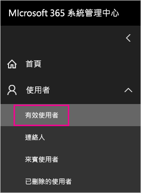
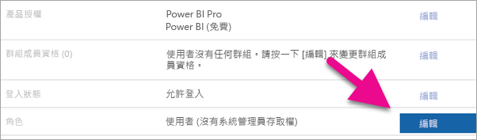
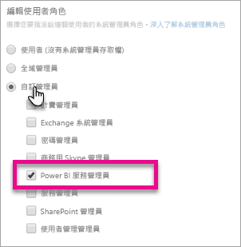

# <a name="understanding-power-bi-service-administrator-roles"></a>了解 Power BI 服務管理員角色

若要管理 Power BI 租用戶，您必須是下列其中一種角色：Power BI 系統管理員、Power Platform 系統管理員或 Microsoft 365 全域管理員。Microsoft 365 使用者管理管理員，可在 Microsoft 365 系統管理中心內或使用 PowerShell 指令碼，將使用者指派為 Power BI 系統管理員角色或 Power Platform 系統管理員角色。 如需詳細資訊，請參閱[使用 Office 365 PowerShell 指派角色給使用者帳戶](/office365/enterprise/powershell/assign-roles-to-user-accounts-with-office-365-powershell)。

Power BI 系統管理員角色和 Power Platform 系統管理員角色的使用者，對 Power BI 租用戶和其系統管理功能 (除了授權以外) 有完整的控制權。 使用者獲派角色之後，就能存取 [Power BI 管理入口網站](service-admin-portal.md)。 在那裡，他們能存取整個租用戶的使用計量，並可控制整個租用戶使用 Power BI 功能的方式。 這些系統管理員角色適用於需要存取 Power BI 管理入口網站的使用者，但不會同時授與那些使用者完整的 Microsoft 365 系統管理存取權。

> [!NOTE]
> 在 Power BI 文件中，「Power BI 系統管理員」指的是 Power BI 系統管理員角色或 Power Platform 系統管理員角色的使用者。 該文件清楚說明了工作需要 Microsoft 365 全域管理員角色的時機。

## <a name="limitations-and-considerations"></a>限制與考量

Power BI 服務管理員角色和 Power Platform 系統管理員角色不提供下列功能：

* 能夠在 Microsoft 365 系統管理中心內修改使用者和授權。

* 稽核記錄的存取權。 如需詳細資訊，請參閱[追蹤 Power BI 中的使用者活動](service-admin-auditing.md)。

這些功能需要 Microsoft 365 全域管理員角色。

## <a name="assign-users-to-an-admin-role-in-the-microsoft-365-admin-center"></a>在 Microsoft 365 系統管理中心將使用者指派為系統管理員角色

若要在 Microsoft 365 系統管理中心內將使用者指派為管理員角色，請遵偱下列步驟。

1. 在 [Microsoft 365 系統管理中心](https://portal.office.com/adminportal/home#/homepage)內，選取 [使用者]   > [作用中使用者]  。

    

1. 選取您想要指派角色的使用者。

1. 在 [角色]  下方，選取 [管理角色]  。

    

1. 展開 [依類別顯示全部]  ，然後選取 [Power BI 系統管理員]  或 [Power Platform 系統管理員]  。

    

1. 選取 [儲存變更]  。

## <a name="assign-users-to-the-admin-role-with-powershell"></a>使用 PowerShell 將使用者指派為系統管理員角色

您也可以使用 PowerShell 來為使用者指派角色。 使用者是在 Azure Active Directory (Azure AD) 中管理。 如果您還沒有 Azure AD PowerShell 模組，[請下載並安裝最新版](https://www.powershellgallery.com/packages/AzureAD/)。

1. 首先，連線至 Azure AD：
   ```
   PS C:\Windows\system32> Connect-AzureAD
   ```

1. 第二，取得 **Power BI 服務管理員**角色的 **ObjectId**。 您可以執行 [Get-AzureADDirectoryRole](/powershell/module/azuread/get-azureaddirectoryrole) 以取得 **ObjectId**

    ```
    PS C:\Windows\system32> Get-AzureADDirectoryRole

    ObjectId                             DisplayName                        Description
    --------                             -----------                        -----------
    00f79122-c45d-436d-8d4a-2c0c6ca246bf Power BI Service Administrator     Full access in the Power BI Service.
    250d1222-4bc0-4b4b-8466-5d5765d14af9 Helpdesk Administrator             Helpdesk Administrator has access to perform..
    3ddec257-efdc-423d-9d24-b7cf29e0c86b Directory Synchronization Accounts Directory Synchronization Accounts
    50daa576-896c-4bf3-a84e-1d9d1875c7a7 Company Administrator              Company Administrator role has full access t..
    6a452384-6eb9-4793-8782-f4e7313b4dfd Device Administrators              Device Administrators
    9900b7db-35d9-4e56-a8e3-c5026cac3a11 AdHoc License Administrator        Allows access manage AdHoc license.
    a3631cce-16ce-47a3-bbe1-79b9774a0570 Directory Readers                  Allows access to various read only tasks in ..
    f727e2f3-0829-41a7-8c5c-5af83c37f57b Email Verified User Creator        Allows creation of new email verified users.
    ```

    在本例中，角色的 **ObjectId** 是 00f79122-c45d-436d-8d4a-2c0c6ca246bf。

1. 接下來，取得使用者的 **ObjectId**。 您可以藉由執行 [Get-AzureADUser](/powershell/module/azuread/get-azureaduser) 來查明。

    ```
    PS C:\Windows\system32> Get-AzureADUser -ObjectId 'tim@contoso.com'

    ObjectId                             DisplayName UserPrincipalName      UserType
    --------                             ----------- -----------------      --------
    6a2bfca2-98ba-413a-be61-6e4bbb8b8a4c Tim         tim@contoso.com        Member
    ```

1. 若要將成員新增至角色，請執行 [Add-AzureADDirectoryRoleMember](/powershell/module/azuread/add-azureaddirectoryrolemember)。

    | 參數 | 描述 |
    | --- | --- |
    | ObjectId |角色的 ObjectId。 |
    | RefObjectId |成員的 ObjectId。 |

    ```powershell
    Add-AzureADDirectoryRoleMember -ObjectId 00f79122-c45d-436d-8d4a-2c0c6ca246bf -RefObjectId 6a2bfca2-98ba-413a-be61-6e4bbb8b8a4c
    ```

## <a name="next-steps"></a>後續步驟

[管理貴組織中的 Power BI](service-admin-administering-power-bi-in-your-organization.md)  
[Power BI 管理入口網站](service-admin-portal.md)  

有其他問題嗎？ [嘗試在 Power BI 社群提問](https://community.powerbi.com/)