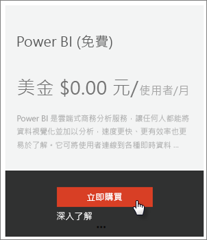
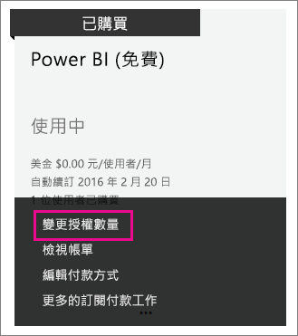

# 組織的 Power BI (免費)
這會查看貴組織中可如何使用 Power BI (免費) 供應項目。 組織代表您有一個租用戶，而且可以管理該租用戶內的使用者與服務。 身為管理員，您可以控制授權指派，或您可以允許使用者以個人身分註冊。 我們將探討 Power BI (免費) 授權，以及如何控制個人註冊。

## 個人註冊與授權指派
組織中的使用者可以使用兩種不同方式存取 Power BI。 他們可以個別註冊 Power BI，或您可以在 Office 365 系統管理入口網站中為其指派 Power BI 授權。

藉由允許對 Power BI 感興趣的使用者免費註冊，允許個人註冊可減少組織系統管理員的負擔。

如需更多控制，您可以封鎖個人登入，並在 Office 365 系統管理中心內自行指派 Power BI 授權。 這可讓您能夠具體表示哪些人可以存取您組織內的哪些服務。 如果您必須處理稽核，也必須知道誰可使用何種工具，這也會是不錯的選擇。

## 如何取得無限制的授權區塊
在 Office 365 系統管理中心內的 [帳單] > [授權] 下，您可能會或可能不會看到無限制授權的 Power BI (免費)。

首次有人以個人身分註冊 Power BI 之後，將顯示此區塊的授權。 在此過程中，這個授權區塊將附加到您的組織，並將授權指派給註冊的使用者。

如果您封鎖個人使用者註冊，而且沒有人已註冊，您將不會看到這個授權區塊。 您可以允許個人使用者註冊，並註冊一位使用者，或者您可以透過新增訂閱 Office 365 流程取得免費授權，該流程將在接下來討論。

Power BI (免費) 授權區塊可供使用之後，您可以指派這些授權給使用者。 如需有關如何指派授權的詳細資訊，請參閱[在 Office 365 中將授權指派給使用者](https://support.office.com/article/Assign-or-unassign-licenses-for-Office-365-for-business-997596b5-4173-4627-b915-36abac6786dc)。

## 透過新增 Office 365 的訂閱取得免費的授權
1. 導覽到 [Office 365 系統管理中心](https://portal.office.com/admin/default.aspx)。
2. 在左邊的瀏覽窗格中，選取 [帳單] > [訂閱]。
3. 選取右邊的 \[Add subscriptions +] \(新增訂閱 +)。
4. 在 [其他方案] 下，將滑鼠停留在 Power BI (免費) 的**省略符號 (...)**，然後選取 [立即購買]。
   
    
5. 輸入您想要新增的授權數量，然後選取 \[Check out now] \(立即簽出) 或 \[新增至購物車]。
   
   > [!NOTE]
   > 您可以視需要在日後新增更多。
   > 
   > 
6. 在簽出流程中輸入所需的資訊。

使用這種方法時，不會購買任何產品，但是您必須輸入信用卡帳單資訊，或選擇開立發票。

如果您稍後決定您想要新增更多授權，您可以移回至 \[新增訂閱]，然後對 Power BI \(免費) 選取 \[Change license quantity] \(變更授權數量)。

您現在可以將這些授權指派給您的使用者。 如需有關如何指派授權的詳細資訊，請參閱[在 Office 365 中將授權指派給使用者](https://support.office.com/article/Assign-or-unassign-licenses-for-Office-365-for-business-997596b5-4173-4627-b915-36abac6786dc)。

## 啟用或停用 Azure Active Directory 中的個人使用者註冊
身為管理員，您可以選擇啟用或停用個人使用者註冊，作為 Azure Active Directory (AAD) 的一部分。 如果您知道如何運用 AAD PowerShell 命令，您就可以自行啟用或停用特定訂閱。 [深入了解](https://technet.microsoft.com/library/jj151815.aspx)

控制此項的 AAD 設定是 **AllowAdHocSubscriptions**。 大多數的租用戶必須將此設定為 true，表示已啟用此設定。 如果您透過合作夥伴取得 Power BI，根據預設，這可能設為 false，表示已停用。

1. 您首先需要使用 Office 365 認證登入 Azure Active Directory。 第一行會提示您輸入認證。 第二行連接到 Azure Active Directory。
   
     $msolcred = get-credential   connect-msolservice -credential $msolcred
   
   
2. 當您登入之後，您可以發出下列命令，查看您的租用戶目前設定那些項目。
   
     Get-MsolCompanyInformation | fl AllowAdHocSubscriptions
3. 您可以使用此命令啟用 ($true) 或停用 ($false) AllowAdHocSubscriptions。
   
     Set-MsolCompanySettings -AllowAdHocSubscriptions $true

> [!NOTE]
> 這會防止貴組織的新使用者註冊 Power BI。 在您停用組織的新註冊前即已註冊 Power BI 的使用者，仍然保留其授權。
> 
> 

## 後續步驟
[Power BI 的自助式註冊](service-self-service-signup-for-power-bi.md)  
[購買 Power BI Pro](service-admin-purchasing-power-bi-pro.md)  
[使用自訂的 Azure Active Directory 租用戶註冊 Power BI (免費)](developer/create-an-azure-active-directory-tenant.md)  
[Power BI Premium - 這是什麼？](service-premium.md)  
[Power BI Premium 技術白皮書](https://aka.ms/pbipremiumwhitepaper)  

有其他問題嗎？ [嘗試在 Power BI 社群提問](http://community.powerbi.com/)

