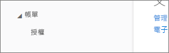
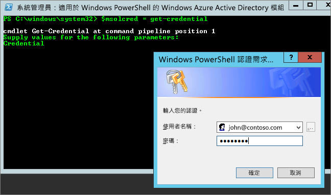

# 無法將 Power BI 加入 Office 365 合作夥伴訂閱
Office 365 允許公司將 Office 365 與其所擁有的解決方案進行搭配整合並加以轉售 ，讓客戶只需透過一個連絡窗口，就能處理購買、帳單和支援等事宜。

如果您想在訂閱 Office 365 時一併購買 Power BI，我們建議您連絡您的合作夥伴，加以選購。 如果合作夥伴不提供 Power BI，您可以考慮不同的方式。

1. 您可以從其他管道購買服務，直接向 Microsoft 或其他合作夥伴購買。 並非所有客戶都可以選擇此購買方式，這取決於客戶和合作夥伴的關係。 您可以前往 **[Office 365 管理入口網站]** > **[帳單]** > **[訂閱]**，加以確認。 如果您有看到 [ **訂閱**]，表示可以直接向 Microsoft 購買服務，或者也可以連絡提供 Power BI 的合作夥伴。
   
    
2. 如果在 [ **帳單** ] 底下沒看到 [ **訂閱**]，表示您無法直接向 Microsoft 或其他合作夥伴購買服務。 
   
   

如果不能直接購買 Power BI，視想要購買的 Power BI 訂閱類型而定，您仍有一些選擇。

[Power BI (免費)](#power-bi-free)

[Power BI Pro 和 Premium](#power-bi-pro)

## Power BI (免費)
如果您滿意 Power BI 的免費供應項目，可以註冊免費服務。 根據預設，系統會停用個別註冊，又稱為特定訂閱。 當您嘗試註冊 Power BI 時，您會看到一則訊息，指出您的 IT 部門已經關閉 Microsoft Power BI 的註冊。

    Your IT department has turned off signup for Microsoft Power BI.

若要啟用特定訂閱，您可以連絡合作夥伴，請他們開啟。 如果您是租用戶系統管理員，而且知道如何利用 Azure Active Directory PowerShell 命令，您可以自行啟用特定訂閱。 [深入了解](https://technet.microsoft.com/library/jj151815.aspx)

1. 您首先需要使用 Office 365 認證登入 Azure Active Directory。 第一行會提示您輸入認證。 第二行連接到 Azure Active Directory。
   
        $msolcred = get-credential
        connect-msolservice -credential $msolcred
   
    
2. 登入之後，您可以發出下列命令，啟用免費註冊。
   
        Set-MsolCompanySettings -AllowAdHocSubscriptions $true

## Power BI Pro 和 Premium
如果想要購買 Power BI Pro 或 Power BI Premium 訂用帳戶，請與合作夥伴討論您可購買的選項。

* 合作夥伴若同意將 Power BI 加入商品組合，即可向其購買。
* 您的合作夥伴可以將您的購買模式轉變成直接向 Microsoft 或其他提供 Power BI 的合作夥伴購買 Power BI。

下列影片探討 Office 365 同步發行及如何購買 Power BI：

<iframe width="560" height="315" src="https://www.youtube.com/embed/C357phT94A8" frameborder="0" allowfullscreen></iframe>

## 後續步驟
[使用 Windows PowerShell 管理 Azure AD](https://technet.microsoft.com/library/jj151815.aspx)  
[Power BI Premium - 這是什麼？](service-premium.md)

有其他問題嗎？ [嘗試在 Power BI 社群提問](http://community.powerbi.com/)

