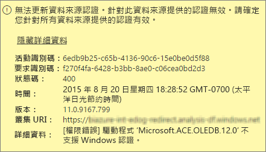
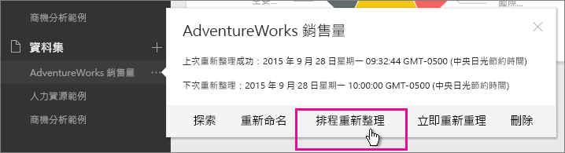
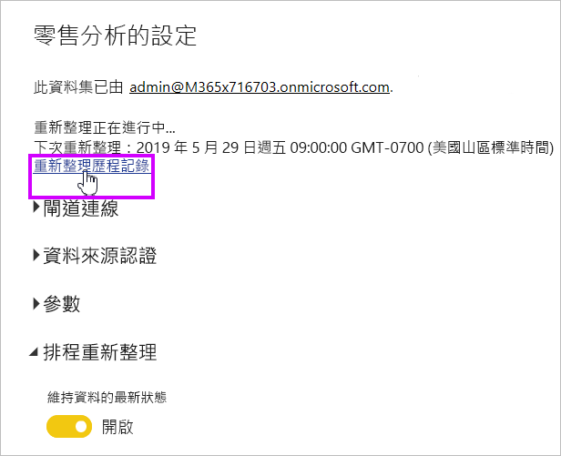
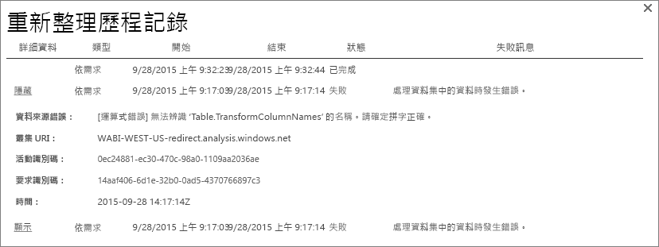
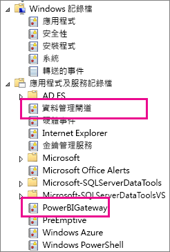
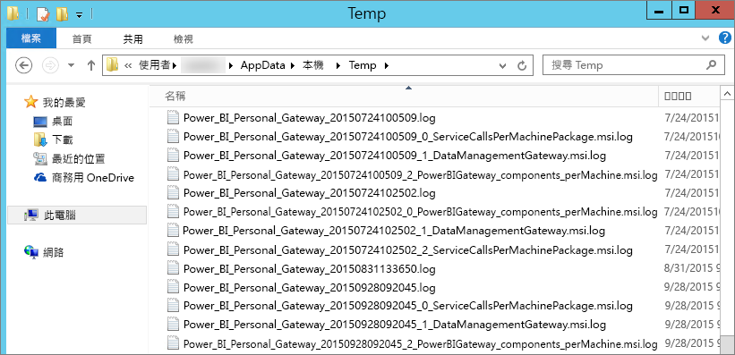

# Power BI Gateway - Personal 疑難排解
下列各節會經歷使用 Power BI Gateway-Personal 時可能遇到的一些常見問題。

> [!NOTE]
> 目前供個人使用的閘道版本是**內部部署資料閘道 (個人)**。 請更新您的安裝才能使用該版本。
> 
> 

## 更新為最新版本
閘道版本已過期時，可能會出現許多問題。  它是個不錯的一般做法請確定您使用最新版本。 如果您未更新閘道，一個月，或更久，請考慮安裝最新版的閘道。 然後，查看是否能重現問題。

## 安裝
**個人閘道是 64 位元**-如果您的電腦是 32 位元，則無法安裝個人閘道。 您的作業系統必須是 64 位元版本。 安裝 Windows 的 64 位元版本，或在 64 位元電腦上安裝個人閘道。

**個人閘道無法安裝做為服務，雖然您是電腦的本機系統管理員**-如果使用者位於電腦的本機系統管理員群組，但群組原則不允許該使用者身分登入的名稱，安裝可能會失敗服務。 目前，請確定群組原則可讓使用者登入為服務。 我們正努力修正這個問題。 [深入了解](https://technet.microsoft.com/library/cc739424.aspx)

**作業已逾時**-這則訊息很常見，如果您正在安裝個人閘道的電腦 （實體機器或 VM） 具有單一核心處理器。 請關閉任何應用程式，並關閉任何非必要程序，然後再次嘗試安裝。

**個人閘道的同一部電腦上，則無法安裝資料管理閘道或 Analysis Services Connector** -如果您已經安裝了 Analysis Services Connector 或資料管理閘道安裝，您必須先解除安裝連接器或閘道。 然後，再安裝個人閘道。

> [!NOTE]
> 如果您在安裝期間遇到的問題，安裝程式記錄檔可以提供可協助您解決問題的資訊。 如需詳細資訊，請參閱 <<c0> [ 安裝程式記錄檔](#SetupLogs)。
> 
> 

 **Proxy 組態**可能會遇到個人閘道器設定，如果您的環境需要使用 proxy 的問題。 若要深入了解如何設定 Proxy 資訊，請參閱 [Configuring proxy settings for the Power BI Gateways](service-gateway-proxy.md) (設定 Power BI Gateways 的 Proxy 設定)。

## 排程重新整理
**錯誤：遺漏儲存在雲端中的認證。**

您可能會收到此錯誤在設定\<資料集\>如果您有排定的重新整理，解除安裝然後重新安裝個人閘道。 當您解除安裝個人閘道時，已設定為重新整理資料集的資料來源認證會移除從 Power BI 服務中。

**解決方案：** 在 Power BI 中，移至資料集的重新整理設定。 在 管理資料來源，出現錯誤訊息，任何資料來源選取**編輯認證**並再次登入的資料來源。

**錯誤：為此資料集提供的認證不正確。請更新重新整理過程中或在 [資料來源設定] 對話方塊中的認證以繼續。**

**解決方案**：如果您收到認證訊息，可能表示：

* 請確定使用者名稱和密碼登入的資料來源是最新狀態。 在 Power BI 中，移至該資料集的 [重新整理] 設定。 在 管理資料來源，選取**編輯認證**更新資料來源的認證。
* 混搭程式與雲端來源之間的內部部署來源，在單一查詢中，如果其中一個來源會使用 OAuth 進行驗證，在個人閘道中重新整理失敗。 此問題的範例是 CRM Online 和本機 SQL Server 之間的交互式。 由於 CRM Online 需要 OAuth，混搭將會失敗。
  
  這個錯誤是已知的問題並且它正在進行調查。 若要解決此問題，有不同的查詢，針對雲端來源和內部部署來源。 接著，使用合併或附加查詢加以結合。

**錯誤：不支援的資料來源。**

**解決方案：** 如果您在 [排程重新整理] 設定中看見不支援的資料來源訊息，這可能表示： 

* 在 Power BI 中的重新整理目前不支援資料來源。 
* Excel 活頁簿不包含資料模型中，只有工作表資料。 目前僅當上傳的 Excel 活頁簿包含資料模型時，Power BI 才支援重新整理。 當您使用 Power Query 在 Excel 中匯入資料時，請務必選擇此選項來載入資料至資料模型。 此選項可確保資料匯入資料模型。 

**錯誤: [無法結合資料]&lt;查詢部分&gt;/&lt;...&gt; / &lt;...&gt;存取的隱私權等級無法一起使用的資料來源。請重建這個資料組合。**

**解決方案**：此錯誤是由於隱私權等級限制及您使用的資料來源的類型。

**錯誤：資料來源錯誤:無法將值 "\[Table\]" 轉換成類型 Table。**

**解決方案**：此錯誤是由於隱私權等級限制及您使用的資料來源的類型。

**錯誤：這個資料列沒有足夠空間。**

如果您有單一資料列大於 4 MB 的大小，就會發生此錯誤。 尋找您的資料來源的資料列，並嘗試篩選出或縮減該資料列的大小。

## 資料來源
**遺漏資料提供者**– 個人閘道器僅限 64 位元版本。 必須將資料提供者的 64 位元版本安裝在個人閘道安裝的相同電腦上。 例如，如果該資料集的資料來源是 Microsoft Access，您就必須將 64 位元的 ACE 提供者安裝在安裝了個人閘道的相同電腦上。  

>[!NOTE]
>如果您有 32 位元版本 Excel 時，您無法在同一部電腦上安裝 64 位元版本的 ACE 提供者。

**Access 資料庫不支援 Windows 驗證** - Power BI 目前對於 Access 資料庫僅支援匿名操作。 我們正努力讓存取資料庫的 Windows 驗證。

**輸入資料來源的認證時登入錯誤**-如果輸入資料來源的 Windows 認證時，您會收到這類錯誤，您仍可能是在較舊版本的個人閘道。 [安裝最新版本的 Power BI Gateway - Personal](https://powerbi.microsoft.com/gateway/)。

  

**錯誤：選取使用 ACE OLEDB 資料來源的 Windows 驗證時發生登入錯誤** - 在輸入使用 ACE OLEDB 提供者的資料來源的資料來源認證時，如果發生下列錯誤：

Power BI 目前不支援 Windows 驗證使用 ACE OLEDB 提供者資料來源。

**解決方案：** 若要解決這個錯誤，您可以選取**匿名驗證**。 舊版 ACE OLEDB 提供者，匿名認證相等 Windows 認證。

## 磚重新整理
如果您收到具有儀表板磚重新整理的錯誤，請參閱下列文章。

[為磚錯誤進行疑難排解](refresh-troubleshooting-tile-errors.md)

## 疑難排解的工具
### 重新整理歷程記錄
**重新整理記錄**可協助您查看發生了哪些錯誤，並提供有用的資料，如果您需要建立支援要求。 您可以檢視排程和需求的重新整理。 以下是如何獲得**重新整理記錄**。

1. 在 Power BI 瀏覽窗格中，於 [資料集]  中選取資料集 &gt; [開啟功能表]&gt; [排程重新整理] 。
   
1. 在 **設定...**，選取**重新整理記錄**。  
   
   
   

### 事件記錄檔
數個事件記錄檔可以提供資訊。 前兩個，**資料管理閘道**並**PowerBIGateway**，如果您是在電腦上的系統管理員。  如果您不是系統管理員，而且您使用個人閘道，您會看到記錄項目內**應用程式**記錄檔。

**Data Management Gateway** 和 **PowerBIGateway** 記錄檔位於 **Application and Services Logs**下。

### Fiddler 追蹤
[Fiddler](http://www.telerik.com/fiddler) 是 Telerik 提供的免費工具，可用來監視 HTTP 流量。 您可以看到與 Power BI 服務從用戶端電腦的通訊。 此通訊可能會顯示錯誤和其他相關的資訊。

### 安裝程式記錄檔
如果**Personal Gateway**，無法安裝，您會看到顯示安裝記錄檔的連結。 安裝程式記錄檔可以顯示有關失敗的詳細資料。 這些記錄是 Windows 安裝的記錄，也稱為 MSI 記錄檔。 可能相當複雜且難以閱讀。 一般而言，產生的錯誤是在底部，但判斷錯誤的原因不是簡單式。 原因有可能是不同記錄的錯誤結果，或是記錄中更上層錯誤的結果。

或者，您可以移至您**Temp 資料夾**（%temp%)並尋找檔案開頭**電源\_BI\_**。

> [!NOTE]
> %temp% 可能位在暫存資料夾的子資料夾內。**電源\_BI\_** 檔案位在暫存目錄的根目錄。  您可能需要向上一或兩個層級。
> 
> 

## 後續步驟
[進行 Power BI Gateway 的 Proxy 設定](service-gateway-proxy.md)  
[資料重新整理](refresh-data.md)  
[Power BI Gateway - Personal](service-gateway-personal-mode.md)  
[為磚錯誤進行疑難排解](refresh-troubleshooting-tile-errors.md)  
[為內部部署資料閘道進行疑難排解](service-gateway-onprem-tshoot.md)  
有其他問題嗎？ [試試 Power BI 社群](http://community.powerbi.com/)

