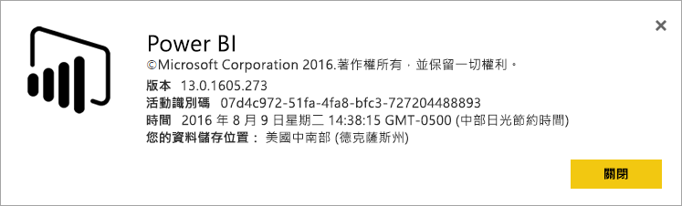

# 我的 Power BI 租用戶位於何處？
<iframe width="560" height="315" src="https://www.youtube.com/embed/0fOxaHJPvdM?showinfo=0" frameborder="0" allowfullscreen></iframe>

了解您的 Power BI 租用戶所在位置，以及選取該位置的方式。 因為這會影響您與服務的互動，所以務必要了解。

## 如何判斷您的 Power BI 租用戶所在位置
您可以執行下列作業，以找出您的租用戶所在區域。

1. 在 Power BI 服務的右上角，選取 [?] 在 Power BI 服務中。
2. 選取 [關於 Power BI]。
3. 查看 [您的資料儲存位置] 旁邊的值。 這是您所在的區域。

## 資料區域的選取方式
資料區域以第一次建立租用戶時選取的國家/地區為依據。 因為資訊是共用的，所以除了 Power BI 以外，這也適用於註冊 Office 365。 如果這是新的租用戶，當您註冊時，您會看到一個國家/地區的下拉式清單。

這個選取項目會決定您資料的儲存位置。 Power BI 會選擇最接近這個選取項目的資料區域。

> [!WARNING]
> 此選取項目無法變更！
> 
> 

有其他問題嗎？ [試試 Power BI 社群](http://community.powerbi.com/)

