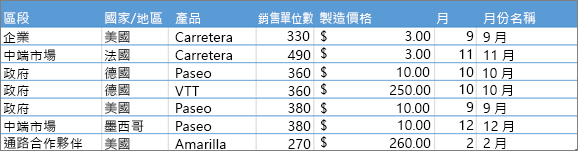
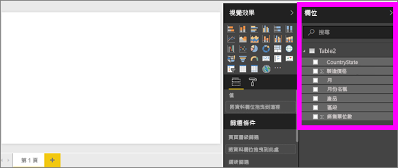
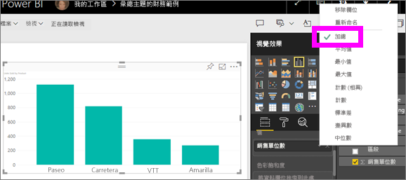
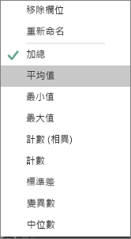
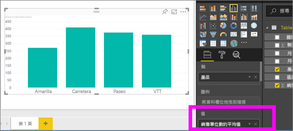
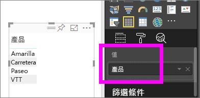
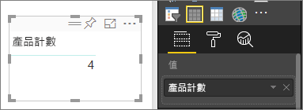
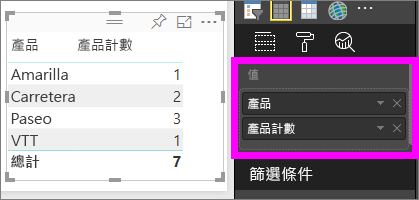

# Power BI 視覺效果中的彙總
## 什麼是彙總？
有時候您會想要以數學方式結合資料中的值。 數學運算可能是加總、平均、最大值、計數等等。當您結合資料中的值時，它稱為「彙總」。 數學運算的結果是「彙總值」。 

Power BI 服務和 Power BI Desktop 建立視覺效果時，可能會彙總資料。 通常彙總就是所需要的結果，但有時候您可能想要以不同方式來彙總值。  例如，總和與平均值。 有幾種不同方式來管理和變更視覺效果正在使用的彙總。

首先，讓我們查看資料「類型」，因為資料類型會決定如何彙總它，以及是否可以彙總。

## 資料類型
大部分的資料集有多個資料類型。 在最基本的層級，資料會是數值或不是數值。 數值資料可以使用總和、平均值、計數、最小值、變異數，以及更多方式來彙總。 即使是文字資料，通常稱為「類別目錄」資料，也可以彙總。 如果您嘗試彙總類別欄位 (透過將它放在僅限數值的貯體，例如**值**或**工具提示**)，Power BI 將計算每個類別的出現次數，或計算每個類別的相異出現次數。 特殊類型的資料 (例如日期) 有自己的一些彙總選項：最早、最新、第一個和最後一個。 

在下列範例中：
- [銷售單位] 與 [製造價格] 是包含數值資料的資料行
-  [業別]、[國家/地區]、[產品]、[月份] 和 [月份名稱] 包含類別目錄資料

   

在 Power BI 中建立視覺效果時，會對某個類別欄位彙總數值欄位 (預設值是「總和」)。  例如，「依產品的銷售單位」、「依月份的銷售單位」和「依業別的製造價格」。 有些數值欄位稱為**量值**。 可以輕鬆地在 Power BI 報表編輯器中識別量值 -- 量值會在 [欄位] 清單中隨著 ∑ 符號顯示。 如需詳細資訊，請參閱[報表編輯器導覽](service-the-report-editor-take-a-tour.md)。

## 為什麼彙總運作的方式和我想要的不同？
使用 Power BI 服務中的彙總可能會造成混淆。或許您有數值欄位，但 Power BI 不讓您變更彙總。 或是您有一個欄位，例如年份，您不想彙總它，只想要計算發生次數。

大多數情況下，問題的來源是資料集中的欄位定義方式。 欄位可能定義為文字，且其說明了它為何無法進行加總或平均。 不幸的是，[只有資料集擁有者可以變更欄位的分類方式](desktop-measures.md)。 因此如果您具有資料集的擁有者權限，不論是在 Desktop 或用來建立資料集的程式 (例如 Excel)，您便可以修正這個問題。 否則，您必須連絡資料集擁有者以取得協助。  

為了協助您度過混淆，我們在本文結尾有專門的一節，稱為＜考量與疑難排解＞。  如果您在那裡找不到答案，請在 [Power BI 社群論壇](http://community.powerbi.com)提出您的問題，以便得到直接來自 Power BI 小組的快速回應。

## 變更數值欄位的彙總方式
假設您有加總不同產品銷售單位的圖表，但您比較想要平均值。 

1. 建立使用類別和量值的圖表。 在此範例中，我們會使用「依產品的銷售單位」。  根據預設，Power BI 會建立針對每個產品 (軸中的類別) 加總銷售單位 (值中的量值) 的圖表。

   

2. 在 [視覺效果] 窗格中，以滑鼠右鍵按一下量值，然後選取您需要的彙總類型。 在此案例中，我們選取「平均值」。 如果您沒有看到您需要的彙總，請參閱底下的＜考量與疑難排解＞。  
   
   
   
   > [!NOTE]
   > 下拉式清單中可用的選項會因 1) 所選取的欄位，以及 2) 資料集擁有者分類欄位的方式而有所不同。
   > 
3. 您的視覺效果現在使用依平均值彙總。

   

##    彙總資料的方式

彙總欄位可用的某些選項：

* **不加總**。 選擇了此選項，該欄位中的每個值會分開處理且不加總。 如果有不應該加總的數值識別碼資料行，這很常用。
* **加總**。 這會加總該欄位中的所有值。
* **平均**。 求出值的算術平均值。
* **最小值**。 顯示最小的值。
* **最大值**。 顯示最大的值。
* **計數 (沒有空格)。** 這會計算該欄位中不是空白值的數目。
* **計數 (相異)。** 這會計算該欄位中不同值的數目。
* **標準差。**
* **變異數**。
* **中位數**。  顯示中間值。 這是具有相同項目數以上或以下的值。  如果有兩個中位數，Power BI 會取其平均值。

例如，下列資料：

| 國家/地區 | 數量 |
|:--- |:--- |
| 美國 |100 |
| 英國 |150 |
| 加拿大 |100 |
| 德國 |125 |
| 法國 | |
| 日本 |125 |
| 澳洲 |150 |

會得到下列結果：

* **不加總**：分別顯示每個值
* **加總**：750
* **平均**：125
* **最大值**：150
* **最小值**：100
* **計數 (沒有空格)：** 6
* **計數 (相異)：** 4
* **標準差：** 20.4124145...
* **變異數：** 416.666...
* **中位數：** 125

## 建立使用類別 (文字) 欄位的彙總
您也可以彙總非數值欄位。 例如，如果有產品名稱欄位，您可以將它新增為值，然後將它設定為 [計數]、[相異計數]、[第一個] 或 [最後一個]。 

1. 在此範例中，我們已將 [產品] 欄位拖入 [值]。 [值] 通常用於數值欄位。 Power BI 會辨識這是一個文字欄位、將彙總設為 [不摘要]，並呈現單一資料行的資料表。
   
   
2. 如果將彙總從預設的 [不摘要] 變更為 [計數 (相異)] ，Power BI 就會計算不同產品的數目。 在此案例中有 4 個。
   
   
3. 如果將彙總變更為 [計數]，Power BI 就會計算總數。 在此案例中，[產品] 有 7 個項目。 
   
   

4. 透過將相同的欄位 (在此案例為 [產品]) 拖入 [值]，並維持預設彙總 [不摘要]，Power BI 會依產品細分計數。

   

## 考量與疑難排解
問︰為什麼沒有**不摘要**選項？

答：您所選取的欄位可能是導出量值或在 Excel 或 [Power BI Desktop](desktop-measures.md) 中建立的進階量值。 每個導出量值都有自己的硬式編碼公式。 您無法變更使用中的彙總。  例如，如果是總和，就只能是總和。 在 [欄位] 清單中，「導出量值」會以計算機符號顯示。

問︰我的欄位**是**數值，為何我只能選擇 [計數] 和 [相異計數]？

答 1︰可能的原因為資料集擁有者不小心或故意「不」將該欄位分類為數字。 例如，如果資料集具有 [年] 欄位，資料集擁有者可能會將其分類為文字，因為比較可能會計算 [年] 欄位 (例如在 1974 年出生的人數)，而不是加總或取平均值。 如果您是擁有者，可以在 Power BI Desktop 中開啟資料集，並使用 [模型] 索引標籤來變更資料類型。  

答 2︰如果欄位有計算機圖示，這表示它是「導出量值」，而每個導出量值都有它自己的硬式編碼公式，只能由資料集擁有者變更。 正在使用的計算可能是簡單的彙總，例如平均或加總，但它也可能更複雜，例如「在父類別所佔比重的百分比」或「自年初起的計算加總」。 Power BI 並不會將結果加總或平均，但會改為針對每個資料點重新計算 (使用硬式編碼的公式)。

答 3︰另一個可能的原因是，您將欄位放至只允許類別目錄值的「值區」。  在此情況下，您只能選擇計數與相異計數。

答 4︰第三個可能的原因是，您使用欄位作為座標軸。 例如，在橫條圖的軸上，Power BI 會針對每個相異值顯示一個橫條，它完全不會彙總欄位值。 

>[!NOTE]
>此規則的例外狀況是散佈圖，「需要」彙總 X 軸和 Y 軸的值。

問：為何我無法針對 SSAS 資料來源彙總文字欄位？

答：與 SSAS MD 的即時連線不允許任何用戶端彙總。 這包括 first、last、avg、min、max 與 sum。

問︰我有散佈圖，而且我希望我的欄位「不要」彙總。  要怎麼做？

答︰將欄位新增至 [詳細資料] 值區，而不是 X 或 Y 軸的值區。

問︰當我新增數值欄位至視覺效果時，它們大部分都預設為加總，但有些預設為平均或計數或其他彙總。  為什麼預設彙總不一律相同？

答︰資料集擁有者可以選擇設定每個欄位的預設摘要。 如果您是資料集擁有者，請變更 Power BI Desktop [模型] 索引標籤中的預設摘要。

問︰我是資料集擁有者，我想確定欄位永遠不會進行彙總。

答：在 Power BI Desktop 中，請在 [模型] 索引標籤上，將 [資料類型] 設為 [文字]。

問︰我在我的下拉式清單中看不見 [不摘要] 的選項。

答︰請嘗試移除欄位，並將其新增回去。

有其他問題嗎？ [試試 Power BI 社群](http://community.powerbi.com/)

