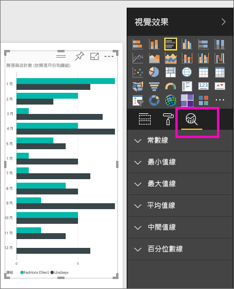
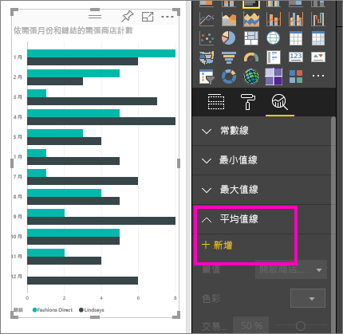
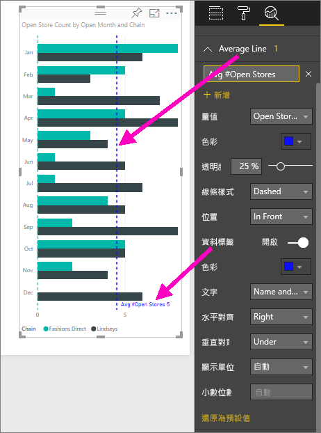
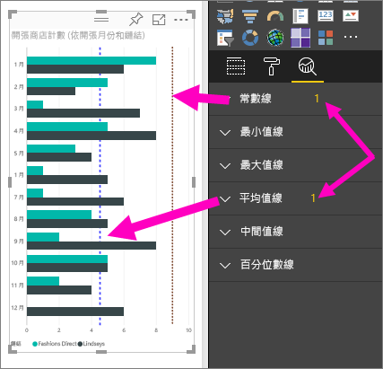

# 為 Power BI 服務中的視覺效果建立動態參考線

有了 **Power BI 服務**的 [分析]  窗格，您就可以將動態「參考線」  新增至視覺效果，為重要的趨勢或深入解析提供焦點。

> [!NOTE]
> [分析]  窗格只會在您選取報表畫布上的視覺效果時顯示。
> 
> 

## 使用 [分析] 窗格
透過 [分析]  窗格，您可以建立下列類型的動態參考線 (並非所有線都是用於所有視覺效果類型)：

* X 軸常數線
* Y 軸常數線
* 最小值線
* 最大值線
* 平均值線
* 最小值線
* 中間值線

若要檢視視覺效果可用的動態參考線，請遵循下列步驟：

1. 選取或建立視覺效果，然後從 [視覺效果]  窗格選取分析圖示  。

2. 針對您要建立的線類型選取向下箭號，以展開其選項。 在這個案例中，我們選取 [平均值線]  。
   
   

3. 若要建立一條新線，請選取 [+ 新增]  並決定將用來建立該線條的量值。  [量值]  下拉式清單會自動從所選的視覺效果填入可用的資料。 讓我們使用 [開啟商店計數]  。

5. 您可以對您的線條使用各種選項，例如色彩、透明度、樣式及位置 (相對於視覺效果的資料項目)。 如果您想要為此線條加上標籤，請提供其標題，然後將 [資料標籤]  滑桿移至 [開啟]  。  在這個案例中，我們會將這條線的標題設為「平均開啟商店數」  ，然後自訂其他幾個選項，如下所示。
   
   

1. 請注意顯示在 [分析]  窗格中，[平均值線]  項目旁的數字。 這告訴您視覺效果上目前有多少動態線及其類型。 如果我們新增 [常數線]  作為商店計數目標 9，您就會看到 [分析]  窗格顯示我們也對這個視覺效果套用了 [常數線]  參考線。
   
   
   

透過 [分析]  窗格，您可以藉由建立動態參考線，醒目提示您感興趣的各種深入解析。

## 考量與疑難排解

如果您選取的視覺效果無法套用動態參考線 (在這個案例中為 [地圖]  視覺效果)，您就會在選取 [分析]  窗格時看到下列內容。
   

使用動態參考線的能力取決於使用的視覺效果類型。 下表顯示目前有哪些視覺效果可以使用哪種動態線：

下列視覺效果可以完整使用動態線：

* 區域圖
* 折線圖
* 散佈圖
* 群組直條圖
* 群組橫條圖

下列視覺效果只可從 [分析]  窗格使用「常數線」  ：

* 堆疊區域圖
* 堆疊橫條圖
* 堆疊直條圖
* 100% 堆疊橫條圖
* 100% 堆疊直條圖

下列視覺效果目前只有「趨勢線」  選項：

* 非堆疊折線圖
* 群組直條圖

最後，非笛卡兒視覺效果目前無法從 [分析]  窗格套用動態線，例如：

* 矩陣圖
* 圓形圖
* 環圈圖
* 資料表

## 後續步驟
[Power BI Desktop 中的分析窗格](desktop-analytics-pane.md)

有其他問題嗎？ [試試 Power BI 社群](https://community.powerbi.com/)

