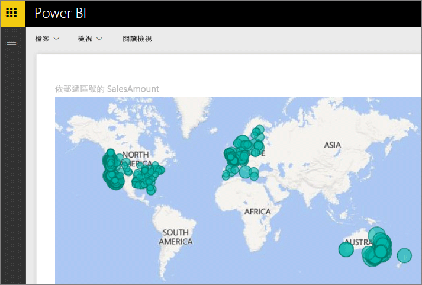
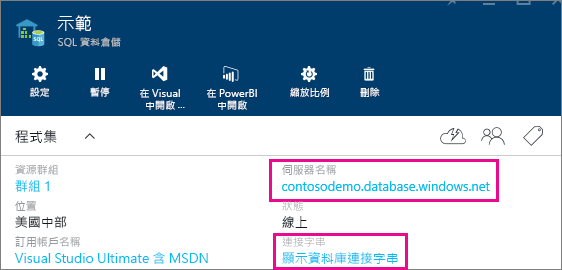

# 具有 DirectQuery 的 Azure SQL 資料倉儲

具有 DirectQuery 的 Azure SQL 資料倉儲可讓您根據 Azure SQL 資料倉儲中已有的資料和度量建立動態報表。 藉由 DirectQuery，當您瀏覽資料時，會即時將查詢傳回至您的 Azure SQL 資料倉儲。 即時查詢搭配 SQL 資料倉儲的調整功能，可讓使用者在幾分鐘內就能從數 TB 的資料建立動態報表。 此外，[在 Power BI 中開啟]  按鈕的引進可讓使用者將 Power BI 直接連接到其 SQL 資料倉儲，而不需要手動指定相關資訊。

使用 SQL 資料倉儲連接器時：

* 連接時，指定完整的伺服器名稱 (請參閱下列詳細資訊)
* 請確定已將伺服器的防火牆規則設定為「允許存取 Azure 服務」。
* 選取資料行或加入篩選等每一個動作，都會直接查詢資料倉儲
* 圖格已設定為大約每隔 15 分鐘重新整理一次，而且不需要排程重新整理  當您連線時，可以在 [進階] 設定中調整 [重新整理]。
* 問與答不能用於 DirectQuery 資料集
* 不會自動挑選結構描述變更

隨著我們持續改善這些體驗，這些限制和備註可能會變更。 連接的步驟如下所述。

## 使用 [在 Power BI 中開啟] 按鈕

> [!Important]
> 我們已改善與 Azure SQL 資料倉儲的連線。  若要獲得連線至 Azure SQL 資料倉儲資料來源的最佳體驗，請使用 Power BI Desktop。  在您建置模型和報表之後，即可將它發佈至 Power BI 服務。  現在已取代 Power BI 服務中 Azure SQL 資料倉儲的直接連接器。

在您的 SQL 資料倉儲與 Power BI 之間移動的最簡單方式是在 Azure 入口網站內使用 [在 Power BI 中開啟]  按鈕。 這個按鈕可讓您無接縫地開始在 Power BI 中建立新的儀表板。

1. 若要開始使用，請巡覽至您在 Azure 入口網站中的 SQL 資料倉儲執行個體。 請注意，SQL 資料倉儲目前只會出現在 Azure 入口網站上。

2. 按一下 [在 Power BI 中開啟]  按鈕

    

3. 如果我們無法直接將您登入，或者您沒有 Power BI 帳戶，則必須由您進行登入。

4. 您會被導向至 SQL 資料倉儲連線頁面，其中已預先填入您的 SQL 資料倉儲中的資訊。 輸入您的認證並點選 [連接] 以建立連接。

## 透過 Power BI 連接

SQL 資料倉儲也會列在 Power BI 的 [取得資料] 頁面上。 

1. 選取導覽窗格底端的 [取得資料]  。  

    ![[取得資料] 按鈕](media/service-azure-sql-data-warehouse-with-direct-connect/getdatabutton.png)

2. 在 [資料庫]  內選取 [取得]  。

    

3. 選取 **SQL 資料倉儲**\> **連接**。

    

4. 輸入連接所需的資訊。 底下的＜尋找參數＞  一節說明這個資料可能在 Azure 入口網站上的位置。

    

    

    

   > [!NOTE]
   > 使用者名稱會是您 Azure SQL 資料倉儲執行個體中定義的使用者。

5. 選取新的磚或新建立的資料集 (以星號表示)，以鑽研資料集。 這個資料集會使用與您的資料庫相同的名稱。

    

6. 您可以瀏覽所有資料表和資料行。 選取資料行會將查詢傳送到來源，同時動態建立視覺效果。 篩選也會轉譯成查詢以傳回資料倉儲。 這些視覺效果可儲存在新報表中，並釘選回您的儀表板。

    

## 尋找參數值

在 Azure 入口網站中可以找到您完整的伺服器名稱與資料庫名稱。 請注意，SQL 資料倉儲目前只會出現在 Azure 入口網站上。

> [!NOTE]
> 如果您的 Power BI 租用戶與 Azure SQL 資料倉儲位於相同區域中，將不會有輸出費用。 您可以使用[這些指示](https://docs.microsoft.com/power-bi/service-admin-where-is-my-tenant-located)來找到您的 Power BI 租用戶所在位置。

[!INCLUDE [direct-query-sso](includes/direct-query-sso.md)]

## 後續步驟

* [Power BI 是什麼？](fundamentals/power-bi-overview.md)  
* [取得 Power BI 的資料](service-get-data.md)  
* [Azure SQL 資料倉儲](/azure/sql-data-warehouse/sql-data-warehouse-overview-what-is/)

有其他問題嗎？ [試試 Power BI 社群](https://community.powerbi.com/)
