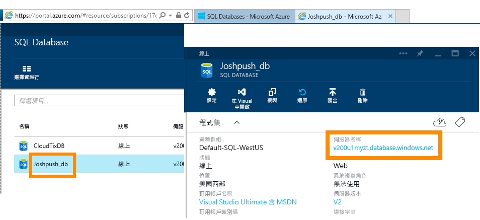
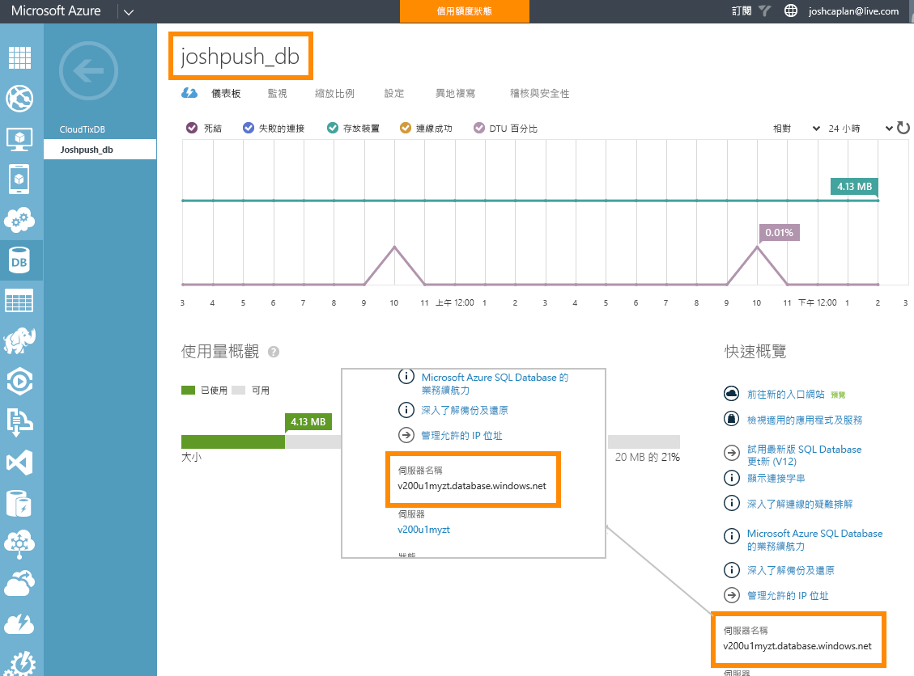

# 具有 DirectQuery 的 Azure SQL Database
了解如何直接連線至 Azure SQL Database 及建立使用即時資料的報表。 您可以將您的資料保留在來源，而不是在 Power BI 中。

藉由 DirectQuery，當您瀏覽報表檢視中的資料時，會將查詢傳送至您的 Azure SQL Database。 對於熟悉所連接資料庫與實體的使用者，會推薦這種做法。

**注意：**

* 連接時請指定完整的伺服器名稱 (請參閱以下以取得詳細資料)
* 請確定已將資料庫的防火牆規則設定為[允許存取 Azure 服務](https://msdn.microsoft.com/library/azure/ee621782.aspx)。
* 例如選取資料行或加入篩選器的每一個動作，都會傳送查詢回資料庫
* 圖格會大約每隔 15 分鐘重新整理 (重新整理不需要排程) 當您連接時，這可以在 [進階] 設定中調整。
* 問與答不能用於 DirectQuery 資料集
* 不會自動挑選結構描述變更

隨著我們持續改善這些體驗，這些限制和備註可能會變更。 連接的步驟如下所述。 

## Power BI Desktop 和 DirectQuery
您必須使用 Power BI Desktop，才能連線到使用 DirectQuery 的 Azure SQL Database。 這個方法提供額外的彈性和功能。 使用 Power BI Desktop 建立的報表可以發行至 Power BI 服務。 您可以深入了解如何在 Power BI Desktop 中連線到 [ DirectQuery 的 Azure SQL Database](desktop-use-directquery.md)。 

## 透過 Power BI 連接
您無法直接從 Power BI 服務連線到 Azure SQL Database。 當您選取 [Azure SQL Database 連接器](https://app.powerbi.com/getdata/bigdata/azure-sql-database-with-live-connect)時，系統會要求您在 Power BI Desktop 內建立連線。 您接著可以將 Power BI Desktop 報表發行至 Power BI 服務。 

### 尋找參數值
在 Azure 入口網站中可以找到您完整的伺服器名稱和資料庫名稱。

## 後續步驟
[在 Power BI Desktop 中使用 DirectQuery](desktop-use-directquery.md)  
[開始使用 Power BI](service-get-started.md)  
[取得 Power BI 的資料](service-get-data.md)  
有其他問題嗎？ [試試 Power BI 社群](http://community.powerbi.com/)

