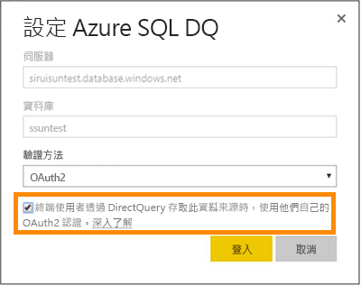

# 具有 DirectQuery 的 Azure SQL Database
了解如何直接連線至 Azure SQL Database 及建立使用即時資料的報表。 您可以將您的資料保留在來源，而不是在 Power BI 中。

藉由 DirectQuery，當您瀏覽報表檢視中的資料時，會將查詢傳送至您的 Azure SQL Database。 對於熟悉所連接資料庫與實體的使用者，會推薦這種做法。

**注意：**

* 連接時請指定完整的伺服器名稱 (請參閱以下以取得詳細資料)
* 請確定已將資料庫的防火牆規則設定為 [[允許存取 Azure 服務](https://msdn.microsoft.com/library/azure/ee621782.aspx)]
* 例如選取資料行或加入篩選器的每一個動作，都會傳送查詢回資料庫
* 圖格會每小時重新整理 (重新整理不需要排程)。 當您連接時，這可以在 [進階] 設定中調整。
* 問與答不能用於 DirectQuery 資料集
* 不會自動挑選結構描述變更

隨著我們持續改善這些體驗，這些限制和備註可能會變更。 連接的步驟如下所述。

> [!Important]
> 我們已改善與 Azure SQL Database 的連線。  若要獲得連線至 Azure SQL Database 資料來源的最佳體驗，請使用 Power BI Desktop。  在您建置模型和報表之後，即可將它發佈至 Power BI 服務。  現在已取代 Power BI 服務中 Azure SQL Database 的直接連接器。
>

## Power BI Desktop 和 DirectQuery
您必須使用 Power BI Desktop，才能連線到使用 DirectQuery 的 Azure SQL Database。 這個方法提供額外的彈性與功能。 使用 Power BI Desktop 建立的報表可以發行至 Power BI 服務。 您可以深入了解如何在 Power BI Desktop 中連線到 [ DirectQuery 的 Azure SQL Database](desktop-use-directquery.md)。 

## 單一登入

在您將 Azure SQL DirectQuery 資料集發行至服務之後，您可以透過 Azure Active Directory (Azure AD) OAuth2 為終端使用者啟用單一登入 (SSO)。 

若要啟用 SSO，請移至資料集、開啟 [資料來源] 索引標籤，然後檢查 [SSO] 方塊。

若已啟用 SSO 選項，且您的使用者存取在資料來源上建立的報告，Power BI 會在對 Azure SQL 資料庫的查詢中傳送其已驗證的 Azure AD 認證。 這可讓 Power BI 遵從在資料來源層級所設定的安全性設定。

SSO 選項會在使用此資料來源的所有資料集中生效。 它不會影響用於匯入案例的驗證方法。

> [!Note]
> 不支援 Azure Multi-Factor Authentication (MFA)。 想搭配 Azure SQL DirectQuery 使用 SSO 的使用者，必須自 MFA 中免除。
>

## 尋找參數值
在 Azure 入口網站中可以找到您完整的伺服器名稱和資料庫名稱。

## 後續步驟
[在 Power BI Desktop 中使用 DirectQuery](desktop-use-directquery.md)  
[Power BI 是什麼？](power-bi-overview.md)  
[取得 Power BI 的資料](service-get-data.md)  
有其他問題嗎？ [試試 Power BI 社群](http://community.powerbi.com/)
